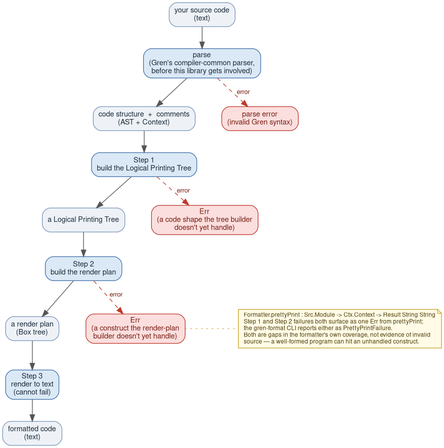

# The Gren Formatter Library

This package is the library behind `gren-format`: given a Gren source file,
it produces a formatted version of the same file — consistent spacing,
consistent indentation, comments and blank lines kept where they belong, and
also honoring the single-line/multi-line formatting the author of the source code chose.

The first part of this document section is a guided tour of *how* it does that, at a conceptual level.
The larger section explains the [Gren Formatter Rules](#gren-formatter-rules).

---

## Table of contents

- [Overview](#overview)
- [How it works](#how-it-works)
  - [Step 1: building the Logical Printing Tree](#step-1-building-the-logical-printing-tree)
    - [Where comments and blank lines fit in](#where-comments-and-blank-lines-fit-in)
    - [Example](#example)
  - [Step 2: turning the Logical Printing Tree into a render plan](#step-2-turning-the-logical-printing-tree-into-a-render-plan)
    - [Example](#example-1)
  - [Step 3: turning the render plan into text](#step-3-turning-the-render-plan-into-text)
    - [Example](#example-2)
  - [Why this design?](#why-this-design)
  - [Where to go next](#where-to-go-next)
- [Gren Formatter Rules](#gren-formatter-rules)
  - [Background](#background)
  - [Module declaration](#module-declaration)
  - [Exposed names sort automatically](#exposed-names-sort-automatically)
  - [Import statements](#import-statements)
  - [An import's exposing list sorts automatically](#an-imports-exposing-list-sorts-automatically)
  - [Import statements sort within unbroken runs](#import-statements-sort-within-unbroken-runs)
  - [Type signatures](#type-signatures)
  - [Function application](#function-application)
    - [A record argument that renders across rows drops to its own line](#a-record-argument-that-renders-across-rows-drops-to-its-own-line)
  - [Parentheses](#parentheses)
  - [Function body](#function-body)
  - [Blank lines between declarations](#blank-lines-between-declarations)
  - [Type aliases](#type-aliases)
  - [Custom types](#custom-types)
  - [Ports](#ports)
  - [Infix operator declarations](#infix-operator-declarations)
  - [Records](#records)
    - [Record values](#record-values)
    - [Record updates](#record-updates)
    - [A lambda whose body is a forced-vertical record, update, or array drops it to its own line](#a-lambda-whose-body-is-a-forced-vertical-record-update-or-array-drops-it-to-its-own-line)
    - [Record field values](#record-field-values)
    - [Record types and extensible records](#record-types-and-extensible-records)
  - [Array literals](#array-literals)
  - [String literals](#string-literals)
    - [Character literals](#character-literals)
    - [Multi-line (triple-quoted) strings](#multi-line-triple-quoted-strings)
  - [If expressions](#if-expressions)
  - [When expressions](#when-expressions)
  - [Let expressions](#let-expressions)
  - [Patterns as arguments](#patterns-as-arguments)
  - [Lambdas](#lambdas)
  - [Pipelines](#pipelines)
  - [Binary operators](#binary-operators)
  - [Comments](#comments)
    - [Where you put a comment is meaningful](#where-you-put-a-comment-is-meaningful)
    - [Single-line comments (`--`)](#single-line-comments---)
    - [Block comments (`{- ... -}`)](#block-comments----)
      - [Comments in an effect module's header](#comments-in-an-effect-modules-header)
    - [Doc comments (`{-| ... -}`)](#doc-comments----)
    - [Blank lines around comments](#blank-lines-around-comments)
    - [A comment on its own line below a declaration](#a-comment-on-its-own-line-below-a-declaration)
    - [A trailing comment on a `when` branch body](#a-trailing-comment-on-a-when-branch-body)
    - [When the formatter can't tell what you meant](#when-the-formatter-cant-tell-what-you-meant)
- [Known limitations](#known-limitations)
  - [A compiler bug with field access on a record-update base](#a-compiler-bug-with-field-access-on-a-record-update-base)
  - [Wide `when` branch patterns](#wide-when-branch-patterns)
  - [Comment placement near invisible tokens](#comment-placement-near-invisible-tokens)
  - [A line break inside a declaration's head](#a-line-break-inside-a-declarations-head)
  - [Comments near an effect module's `where` block](#comments-near-an-effect-modules-where-block)
  - [A comment right after `exposing` doesn't sort with the first name](#a-comment-right-after-exposing-doesnt-sort-with-the-first-name)
  - [A comment after the last binding in a `let`](#a-comment-after-the-last-binding-in-a-let)
  - [Block comment body indentation](#block-comment-body-indentation)
- [Comparison with elm-format](#comparison-with-elm-format)
  - [The idea both formatters share](#the-idea-both-formatters-share)
  - [The one way they actually differ](#the-one-way-they-actually-differ)
  - [Divergence catalogue](#divergence-catalogue)
  - [Out of scope for comparison](#out-of-scope-for-comparison)

---

## Overview

Turning your source file into its formatted version happens through a pipeline
of steps, each step handing its result to the next. Any step can fail: a parse
error means the source itself is invalid Gren, while a failure in Step 1 or
Step 2 means the formatter hasn't been taught to handle some construct yet —
not that anything is wrong with your code. Either way, nothing is silently
mangled; the failure is reported instead:



**Before this library gets involved**, the compiler-common parser reads your file and
splits it into two pieces:

- the Abstract Syntax Tree (AST) — a description of which function calls which,
  what a `let` contains, what a type looks like, and so on
- a separate list of every comment you wrote, since these
  don't change what the code means, but they do matter for how it looks

This library's job starts from those two pieces and ends with the formatted
text. It never changes what your code means — it only decides how it looks
on the page.

---

## How it works

### Step 1: building the Logical Printing Tree

The first step walks over your code's structure and builds a **Logical
Printing Tree**: one entry for every piece of your program (a function, an
expression, a list, a comment, a blank line, and so on), arranged in the
same shape as your code.

Each entry in this tree isn't the final text yet — it's a *layout decision*.
Some examples of the kinds of decisions recorded here:

- "these pieces sit on one line if you wrote them on one line, or each gets
  its own line if you spread them across rows"
- "this is a block whose body always starts on the next line, indented"
- "this is a list that's either written all on one line, or with one item
  per line — never a mix"

Where those decisions come from matters: the formatter mostly follows *your*
original line breaks. If you wrote a list across several lines, the Logical
Printing Tree records "spread this out"; if you wrote it on one line, it records
"keep this together." The tree is really a map of those choices, ready to
be turned into text later.

#### Where comments and blank lines fit in

Comments and blank lines aren't part of your code's structure, so they
arrive separately, each tagged with the line and column where you wrote it.

Once the rest of the Logical Printing Tree is built from your code alone,
this step goes back through and puts each comment and blank line in place —
finding the spot in the tree that sits at that same line and column, and
inserting it next to the code it was originally written
beside. A comment on the same line as some code attaches to that code; a
comment on its own line becomes its own entry, positioned between whatever
came before and after it in your file. The same idea applies to blank
lines: the formatter notices where you left gaps and preserves them as
their own entries in the tree.

The result is a Logical Printing Tree that has everything: code, comments,
and blank lines, all in the right order and all carrying their layout
decisions.

#### Example

Comments are what make this genuinely hard: they carry meaning for a human
reader, but the parser doesn't attach them to any particular piece of code —
they just sit in a separate list, tagged with a position. Take this
file where spacing is messy and non-standard:

```gren
module Sample exposing (greet)


import String


-- Greets someone by name
greet:String->String
greet name =
  "Hello, "  ++    name
```

(The parser doesn't care whether `:` and `->` have surrounding spaces —
`greet:String->String` parses exactly like `greet : String -> String`;
whitespace around most tokens is not meaningful.)

The parser splits this into an AST — which never mentions the comment at
all — and a Context that holds only the comment, tagged with the row and
column where it starts:

```
Module "Sample"
├── exports: [ greet ]
├── imports: [ String  (4:1–4:14) ]
└── values
    └── greet(name)                                (8:1–10:24)
        ├── signature: String -> String             (8:7–8:21)
        └── body: Binop "++"                        (10:3–10:24)
            ├── left:  String "Hello, "
            └── right: Var name

Context
└── comments: [ Line "-- Greets someone by name"  (7:1–7:26) ]
```

Building the Logical Printing Tree means walking that AST first, then going
back and re-inserting the comment at row 7 — right where it was written,
directly above the signature it sits beside:

```
RootBox
├── OriginalRows[module]       "module Sample exposing (greet)"
├── EmptyLine
├── OriginalRows[import]       "import String"
├── EmptyLine
├── EmptyLine
├── OriginalRows[lineComment]  "-- Greets someone by name"
├── OriginalRows[funcSig]      "greet : String -> String"
└── OriginalRows[funcDecl]
    ├── AcrossOrVertical        "greet name ="
    └── BodyBlock
        └── Binop "++"
            ├── "Hello, "
            └── OpAndRhs  "++ name"
```

Notice there's no `EmptyLine` between the comment, the signature, and the
function itself — all three stay glued together as one declaration unit.
(See [Blank lines around comments](#blank-lines-around-comments) for the
general rule.)

---

### Step 2: turning the Logical Printing Tree into a render plan

The Logical Printing Tree says *what could* happen ("these items can go on
one line or several"). The next step turns each of those decisions into
something much more concrete: a small set of building blocks that say
exactly what to print — a piece of text, a line break, or "indent
everything from here by one more level."

This step doesn't do any guessing or searching for the "best" way to lay
things out. Because the Logical Printing Tree already recorded each
decision (based on how you originally wrote the code), this step just
follows those decisions directly. That's why the same input always
produces the same output, and why there's no "line width" setting to
configure — the formatter isn't trying to fit your code into 80 columns or
any other target, it's reproducing the shape you already chose.

#### Example

Continuing the same example, the Logical Printing Tree from Step 1 becomes
this render plan — one entry per root item, each a small tree of concrete
building blocks. A `Stack` is a box that is already committed to printing as
2 or more actual lines; everything else (`Seq`, and the bare pieces inside
it — text, `Space`, `Tab`) stays on the current line:

```
[0] Seq[ "module", Space, "Sample", Space, "exposing", Space, "(", "greet", ")" ]

[1] ""

[2] Seq[ "import", Space, "String" ]

[3] ""
[4] ""

[5] "-- Greets someone by name"

[6] Seq[ "greet", Space, ":", Space, "String", Space, "->", Space, "String" ]

[7] Stack
    ├── Seq[ "greet", Space, "name", Space, "=" ]
    └── Seq[ Tab, "\"Hello, \"", Space, "++", Space, "name" ]
```

The comment (entry `[5]`) is just a bare piece of text sitting between two
blank lines (entries `[3]`/`[4]`, each a bare empty string) and the
signature — nothing left to decide about it. The whole
signature (entry `[6]`) is one `Seq` with an ordinary `Space` between every
token; there's no separate "could this become a newline?" node the way
there was in Step 1, because a signature you wrote on one line is already
settled at this stage (see [Type signatures](#type-signatures)). The
function (entry `[7]`) is where a real decision shows up: it's a `Stack`,
meaning it *will* print as 2 lines no matter what, because you wrote `=`
and the body on separate rows. The `Tab` at the start of the second line is
what becomes the body's indentation once Step 3 renders it — not a fixed
"4 spaces" but a jump to the next indent stop, the same primitive
elm-format itself uses. Step 3 doesn't choose between staying flat or
breaking; it just executes whichever this tree already committed to.

---

### Step 3: turning the render plan into text

The last step is the simplest: walk over the render plan from the previous
step and produce the actual characters of the formatted file — inserting
real newlines, real spaces, and the right amount of indentation at each
level. What comes out the other end is the finished, formatted source file.

#### Example

Rendering the plan from Step 2 produces the finished file:

```gren
module Sample exposing (greet)

import String


-- Greets someone by name
greet : String -> String
greet name =
    "Hello, " ++ name
```

The two blank lines around `module`/`import` collapsed to one, `:` and
`->` each got a surrounding space, the four spaces around `++` collapsed
to one, the 2-space body indent became 4, and the comment landed exactly
where it started — still glued to the signature, with no blank line
between them.

---

### Why this design?

The formatter's guiding idea is: **your line breaks are your layout
decisions.** Rather than trying to choose the "best" way to
arrange your code, it honors how you already wrote it and simply makes that
consistent everywhere. This keeps the whole process predictable — running
the formatter twice in a row always produces the same result, and a change
to one part of a file never surprises you by reshuffling an unrelated part.

---

### Where to go next

- [Gren Formatter Rules](#gren-formatter-rules) below — a full reference of
  formatting rules with worked examples, for anyone using `gren format` day
  to day.
- [`DEVELOPER.md`](DEVELOPER.md) — an orientation guide for anyone extending
  the formatter with new syntax.

---

## Gren Formatter Rules

A guide to how `gren format` lays out your code — what it changes, what it
leaves alone, and why.

---

### Background

The Gren formatter has one central idea: **your line breaks are your layout
decisions.** Write something on one line and it stays on one line. Put a line
break between items and the formatter keeps them on separate lines, normalizing
to one item per line.

There is **no page width.** The formatter never wraps a long line. A function
call with five arguments all on one row stays on one line no matter how wide it
is. A type signature written as one long line stays that way. If you want
something to break, put a line break in it.

The four core rules:

1. **One row → one line.** If you wrote a construct on a single row, the
   formatter keeps it on one line. Width is irrelevant.

2. **Multiple rows → one item per line.** If you put a line break between any
   two items of a construct, the formatter keeps every item on its own line.
   There is no "some items here, some there" shape — a line break anywhere
   means every item gets its own line.

3. **The formatter never changes what your code means.** It only moves
   whitespace. It never rewrites an expression, reorders anything, or edits
   text inside a comment or string.

4. **Formatting is stable.** Running the formatter on already-formatted code
   produces the same code back. Format once or ten times — same result. A
   torture test inserts a block comment into every inter-token gap of every
   fixture file, formats twice, and requires byte-identical output; it
   currently finds **zero** non-idempotent gaps across the whole test corpus.

A few things are **always fixed**, regardless of how you wrote them:

- A binding's value always starts on its own line (see
  [Function body](#function-body)).
- A `when` branch body always starts on its own line.
- An `if` branch body always starts on its own line.
- A blank line always separates `else`/`else if` from the branch above it.
- Two blank lines always precede every top-level declaration.
- One blank line always separates `let` bindings.
- A type alias always puts the aliased type on its own line.
- A custom type always puts the variant list on its own line(s).
- **Indentation is 4 spaces.** Always spaces, never tabs.
- On a `module` line, `exposing` always stays glued to the module name —
  never on its own line — though the exposed list itself can still spread
  across multiple rows below it (see
  [Module declaration](#module-declaration)).

Everything else follows your layout choices.

---

### Module declaration

`exposing` always stays on the same line as the module name — it never drops
to its own line the way an import's `exposing` can. Written on one line, the
whole thing stays on one line:

```gren
module MyApp exposing (Model, Msg, init, update, view, subscriptions)
```

Written across rows, the list indents +4 under the module line — one item
per line — but `exposing` itself still stays glued to `module MyApp`:

```gren
module MyApp exposing
    ( Model
    , Msg
    , init
    , update
    , view
    , subscriptions
    )
```

A comment written between the module name and `exposing` always canonicalizes
to *after* `exposing` (its exact original position isn't preserved) — and
since a comment forces a break right after itself, the exposing list drops to
the next line, indented +4, while `module MyApp exposing` stays intact as one
line:

```gren
module MyApp exposing -- a note
    ( Model, Msg )
```

The wildcard `exposing (..)` is always written as `(..)` on the module line.

A comment inside the exposing list keeps it vertical only when the comment
can't share a line — a `--` comment, a `{- … -}` spread over several lines, or
one you put on a row of its own. A short `{- … -}` beside a name rides the line
you wrote:

```gren
module MyApp exposing (Model {- the state -}, Msg)
```

A custom type exposed with its constructors gets a space before `(..)`:

```gren
module MyApp exposing (Outcome (..), Model)
```

This applies anywhere an exposing list can name a custom type's
constructors, including an import's exposing list (see
[Import statements](#import-statements)).

### Exposed names sort automatically

Regardless of the order you wrote them in, an `exposing ( ... )` list sorts
into three groups — operators, then types, then plain values — and
alphabetically within each group. This is always the order, independent of the
module's doc comment. (elm-format instead reorders a module's exposing list to
follow the `@docs` directives in its doc comment when they're present, falling
back to this alphabetical order only when they're absent; gren-format
deliberately doesn't couple the two — see
[Comparison with elm-format](#comparison-with-elm-format), point 3.)

```gren
module ExposingListSort exposing (zebra, Kiwi, apple, Mango)
```

becomes:

```gren
module ExposingListSort exposing (Kiwi, Mango, apple, zebra)
```

A comment attached to a name — on its own line above it, or trailing on the
name's own line — travels with it when it moves:

```gren
module ExposingListSort exposing
    ( zebra -- the last one
    , Kiwi
    , apple
    , Mango
    )
```

becomes:

```gren
module ExposingListSort exposing
    ( Kiwi
    , Mango
    , apple
    , zebra -- the last one
    )
```

This applies the same way to an import's own exposing list — see
[An import's exposing list sorts automatically](#an-imports-exposing-list-sorts-automatically).

---

### Import statements

A plain import stays on one line:

```gren
import Array
```

An alias uses `as`. An exposing list follows your layout — flat if you wrote
it flat, vertical if you wrote it across rows. Just like a module's `exposing`
(see [Module declaration](#module-declaration)), an import's `exposing` stays
glued to the header as its last word; when the list goes vertical it starts on
the next line, indented +4:

```gren
-- flat:
import String exposing (fromInt, toInt)

import Array.Extra as AE exposing (filterMap, unique)

-- vertical:
import Dict exposing
    ( Dict
    , empty
    , fromArray
    , get
    )
```

(elm-format instead drops the import's `exposing` onto its own line; keeping it
on the header line is a deliberate divergence — see
[Comparison with elm-format](#comparison-with-elm-format), point 4.)

### An import's exposing list sorts automatically

Each import's own exposing list sorts, the same way a module's does —
operators, then types, then values, alphabetically within each group (see
[Exposed names sort automatically](#exposed-names-sort-automatically)):

```gren
import Mango exposing (zebra, Kiwi, apple, Mango)
```

becomes:

```gren
import Mango exposing (Kiwi, Mango, apple, zebra)
```

(This is independent of whether the import itself is part of a sortable
run of imports — see below.)

### Import statements sort within unbroken runs

`import` statements sort alphabetically by module name, but only within a
*run* — a stretch of imports with nothing between them: no blank line, no
comment on its own line. A blank line or an own-line comment is a boundary:
it never moves, and it splits the imports around it into independently
sorted groups. A run is fine with multi-row imports (a wrapped exposing
list doesn't break it) — only a blank line or a comment does.

```gren
import Zebra
import Mango
-- a section note
import Kiwi
import Apple

import Delta
```

becomes:

```gren
import Mango
import Zebra
-- a section note
import Apple
import Kiwi

import Delta
```

`[Zebra, Mango]` and `[Kiwi, Apple]` are separate runs (split by the
comment), each sorted independently; `Delta` is alone in its own run (blank
line above it), so there's nothing to sort. The comment and the blank line
stay exactly where they were.

A comment trailing an import on that import's *own* source row is the one
exception — unlike an own-line comment, it does not break the run, and it
travels with its import if that import moves within the group:

```gren
import Foo -- deprecated, remove soon
import Bar
import Baz
```

becomes:

```gren
import Bar
import Baz
import Foo -- deprecated, remove soon
```

---

### Type signatures

A type signature follows your layout.

Written on one line, it stays on one line — however long it is:

```gren
add : Int -> Int -> Int

processItems : Array String -> Dict String Int -> (String -> Bool) -> Array String -> Result String (Array String)
```

Written across rows, it stays across rows. The canonical multi-line shape puts
each `->` segment on its own line, with `->` leading each continuation:

```gren
processItems :
    Array String
    -> Dict String Int
    -> (String -> Bool)
    -> Result String (Array String)
```

If you wrote it across rows and it would fit on one line, it stays multi-line:

```gren
keptMultiLine :
    Int
    -> Int
    -> Int
```

The multi-line shape triggers when any `->` separator appears on a different
row than the one before it. A line break right after the `:` with the rest
still on one line is not enough — the break must fall between `->` segments.

A single-line comment (a `--` comment, or a `{- ... -}` that fits on one
physical line) landing right after a `->` glues to that `->` on the same
line, rather than starting its own line; the rest of the signature still
uses the per-segment shape:

```gren
bestDiscount :
    Array { code : String, basisPoints : Int }
    -> -- comment about the result
    Maybe { code : String, basisPoints : Int }
```

Only a signature the author kept on **one row** falls back to filling the flow
and wrapping at word boundaries when it carries a comment — there's no
`->`-segment boundary to anchor a break to. A multi-line block comment is
different again: it forces a break right after itself, and whatever follows
just continues to fill the same line rather than starting a new per-segment
line:

```gren
convert : Int -> {- explanation that
                    spans multiple lines -}
    Int -> Int
```

Compare this to the canonical per-segment shape a few lines up: there, every
`->` starts its own line. Here, `Int -> Int` stays together on one
continuation line — the break landed where the comment ended, not at a
`->` boundary.

---

### Function application

A function call follows your layout.

Written on one line, all arguments stay on that line:

```gren
result =
    foo a b c

result =
    someFunction firstLongArg secondLongArg thirdLongArg fourthLongArg fifthLongArg
```

Written across rows, arguments stay across rows, each indented 4 spaces from
the function name:

```gren
result =
    someFunction
        firstLongArg
        secondLongArg
        thirdLongArg
```

A redundant pair of parens around an argument is stripped when the argument
doesn't need them to parse unambiguously — a record, array, record update,
variable, literal, or field-access chain:

```gren
-- you wrote:
view (model) ({ id = 1 }) =
    ...

-- formats to:
view model { id = 1 } =
    ...
```

Parens stay when they're load-bearing — an applied function, a lambda, an
operator chain, a negation, an `if`/`when`/`let`, or a bare operator value
like `(+)`:

```gren
result =
    Array.foldl (+) 0 (compute x) (\y -> y * 2)
```

#### A record argument that renders across rows drops to its own line

A record argument with 2+ fields (or one field plus a comment) follows your
row placement, same as any other record literal — see
[Record values](#record-values). If you glued it to the function name on the
same row, it stays glued and flat, no matter how long the line ends up being —
there's no length check:

```gren
type Bar
    = Bar { name : String, value : Int }


mkBar x =
    Bar { name = x, value = 1 }
```

But once the record itself renders across rows, the formatter always moves it
to its own line, indented +4 from the function name — it never leaves the
record's first row glued to the function name while only its later fields
wrap:

```gren
-- you wrote:
mkBar x =
    Bar { name = x
        , value = 1
        }

-- formats to:
mkBar x =
    Bar
        { name = x
        , value = 1
        }
```

Any argument that follows the record also gets its own line, for the same
reason — nothing stays glued to the record's closing `}`:

```gren
-- you wrote:
foo x =
    someFunc { name = x
             , value = 1
             } extraArg

-- formats to:
foo x =
    someFunc
        { name = x
        , value = 1
        }
        extraArg
```

The same thing happens inside a pipeline step:

```gren
build x =
    x
        |> AST.TType
            { name = x
            , args = []
            }
```

This applies to a record, or anything else whose own content forces it across
rows — including a parenthesized lambda whose body wraps (an `if`/`when`/`let`,
or a record/array the lambda returns across rows), or a parenthesized pipeline.
The whole `(...)` drops to its own line, and any argument after it drops too:

```gren
foo xs =
    Array.map
        (\n ->
            if n > 0 then
                n

            else
                -n
        )
        xs
```

Here `Array.map` sits alone on the first line, the `(\n -> …)` argument is on
its own line indented +4, and `xs` follows on its own line. Inside the lambda,
the `if` body drops to its own line under `->` (see [Lambdas](#lambdas)).

---

### Parentheses

When a parenthesized expression renders across rows, the closing `)` always
gets its own line, indented to line up with the opening `(` — it never trails
the last piece of content:

```gren
topLevelParser =
    (Parser.oneOf
        [ a
        , b
        ]
    )
```

This applies wherever parens show up, not just at the top of a function body —
nested inside a call, for instance:

```gren
combine x y =
    make
        (build
            { a = x
            , b = y
            }
        )
```

...or wrapping an operator chain:

```gren
total =
    (1
        + 2
    )
```

The trigger is the parenthesized content rendering across rows — either
because you wrote it that way, or because something inside forces it (a
comment, an `if`/`when`/`let`). Either way the shape is the same: content
starts right after `(`, and `)` closes on its own line underneath.

---

### Function body

A binding's value **always** goes on the next line, indented 4 spaces from
`name args =`. There is no inline form, however short the body:

```gren
version =
    "1.0.0"


answer =
    42


double : Int -> Int
double n =
    n * 2


makePoint x y =
    { x = x, y = y }
```

This uniformity means adding an argument or wrapping a value in a call never
reshuffles the line where the body sits.

---

### Blank lines between declarations

Two blank lines always appear before every top-level declaration — functions,
type aliases, custom types, and ports alike. This is unconditional: whether you
wrote zero blank lines or five, you get exactly two.

```gren
double : Int -> Int
double n =
    n * 2


square : Int -> Int
square n =
    n * n
```

The two blank lines go before the *beginning* of the whole declaration unit.
The unit begins with any comment directly above it (with no blank line in
between); otherwise with its type signature; otherwise with the declaration
itself. So a leading comment, signature, and definition stay together, with the
two blank lines above the topmost line:

```gren
{-| Doubles its argument. -}
double : Int -> Int
double n =
    n * 2
```

A comment separated by a blank line from *both* the declaration above it and
whatever follows it is treated as genuinely floating — free-standing
commentary, not attached to anything. Once any gap at all separates it from
its neighbors, it gets the same two blank lines above it as a declaration
unit, regardless of how many blank lines the author actually wrote:

```gren
double : Int -> Int
double n =
    n * 2


-- A floating note, kept at arm's length


square : Int -> Int
square n =
    n * n
```

A comment glued directly beneath the code above it, with no gap at all, stays
glued — the "floating" treatment only kicks in once the author has already
separated it from what's above:

```gren
double : Int -> Int
double n =
    n * 2
-- A note glued directly beneath, no gap


square : Int -> Int
square n =
    n * n
```

A comment that's detached above but glued to whatever *follows* it — for
example, a one-line explanation sitting directly above an import — is not
floating; it keeps the single gap-driven blank line, since it isn't
free-standing, it's introducing what comes right after it:

```gren
import Dict

-- Used for array utilities
import Array
```

---

### Type aliases

A `type alias` always puts the aliased type on its own line, indented 4
spaces, even when the whole thing would fit on one line:

```gren
type alias Id =
    Int
```

When the aliased type is a record, it follows your layout exactly like a record
value (see [Records](#records)):

```gren
type alias Point =
    { x : Int, y : Int }


type alias Model =
    { name : String
    , count : Int
    , active : Bool
    }
```

---

### Custom types

A custom type always puts the variant list on the line(s) after the name.
The variants themselves follow your layout.

Written on one line, the variants stay on one line:

```gren
type Color
    = Red | Green | Blue
```

Written across rows, each variant goes on its own line:

```gren
type Direction
    = North
    | South
    | East
    | West
```

Type variables go on the header line after the name:

```gren
type Maybe a
    = Nothing
    | Just a
```

A variant's payload sits on the same line as the variant name:

```gren
type Shape
    = Circle Int
    | Rectangle Int Int
```

A short `{- … -}` beside a variant doesn't change any of this — the one-line
form stays on one line:

```gren
type Color
    = Red {- warm -} | Green | Blue
```

Only a comment that can't share the line (a `--` comment, a `{- … -}` spread
over several lines, or one on a row of its own) splits the variants apart.

---

### Ports

A port stays on one line when you wrote it that way:

```gren
port outgoing : String -> Cmd msg

port incoming : (String -> msg) -> Sub msg
```

When the type is written across rows, it follows the same layout as a
multi-line type signature — each `->` segment on its own line:

```gren
port sendThings :
    VeryLongArgumentType
    -> AnotherArgumentType
    -> Cmd msg
```

---

### Infix operator declarations

An `infix` declaration is always written on one line:

```gren
infix right 5 (++) = append
```

---

### Records

#### Record values

An empty record is always `{}`.

A record follows your layout. Written on one line:

```gren
{ x = 1, y = 2 }
```

Written across rows (one or more fields on their own line), every field gets
its own line. The canonical shape puts `{` and the first field on the first
line, `, ` before each later field, and `}` alone on the last line:

```gren
{ x = 1
, y = 2
}
```

If some fields were on one line and others were on separate lines, the
formatter normalizes to fully vertical:

```gren
-- you wrote:
{ a = 1, b = 2
, c = 3
}

-- formats to:
{ a = 1
, b = 2
, c = 3
}
```

#### Record updates

A single-field update stays inline when you wrote it that way:

```gren
withDefault r =
    { r | x = 0 }
```

But if that one field's value spans several lines — because it is an `if`,
`let`, `when`, or lambda, or you wrote it across rows — the update opens up the
same way a multi-field one does, rather than staying crammed onto the `{` line:

```gren
guard r =
    { r
        | field =
            if cond then
                yes

            else
                no
    }
```

This is one shared rule for every record update, regardless of how many fields
it has (matching elm-format). One case still differs from elm-format: when the
field's value is a lambda, gren keeps the `\arg ->` on the `= ` line
(`| field = \arg ->`) and drops only the body, whereas elm-format drops the
whole lambda to its own line. This is a known remaining difference.

A multi-field update follows your layout:

```gren
-- flat:
setOrigin pt =
    { pt | x = 0, y = 0 }

-- vertical:
movePoint dx dy pt =
    { pt
        | x = pt.x + dx
        , y = pt.y + dy
    }
```

Note the vertical shape is different from a plain record literal: the `|`/`,`
field lines indent 4 spaces *past* the opening `{`, while the closing `}`
comes back and lines up flush *with* `{` — not with the fields. This holds
regardless of what precedes the `{` on its own line — for example, a record
update glued after a field name:

```gren
wrapper x =
    { holder = { x
                   | a = 1
                   , b = 2
               } }
```

Here `{` sits wherever `holder = ` happens to end; the fields still land 4
spaces past *that* column, and `}` still lines up with it exactly.

#### A lambda whose body is a forced-vertical record, update, or array drops it to its own line

A lambda's body normally follows your row placement, same as any other
lambda body (see [Lambdas](#lambdas)). A record, record update, or array
literal is an exception: once it renders across rows — because you wrote it
that way, or a comment forces it — it drops to its own line under `->`,
even if you glued it there, matching elm-format and gren's own rule for a
forced-vertical record used as a call argument
([above](#a-record-argument-that-renders-across-rows-drops-to-its-own-line)):

```gren
-- you wrote:
bumpUpdate =
    \x -> { x
        | a = 1
        , b = 2
        }

-- formats to:
bumpUpdate =
    \x ->
        { x
            | a = 1
            , b = 2
        }
```

A record literal and an array literal follow the same rule:

```gren
bumpRecord =
    \x ->
        { a = 1
        , b = 2
        }


bumpArray =
    \x ->
        [ 1
        , 2
        ]
```

A flat update, record, or array — one that fits and stays inline — is
unaffected:

```gren
bumpFlat =
    \x -> { x | a = 1 }
```

An `if`, `when`, or `let` body drops to its own line under `->` too, but by a
different rule — it *always* does so (it manages its own body indentation),
whether or not it would fit inline (see [Lambdas](#lambdas)).

#### Record field values

A field value that is itself a **lambda** keeps the `\args ->` header on the
name's line; the body goes on its own line 4 spaces under the field — never 8:

```gren
parser =
    { parseFn = \args ->
        if Array.length args == 0 then
            Ok {}

        else
            Err WrongArity
    , label = "parser"
    }
```

A short lambda body stays inline:

```gren
{ increment = \v -> v + 1 }
```

When the field value is an **`if`**, **`when`**, or **`let`**, those
constructs drop to the next line so their aligned keywords line up 4 spaces
under the field name:

```gren
choices =
    { kind =
        if isAdmin then
            Admin

        else
            Guest
    , label =
        let
            base =
                "user"
        in
        base ++ suffix
    }
```

The same rules apply in record updates:

```gren
withParser model =
    { model
        | name = "parser"
        , parseFn = \args ->
              if Array.length args == 0 then
                  Ok {}

              else
                  Err WrongArity
    }
```

#### Record types and extensible records

A record *type* in a signature follows the same layout rules. An extensible
record type `{ r | field : Type }` follows your layout for its fields:

```gren
-- flat:
getName : { r | name : String } -> String

-- vertical:
getInfo :
    { record
        | firstNameField : String
        , lastNameField : String
        , ageInYears : Int
    }
    -> String
```

---

### Array literals

An empty array is always `[]`.

A non-empty array follows your layout. Written on one line:

```gren
[ 1, 2, 3 ]
```

Written across rows, every item goes on its own line. The canonical shape
puts `[` and the first item together, `, ` before each later item, and `]`
alone on the last line:

```gren
[ "first"
, "second"
, "third"
]
```

If items were spread across rows in any arrangement — some together, some
separate — the formatter normalizes to one item per line:

```gren
-- you wrote:
[ 1, 2
, 3, 4
]

-- formats to:
[ 1
, 2
, 3
, 4
]
```

A comment that can't share a line — a `--` comment, a `{- … -}` spread over
several lines, or one you put on a row of its own — forces the vertical layout
and sits between the items:

```gren
[ firstItem
-- a comment between items
, secondItem
]
```

A short `{- … -}` you wrote beside an item is different: it fits, so it just
stays where you put it and the array keeps the layout you gave it:

```gren
[ firstItem {- a note -}, secondItem ]
```

Records and arrays inside an array each decide their own layout independently,
following the same author-layout rules.

---

### String literals

A regular string is left as written, with its escape sequences intact:

```gren
greeting =
    "Hello, World!"


withEscapes =
    "line one\nline two\t!\\"
```

#### Character literals

A character uses single quotes. Five special characters are always written as
escapes; everything else is written as the plain character:

```gren
tab = '\t'
newline = '\n'
carriageReturn = '\r'
singleQuote = '\''
backslash = '\\'
letter = 'a'
```

#### Multi-line (triple-quoted) strings

A `"""` string always stays in triple-quoted form. The opening `"""` sits at
the binding's body column, and the content lines and closing `"""` sit at that
same indentation:

```gren
message =
    """
    Hello, World!
    """
```

Content lines are re-indented to line up with the `"""` delimiters. This is
safe because Gren strips the closing delimiter's column from every content line
before the formatter sees them; only relative indentation within the block is
preserved.

---

### If expressions

The `if … then` header follows your layout.

Written on one line — condition on the same row as `if` — it stays on one
line:

```gren
if x > 0 then
    "positive"

else
    "non-positive"
```

Written across rows — condition on a different row from `if` — it stacks: `if`
on its own line, the condition indented 4, `then` flush with `if`:

```gren
if
    x > 0
then
    "positive"

else
    "non-positive"
```

The condition itself follows author layout too — a multi-line binop predicate
uses the precedence-aware breaks described in
[Binary operators](#binary-operators).

Branch bodies **always** go on the next line, indented 4 spaces — even a
one-word body. `else` always lines up with `if`. A single blank line always
separates a branch body from the `else` or `else if` that follows it:

```gren
if n < 0 then
    "negative"

else if n == 0 then
    "zero"

else
    "positive"
```

---

### When expressions

Gren's `when … is` is the equivalent of Elm's `case … of`, but the grammar
is more flexible: the scrutinee may appear on the same line as `when`, or on
its own line between `when` and `is`. In Elm the scrutinee must always share
its line with `case`, so elm-format has no layout choice to preserve. In Gren
the formatter preserves whichever form you wrote.

Written on one line — scrutinee on the same row as `when`:

```gren
when msg is
    Increment ->
        model + 1
```

Written across rows — scrutinee on a different row from `when`, `is` at the
same indent as `when`:

```gren
when
    msg
is
    Increment ->
        model + 1
```

The broken form is useful when the scrutinee is a long expression that you
want to read clearly on its own line — something that in Elm you would have
to bind with a `let` first:

```gren
when
    Dict.get model.selectedId model.items
is
    Just item ->
        item.name

    Nothing ->
        "unknown"
```

Branch bodies **always** go on the next line, indented 4 spaces from the
pattern. A blank line always separates one branch from the next:

```gren
when n is
    1 ->
        "one"

    2 ->
        "two"

    _ ->
        "other"
```

The blank line is uniform regardless of whether a body is short or multi-line:

```gren
when msg is
    ChangeLanguage lang ->
        { model = { model | lang = lang }
        , command = Cmd.none
        }

    NoOp ->
        { model = model
        , command = Cmd.none
        }
```

A `--` comment on its own line between two branches belongs to the branch
below it: the blank line goes above the comment, and the comment stays
attached to the branch with no blank line between them:

```gren
when n is
    1 ->
        "one"

    -- a note about the next case
    2 ->
        "two"
```

A branch pattern that destructures a record follows your layout, same as any
other record pattern. Written on one line, the fields stay on one line:

```gren
when point is
    { x, y } ->
        String.fromInt x ++ ", " ++ String.fromInt y
```

Written across rows, the fields stay across rows, aligned directly under the
pattern's opening `{` — the same convention record literals use:

```gren
when point is
    { x
    , y
    } ->
        String.fromInt x ++ ", " ++ String.fromInt y
```

---

### Let expressions

`let` and `in` line up at the same indentation. Bindings are indented 4 spaces
under `let`, and the result expression starts on the line after `in`:

```gren
circleArea radius =
    let
        pi =
            3.14159

        rSquared =
            radius * radius
    in
    pi * rSquared
```

A binding's value always drops to the next line, indented 4 more spaces.
Arguments and a type signature make no difference:

```gren
hypotenuse x y =
    let
        square : Int -> Int
        square n =
            n * n
    in
    square x + square y
```

Exactly **one** blank line always separates bindings, regardless of how many
you wrote. A type signature sits directly on its definition. A comment sticks
to the binding below it — the blank goes above the comment:

```gren
let
    first =
        a

    second : Int
    second =
        b

    -- a note about third
    third =
        c
in
first + second + third
```

Unlike at the top level, a comment in a `let` never floats apart from the
binding below it — a blank line between a comment and the binding it precedes
is removed.

A comment written after the value of the *last* binding is a special case:
because the `in` keyword has no recorded position, gren-format can't tell a
comment trailing that binding from one introducing the result, so it places it
on its own line just below `in`. This is a deliberate divergence from
elm-format — see [Comparison with elm-format](#comparison-with-elm-format),
point 21, and [A comment after the last binding in a `let`](#a-comment-after-the-last-binding-in-a-let).

You can destructure on the left of a binding:

```gren
let
    { model, command } =
        update msg model
in
model
```

A single-constructor unwrap or `as`-alias in a binding is wrapped in
parentheses:

```gren
let
    (Builder bb) =
        toBuilder x

    ({ y } as point) =
        origin
in
bb point
```

---

### Patterns as arguments

Wherever patterns appear side by side as space-separated arguments — in a
function definition, a `let` definition, or a lambda — two forms are wrapped
in parentheses:

- A **constructor applied to a payload**, e.g. `(Response response)`
- An **`as`-alias**, e.g. `({ x, y } as point)`

```gren
setStatus statusCode (Response response) =
    Response { response | status = statusCode }


update ({ model } as state) msg =
    state


mapBox =
    \(Box value) -> value
```

A bare constructor with no payload (`Nothing`) takes no parentheses.

The parentheses matter because a constructor's payload parses greedily: without
them, `setStatus statusCode Response response` reads `response` as the payload
of `Response`, not as a separate argument.

---

### Lambdas

A lambda's body follows your layout.

Written on one line — body on the same row as `->`:

```gren
double =
    \n -> n * 2


add =
    \a b -> a + b
```

Written across rows — body on a different row from `->`:

```gren
transform =
    \veryLongParameterName ->
        veryLongParameterName * 2
```

A lambda whose body is an `if`, `when`, or `let` always drops that body to its
own line under `->`, indented +4 — it never stays glued to `->`:

```gren
classify =
    \n ->
        if n > 0 then
            "positive"

        else
            "other"
```

Passed as an argument, a lambda is wrapped in parentheses. A lambda with a
one-line body stays glued to the function name:

```gren
doubleAll =
    Array.map (\n -> n * 2) nums
```

But once the lambda's body wraps — an `if`/`when`/`let` body, or a
record/array it returns across rows — the whole `(...)` argument drops to its
own line, indented +4 from the function name, and any following argument drops
too (see [A record argument that renders across rows drops to its own
line](#a-record-argument-that-renders-across-rows-drops-to-its-own-line), which
this shares its rule with):

```gren
signums =
    Array.map
        (\n ->
            if n > 0 then
                1

            else
                -1
        )
        nums
```

There is one exception: a lambda that is the **direct operand** of a pipeline
step stays glued to `|>`/`<|` (only the operator precedes it, so there is no
function name to separate from), with its body dropping under `->`:

```gren
result =
    values
        |> (\n ->
                if n < 0 then
                    -n

                else
                    n
            )
```

---

### Pipelines

Both `|>` (forward) and `<|` (backward) pipelines follow your layout. A run
of the *same* operator is treated as one pipeline.

Written on one line, a pipeline stays on one line:

```gren
result =
    list |> Array.map double |> Array.first
```

Written across rows, each step stays on its own line.

**`|>` pipelines** use a leading-operator style, each step indented 4 spaces
from the seed:

```gren
result =
    nodes
        |> Array.map double
        |> Array.keepIf isValid
        |> Array.first
```

When a `|>` step's last argument is a multi-line lambda (body written on a
different row from `->`, so wrapped in parentheses), the lambda sits on its own
line indented +4 from the `|>`. The body is indented a further +4, and `)` closes
at the same column as `(`:

```gren
result =
    Time.now
        |> Task.andThen
            (\start ->
                doWork start
            )
```

This applies at every nesting level:

```gren
result =
    Time.now
        |> Task.andThen
            (\start ->
                lifecycle start
                    |> Task.andThen
                        (\outcome ->
                            Task.succeed outcome
                        )
            )
```

When the step has arguments after the lambda, they each land on their own line at
the same column as the opening `(`:

```gren
passed =
    sr.results
        |> Array.foldl
            (\r acc ->
                if isFailed r.outcome || isErrored r.outcome then
                    acc

                else
                    acc + 1
            )
            0
```

When the lambda comes **straight after `|>`** — the whole step is `|> (\... -> ...)`,
with no function in between — the lambda stays glued to `|>` and its body drops
below, the same as above. The closing `)` lines up directly under its own `(`,
matching `elm-format`:

```gren
summary =
    counts
        |> Dict.foldl addRow []
        |> (\rows ->
                if Array.isEmpty rows then
                    "no data"

                else
                    String.join "\n" rows
           )
```

**Your row placement is the choice.** The formatter uses the multi-line form when
the lambda body starts on a different row from `->`, and the inline form when the
body is on the same row.

A single-line lambda (body on the same row as `->`) stays inline:

```gren
result =
    list
        |> Array.map (\n -> n * 2)
```

So to get the multi-line form, put the body on the next row — even if the rest of
the lambda is otherwise on one line:

```gren
-- body on the next row from ->: formatter uses the multi-line form
sr.results
    |> Array.foldl (\r acc ->
        if isFailed r.outcome || isErrored r.outcome then
            acc
        else
            acc + 1) 0
```

Formats to the canonical multi-line form shown above.

**`<|` pipelines** use a trailing-operator style, each step body indented 4
spaces from the seed:

```gren
result =
    String.toUpper <|
        String.append "Greetings, " <|
        String.append name "!"
```

Every step lands at the *same* indent — a flat pipeline, same as `|>`. This is
a deliberate divergence from `elm-format`, which nests each successive `<|`
step one level deeper. See
[Comparison with elm-format](#comparison-with-elm-format), point 14.

When a `<|` step body is a lambda, the `<|` trails the preceding step and the
lambda sits on the next line, indented +4 from the pipeline seed. The lambda
body is indented another +4:

```gren
main =
    Node.defineSimpleProgram <|
        \env ->
            run env
```

A comment just before a `|>` step travels with that step:

```gren
result =
    list
        -- keep only the valid ones
        |> Array.keepIf isValid
        |> Array.map double
```

---

### Binary operators

A chain of operators follows your layout.

Written on one line, it stays on one line:

```gren
area =
    width * height + margin

greeting =
    "Hello, " ++ firstName ++ " " ++ lastName
```

Written across rows, the chain breaks **at its loosest-binding operators**, and
tighter-binding parts stay together on one line. Each break operator leads its
continuation line, indented 4 spaces from the first operand:

```gren
score =
    baseScore
        + bonusPoints * multiplier
        - penaltyAmount
```

`bonusPoints * multiplier` stays on one line because `*` binds tighter than `+`
and `-`, so the chain only splits at the `+` and the `-`. When several operators
of different strengths mix, the chain still splits only at the weakest ones:

```gren
eligible =
    isAdministrator
        || hasElevatedRole && accountIsActive == True
        || isOwner
```

Here `||` is the weakest operator, so the chain breaks at each `||`; the
`&&` and `==` bind tighter and stay on their line. When every operator in the
chain binds equally, they all break, since none is tighter than the rest:

```gren
greeting =
    "Hello, "
        ++ firstName
        ++ " "
        ++ lastName
```

A chain also breaks when one of its operands is **itself** multi-line — a record,
array, or parenthesized expression you wrote across rows — even if you kept the
operators on one line. The multi-line operand opens the chain up; a tighter
operator right after it stays glued to its closing `}`/`]`/`)`:

```gren
config =
    defaults
        ++ { verbose = True
           , retries = 3
           } * scale
        ++ overrides
```

(A multi-line `"""…"""` string operand is the exception — it stays glued in the
chain, since its own lines already carry the layout.)

A comment in the chain doesn't change the breaks — the chain splits at the same
operators, and each comment stays where you wrote it. A comment on its own line
sits at the operator indent; a comment trailing an operand rides that operand's
line; a comment just before an operand glues in front of it:

```gren
total =
    leftComponent
        -- start with the pieces
        ++ rightComponent {- the middle -}
        ++ trailingValue
```

The same precedence-aware layout applies to a stacked `if` condition (see
[If expressions](#if-expressions)).

---

### Comments

The formatter **never changes the text of a comment.** It only decides where
the comment sits relative to the code around it.

#### Where you put a comment is meaningful

Whether a comment **shares a line with the code before it** or **sits on its
own line** is kept as written:

```gren
foo =
    1 {- inline: stays on the value's line -}


bar =
    { a = 1
    {- standalone: stays on its own line, before the close -}
    }
```

#### Single-line comments (`--`)

A `--` comment on a line of code stays on that line:

```gren
import Dict exposing
    ( Dict
    , empty -- a comment on the same line as empty
    )
```

A `--` comment on its own line stays on its own line, indented to match the
code around it:

```gren
foo a =
    -- before the body
    a * 100
```

#### Block comments (`{- ... -}`)

A short block comment inside an expression stays inline:

```gren
foo a =
    a * {- inline note -} 100
```

This holds inside a list, record, or record type too — writing one beside an
item doesn't break the brackets open:

```gren
sizes =
    [ 1 {- one -}, 2, 3 ]


point =
    { x = 0 {- origin -}, y = 0 }
```

A block comment whose body spans several lines forces the construct around it
to break vertically. When the comment's text starts on the same line as `{-`,
the body lines are re-indented to line up under the `{-`:

```gren
value =
    items
        {- this comment spans
           three lines and keeps
           its shape -}
        |> process
```

The re-anchoring uses the body's *own structure*: its shallowest line aligns
just past the `{- ` prefix, and deeper lines stay deeper by the same relative
amount. Sloppy or accidental input indentation is cleaned up.

The same re-anchoring applies when `{-` sits alone on its first line — there is
no separate "verbatim" mode. Hand-aligned content (ASCII art, an aligned table)
keeps its *relative* shape; the block is re-anchored under the `{-` rather than
pinned to the exact columns you typed:

```gren
-- you wrote (the {- alone on its line, body indented however):
config =
        {-
      an aligned diagram
         /\
        /  \
       /____\
    -}
        42

-- formats to (block re-anchored under the {-, relative shape preserved):
config =
    {-
       an aligned diagram
          /\
         /  \
        /____\
    -}
    42
```

This matches elm-format, which re-indents block comment bodies the same way.

##### Comments in an effect module's header

An effect module's `where { … }` block — the `where`, the braces, the field
name, the `=` — carries no position information from the parser. Only the
handler name (e.g. `MyCmd`) has a known position. A comment's placement is
therefore judged by how close it sits to that name: is it close enough to
still be "inside" the block, given that the block's own boundaries aren't
really known?

The `where { … }` block always collapses to one line, regardless of how the
author broke it across rows — like any other comment-free construct, it isn't
forced open just because it once spanned multiple rows.

A short `{- … -}` comment right next to the name rides that one line, exactly
where it was written:

```gren
-- you wrote (and the formatter keeps):
effect module MyModule where { command = MyCmd {- note -} } exposing (..)
```

A comment that *can't* share a line does force the block open, one field per
line, with the closing `}` and `exposing (..)` lined up under the first field's
column. A `{- … -}` spread over several lines is the case you can actually hit
here — a `--` comment inside the braces has its own problem, described in
[Comments near an effect module's `where` block](#comments-near-an-effect-modules-where-block):

```gren
-- you wrote:
effect module MyModule where { command = MyCmd {- a longer
                                                  note -} } exposing (..)

-- formats to:
effect module MyModule where { command = MyCmd {- a longer
                                                  note -}
                             } exposing (..)
```

Concretely, "close enough" means within a couple of columns of where the
handler name ends — just enough room for a single space plus the closing `}`
that has no position of its own to check against. A comment that close is
treated as attached to the handler name and travels with it.

Wider spacing pushes the comment past that margin, so it no longer reads as
attached to the handler name. Once that link is gone, the comment falls back
to the same rule used for a comment trailing the module line in general: it
stays glued to the end of the line instead of to the handler name:

```gren
-- you wrote (only more spaces before the comment):
effect module MyModule where { command = MyCmd      {- note -} } exposing (..)

-- formats to:
effect module MyModule where { command = MyCmd } exposing (..) {- note -}
```

Whatever follows the module line always gets exactly one blank line before
it, regardless of how tight or loose the original spacing was — otherwise the
same file could format differently depending on how close together the
author happened to type the module line and the next line, which would work
against [idempotent formatting](#background).

#### Doc comments (`{-| ... -}`)

A doc comment sits directly above the declaration it documents with no blank
line between them. A module doc comment is the exception: it comes after the
module line with one blank line in between:

```gren
module MyApp exposing ( foo )

{-|
This is the module doc comment.
-}

{-| Doc comment for foo.
-}
foo : Int -> Int
foo n =
    n
```

#### Blank lines around comments

There is one rule behind everything in this section: **a blank line separates
statements and declarations — top-level units, `let` bindings, `when` cases, and
`if`/`else` branches — and never separates the parts of a single expression.** A
list, a record, a binop chain, and a pipeline are each one expression, so no
blank line ever falls between their parts, and an own-line comment sitting between
two of those parts is kept without a blank line above it. (elm-format differs both
ways: it *adds* a blank above such a comment inside a list or record, and does
*not* add one between pipeline steps — see the divergence catalogue.)

A comment directly above a declaration stays attached — no blank line between
them:

```gren
-- about foo
foo =
    1
```

A comment separated from the code below it by a blank line stays separate. The
blank line is preserved, and the code below still gets its normal two blank
lines:

```gren
-- a loose remark


foo =
    1
```

#### A comment on its own line below a declaration

A comment you write on its **own line below a declaration** — under a function
body, after the last operand of a chain, below a closing `]`/`}` — always moves
to the **left margin (column 1)**. It never stays indented under the code. This
matches elm-format.

What your original **indentation** still decides is which declaration the comment
belongs to, and that shows up in the blank lines around it. Written *indented*
under the code above, it belongs to that code: it drops to column 1 directly
below it, and a blank line sets it off from whatever comes next.

```gren
-- you write this:
total =
    alpha
        ++ beta
        {- trails the chain -}
next =
    1
```

```gren
-- gren-format produces (comment stays with `total`):
total =
    alpha
        ++ beta
{- trails the chain -}


next =
    1
```

Written at the **margin already**, it introduces what comes next: a blank line
sets it off from the code above, and it stays with the following declaration.

```gren
-- you write this:
total =
    alpha
        ++ beta
{- introduces next -}
next =
    1
```

```gren
-- gren-format produces (comment leads `next`):
total =
    alpha
        ++ beta


{- introduces next -}
next =
    1
```

A blank line above the comment always cuts it loose from the code above,
regardless of indentation.

This is only about a comment on its *own* line. A comment written on the **same
line** as the code it follows stays right there beside it — `foo : Int -> Int
{- about foo -}` keeps the comment on the signature line (see the divergence
"A comment written after code stays on that line").

#### A trailing comment on a `when` branch body

A block comment at the end of a `when` branch body attaches to the body's
last line, staying inline — regardless of whether another branch follows:

```gren
describe x =
    when x is
        Foo ->
            someValue {- trailing note -}

        Bar ->
            otherValue
```

#### When the formatter can't tell what you meant

Some tokens — `=`, `:`, `|`, an import's `as` and alias name — are parsed and
then discarded, leaving no position in the AST. A comment beside one of these
is always placed on **one canonical side**, so two programs that differ only in
which side of such a token a comment sits on format to the *same* output.

A comment around a signature's `:` always lands **after** it:

```gren
foo {- c -} : Int          -->   foo : {- c -} Int
foo : {- c -} Int          -->   foo : {- c -} Int
```

A comment around a definition's `=` always lands **after** it:

```gren
-- both of these:
foo {- c -} = 42
foo = {- c -} 42

-- format to:
foo = {- c -}
    42
```

A comment around a union `|` always lands **after the variant before it**:

```gren
-- both of these:
type T = A {- c -} | B
type T = A | {- c -} B

-- format to:
type T
    = A {- c -}
    | B
```

A comment around an import's `as` always lands **before** it:

```gren
-- both of these:
import Foo {- c -} as Bar
import Foo as {- c -} Bar

-- format to:
import Foo {- c -} as Bar
```

---

## Known limitations

### A compiler bug with field access on a record-update base

Field access directly after a closing paren, a plain record literal, or a
qualified name — `(getUser model).name`, `{ x = 1 }.x`,
`Config.default.timeout` — parses and formats correctly. But a
record-**update** base still hits a narrower case of the same bug:

```gren
{ model | x = 0 }.x
```

is formatted with a space before the dot (`{ model | x = 0 } .x`). That
space changes the meaning: it applies the accessor *function* `.x` to the
record update instead of reading its field, and the formatted file no
longer compiles. The parser reads both spellings as the same expression
(`Call(Update, [Accessor])`) — the same root cause as
[compiler-common#27](https://github.com/gren-lang/compiler-common/issues/27),
which fixed every other kind of base but not this one.

### An unparenthesized constructor pattern can't be aliased with `as`

```gren
f x =
    when x is
        Just y as whole ->
            whole
```

fails to parse — `Expected keyword '->'` at `as` — even though the real Gren
compiler accepts it. The parser accepts `as` after a bare variable or
wildcard (`x as step`, `_ as step`) and after a *parenthesized* constructor
application (`(Just y) as whole`), but not after an unparenthesized one. Since
parsing happens before formatting, gren-format refuses the whole file, not
just this pattern — real fallout: `core/src/String/Parser/Advanced.gren` has
this exact shape and can't be formatted until it's fixed. Tracked at
[compiler-common#31](https://github.com/gren-lang/compiler-common/issues/31).
Workaround: add the parens yourself, `(Just y) as whole`.

### Wide `when` branch patterns

A `when` branch whose record (or array) pattern is too wide to fit on one line
can wrap in a way the Haskell-based Gren compiler rejects:

```gren
-- the formatter may produce:
        { aPopped = Just { first = m1, rest = ms1rest }
        , bPopped = Just { first = m2, rest = ms2rest }
        } ->
```

The Haskell-based compiler requires every continuation line of a pattern to be
indented deeper than the pattern's first character, and this layout doesn't
satisfy that. Compiling the formatted file may fail with "I was expecting to
see a closing curly brace next." Rejoin the pattern onto one line by hand
until this is resolved.

### Comment placement near invisible tokens

As described in [When the formatter can't tell what you meant](#when-the-formatter-genuinely-cant-tell-what-you-meant), a comment beside `=`, `:`, `|`, or an import's `as` always snaps to one
canonical side. Two different intents produce the same output.

### A line break inside a declaration's head

A line break *inside* a declaration's keyword (e.g. `import` on one line,
the module name on the next) can cause a blank line to appear between a
comment and that declaration. The root cause is a parser bug that records the
wrong line number for keyword-led declarations:
[compiler-common#25](https://github.com/gren-lang/compiler-common/issues/25).

```gren
-- a comment
import
    String
```

formats to:

```gren
-- a comment

import String
```

with a spurious blank line pushed between the comment and the import it was
written directly above — even though writing the same import on one line
(`-- a comment` / `import String`) formats with no blank line at all. The
parser records the position of `String` (the name) rather than `import` (the
keyword), so the formatter sees a bigger gap between the comment and the
declaration than the author actually left.

### Comments near an effect module's `where` block

As described in [Comments in an effect module's header](#comments-in-an-effect-modules-header),
a comment's placement near the `where { … }` block is determined by proximity
to the handler name. Changing the spacing can change where the comment ends up.
This stays as-is until the parser records positions for the missing tokens.

The sharpest form of this: a `--` comment written **inside** the braces, on its
own line, does not stay there. It is moved out of the block, below the module
line:

```gren
-- you wrote:
effect module MyModule where { command = MyCmd
                             -- line note
                             } exposing (..)

-- formats to (the comment is no longer inside the block):
effect module MyModule where { command = MyCmd } exposing (..)
    -- line note
```

The comment survives — nothing is deleted — but it no longer sits beside the
handler name it was written next to.

**This one cannot be fixed here.** The parser records a position for the handler
name and nothing else in the block: not the `where`, not the braces, not
`exposing`. So these two files:

```gren
effect module MyModule where { command = MyCmd
                             -- line note
                             } exposing (..)
```

```gren
effect module MyModule where { command = MyCmd } exposing (..)
                             -- line note
```

hand the formatter *byte-identical* information — same tree, same single
comment at row 2, column 30. There is no fact available to tell them apart, so
they format the same way. A `--` comment inside the braces has to be on a line
of its own (it would otherwise comment out the rest of the header), which is
exactly the case that needs the missing `}` position to place. Fixing it means
the parser recording positions for those tokens; until then a `{- … -}` comment
is the one that stays put.

### A comment right after `exposing` doesn't sort with the first name

As described in [Exposed names sort automatically](#exposed-names-sort-automatically),
a comment on its own line — attached to the *first* name in an
`exposing ( ... )` list — is a special case: the opening `(` has no position
in the AST, so the comment is placed as a header-level comment right after
`exposing`, not as a child of the first name. It renders in that same spot
every time, regardless of which name ends up first after sorting:

```gren
module ExposingListSort exposing
    ( -- describes zebra
      zebra
    , Kiwi
    , apple
    , Mango
    )
```

formats to:

```gren
module ExposingListSort exposing
    -- describes zebra
    ( Kiwi
    , Mango
    , apple
    , zebra
    )
```

A comment before any *other* name in the list (not the first) doesn't have
this issue — it travels with its name normally, as shown in
[Exposed names sort automatically](#exposed-names-sort-automatically).

### A comment after the last binding in a `let`

The `in` keyword of a `let ... in` is another token with no recorded position:
the parsed `let` remembers only its bindings and its result expression, never
where `in` sat. So a comment written in the gap between the last binding and the
result can't be pinned to one side of `in` — it might be trailing the binding
above, or introducing the result below, and there's no fact to tell those apart.
gren-format always treats it as introducing the result, placing it on its own
line just below `in`:

```gren
-- you wrote:
x =
    let
        y =
            1 -- a note
    in
    y

-- formats to (the note moves below in):
x =
    let
        y =
            1
    in
    -- a note
    y
```

This is the one placement that stays put every time you reformat *and* never
misplaces a comment you really did write below `in`. elm-format, whose parser
records the `in` position, keeps a trailing-binding comment up with the
bindings instead — a divergence covered in
[Comparison with elm-format](#comparison-with-elm-format), point 21, with the
full reasoning for why gren-format can't follow suit.

### Block comment body indentation

A multi-line block comment's body is re-indented from its **own** structure: the
least-indented content line is placed a few columns in from the `{-`, and every
other line keeps its position *relative* to that. So hand-aligned content — an
ASCII diagram, an aligned table — keeps its shape; the block as a whole is
anchored under the comment's opener rather than pinned to the exact columns you
typed. Because the indentation is derived only from the body (never from the
whitespace around the comment), two inputs that differ only in that surrounding
whitespace format to the same output — it is whitespace-canonical.

This applies to every multi-line block comment, including the form where `{-`
sits alone on its first line. (An earlier version of gren-format treated that
opener-alone form as a "keep my exact columns" signal and left the body
verbatim; that was a divergence from elm-format, which re-indents the body the
same way described here, so it was removed.)

---

## Comparison with elm-format

Gren is a spiritual descendant of Elm, so `gren format` and `elm-format` should agree on
shared syntax unless there's a deliberate reason not to. We ran an audit on the
formatter's own test fixtures (`gren-format-lib/tests/testfiles/Formatter/`),
converting the Gren code to Elm, ran them through
`elm-format` and catalogued every divergence.

Before the specific findings, it helps to see how alike the two tools are
underneath — that's what explains why they agree on the overwhelming majority of
code, and why the places they *don't* look the way they do.

### The idea both formatters share

Neither formatter reflows your code to fit a page width. There is no line-length
limit and no search for the "best" arrangement in either tool. Both lay a piece
of code out vertically only when **(a)** you wrote it across multiple lines, or
**(b)** something inside it is itself multi-line and forces the rest open.
Everything else is kept the way you wrote it. This shared "your line breaks are
your layout decisions" philosophy (see [Why this design?](#why-this-design)) is
why the two formatters produce the same output almost everywhere — and why, when
they *do* differ, it is never because one of them decided a line "got too long."

### The one way they actually differ

Given that shared foundation, the mechanics really only differ in one place:
**how comments are tracked.** elm-format has its own parser that keeps every
comment pinned to the exact spot in the program where it was written, and
carries it through untouched. gren-format is built on top of the *real Gren
compiler's* parser — the same one that compiles your code — and that parser
throws comments away, because the compiler doesn't need them. So gren-format
has to put each comment back afterwards by looking at where in the source it
sat and matching that against the surrounding code. That reconstruction is the
reason the formatter is so careful about source positions, and the reason
running it twice must produce byte-for-byte identical output (see
[Background](#background)). elm-format never has to solve this, because its
comments never leave the spot they were parsed into. The upside of
gren-format's choice is that it always agrees with the real language — it can
never drift from what the compiler actually accepts.

### Divergence catalogue

The rest of this section catalogues the places where, given all of the above, we
made a deliberately different choice from elm-format. Each finding records the
decision and why.

1. **Blank lines: comment-attached vs. declaration-attached**
   elm-format always puts its 2-blank-line separator immediately above the
   declaration itself, splitting a leading comment away from the code it
   documents. gren-format treats the comment as part of the declaration's
   group and puts the 2 blank lines before the comment instead (see
   [Blank lines around comments](#blank-lines-around-comments)). Keeping the
   comment glued to its declaration is the more useful behavior for a doc
   comment or an explanatory note — splitting them apart the way elm-format
   does would be a regression, not a fix.

   ```gren
   -- gren-format (comment stays glued to bar; the 2 blank lines go above the comment):
   foo : Int
   foo =
       1


   -- explains bar
   bar : Int
   bar =
       2

   -- elm-format (2 blank lines land immediately above bar, splitting the comment away):
   foo : Int
   foo =
       1


   -- explains bar


   bar : Int
   bar =
       2
   ```

2. **Multi-line block comment's closing `-}` placement**
   gren-format has no gluing or collapsing logic for a block comment at all:
   whatever line shape the author wrote — `-}` glued to the last content
   line, or on its own line — is reproduced exactly (see
   [Comments](#comments)). elm-format instead always detaches `-}` onto a
   trailing line of its own as soon as a comment spans more than one source
   line — even if the author glued it to the last content line and the whole
   comment would still fit there. (A comment the author wrote on a single
   source line, `{- short -}`, is untouched by either tool — there's nothing
   to detach.)

   ```gren
   -- you wrote (and gren-format keeps, only re-anchoring "body" under "short"):
   {- short
   body -}
   foo : Int

   -- elm-format detaches to:
   {- short
      body
   -}
   foo : Int
   ```

   This is consistent with gren-format's broader "your line breaks are your
   layout decisions" philosophy; elm-format's normalizing rule is a fixed
   convention, not obviously better.

3. **Exposing list ordering — alphabetical, deliberately independent of
   `@docs`; import sorting — narrower than elm-format.** gren-format
   alphabetizes every `exposing ( ... )` list — operators, then types, then
   values, alphabetically within each group (see
   [Exposed names sort automatically](#exposed-names-sort-automatically)).

   elm-format does something different for a **module's** exposing list: when
   the module's doc comment carries `@docs` directives — as every published
   package's does — elm-format orders and groups the exposing list to *match
   the `@docs`*: one exposing line per `@docs` line, listing exactly that
   line's names in that order, so the public-API list mirrors the rendered
   documentation. (It falls back to alphabetical only when the module has no
   `@docs` at all.) **gren-format deliberately does not copy this.** Tying the
   exposing list's order to doc-comment prose would make a purely structural
   part of the file depend on documentation content — and would need a policy
   for exposed names that no `@docs` line mentions. gren-format instead keeps
   the list alphabetical and independent of the doc comment: simpler,
   predictable, and unaffected by how the docs happen to be written.

   `import` statements sort alphabetically too (they carry no `@docs`, so both
   formatters just alphabetize them) — but, unlike elm-format, which always
   alphabetizes the whole `import` block regardless of the author's spacing,
   gren-format only sorts within a run of imports that sit with nothing between
   them; a blank line or a comment on its own line is a boundary the sort never
   crosses. See
   [Import statements sort within unbroken runs](#import-statements-sort-within-unbroken-runs).

4. **`import X exposing (...)` wrapping style** When an
   import's exposing list wraps, gren-format keeps `exposing` on the `import`
   line as its last word and indents the list +4 below it:

   ```gren
   import Dict exposing
       ( Dict
       , empty
       )
   ```

   elm-format instead drops `exposing` onto its own line (`import Dict` /
   `exposing` at +4 / list at +8). gren-format deliberately does not: this makes
   a wrapped `import` line look exactly like a wrapped `module` line (both keep
   `exposing` as the header's last word, list at +4), so the two statement kinds
   are consistent. See [Import statements](#import-statements) for the canonical
   shape.

5. **A single-line comment right after a `->` in a wrapped signature**
   When a multi-row signature has a `--` comment (or a `{- ... -}` that
   fits on one line) right after a `->`, gren-format glues it to that `->` on
   the same line; the rest of the signature still uses the canonical
   per-`->`-segment layout (see [Type signatures](#type-signatures)):

   ```gren
   -- gren-format:
   bestDiscount :
       Array { code : String, basisPoints : Int }
       -> -- comment about the result
       Maybe { code : String, basisPoints : Int }

   -- elm-format:
   bestDiscount :
       Array { code : String, basisPoints : Int }
       ->
           -- comment about the result
           Maybe { code : String, basisPoints : Int }
   ```

   elm-format instead drops the comment to its own indented line above the
   type it leads. gren-format's glued form keeps a short comment from pushing
   the type it annotates onto a third line. (A *multi-line* block comment
   right after a `->` is out of scope for this point — both tools handle that
   case differently again, and neither matches its own single-line-comment
   behavior above.)

6. **Union type declarations always stack one variant per line in
   elm-format** Even when the author wrote
   `= Red | Green | Blue` on one line and it fits, elm-format always splits to
   one `| Variant` per line — contradicting elm-format's own general
   "respects the author's newlines" design. gren-format's author-driven rule
   (see [Custom types](#custom-types)) is preferred and stays.

7. **Record patterns (destructuring) aren't author-driven in
   elm-format** When you break a record (or array) *pattern*
   across multiple lines with no comment inside it, elm-format collapses it
   back onto one line if it fits — unlike everywhere else, your line break
   isn't preserved. gren-format's pattern layout stays author-driven like
   every other construct: written multi-line, it stays multi-line.

   ```gren
   -- you wrote (and gren-format keeps):
   view { name
        , age
        } =
       name

   -- elm-format collapses to:
   view { name, age } =
       name
   ```

   (A comment inside the pattern forces both tools to keep it open — that
   case isn't a divergence.) Same reasoning as #6: gren-format's consistent
   author-driven layout is preferred.

8. **A `--` comment inside an effect module's `where { ... }` block escapes it**
   Both tools collapse a `where { ... }` clause to one line regardless of how
   the author wrote it, and both keep a short `{- … -}` comment on that line (see
   [Comments in an effect module's header](#comments-in-an-effect-modules-header)).
   They part company on a `--` comment written inside the braces. elm-format
   breaks the whole module header apart to give the comment a line:

   ```gren
   -- you wrote:
   effect module MyModule where { command = MyCmd
                                -- line note
                                } exposing (..)

   -- elm-format:
   effect module MyModule
       where
           { command =
               MyCmd
               -- line note
           }
       exposing
       (..)

   -- gren-format (the comment leaves the block):
   effect module MyModule where { command = MyCmd } exposing (..)
       -- line note
   ```

   This one is not a preference. gren-format cannot reproduce either shape,
   because the two files it would have to tell apart are byte-identical as far
   as the parser reports them — see
   [Comments near an effect module's `where` block](#comments-near-an-effect-modules-where-block).
   That elm-format can still place the comment inside the block shows its parser
   keeps something about the block's extent that Gren's does not. Fixing this is
   a matter of recording that information, not of choosing a layout.

9. **Verbatim literal preservation vs. normalization**
   elm-format normalizes scientific-notation floats (`1e5` → `1.0e5`,
   `1.5E3` → `1.5e3`, `1.5e+3` → `1.5e3`), uppercases `\u{...}` hex escapes,
   expands named escapes like `\r` to `\u{000D}`, and drops unnecessary `\"`
   escaping inside triple-quoted strings. gren-format deliberately preserves
   the author's exact original literal spelling (see
   [String literals](#string-literals)) — this was already a considered
   design choice, not an oversight.

10. **Redundant parens: gren-format keeps the ones you wrote, elm-format
    strips them.** If you put parens somewhere they aren't needed, gren-format
    leaves them exactly as written, in every position, with no exceptions.
    elm-format works out that they're redundant and removes them. This is a
    deliberate, settled choice, not an oversight, and it is the single most
    common difference between the two on generated code. It shows up in two
    places.

    **Around a `when`, `if`, or `let`.** Wrap one of these in parens anywhere a
    single expression is expected — at the top of a definition, as a record field,
    an array item, a lambda body, a `let` binding, a `when` or `if` branch, or the
    body of a `<|` — and gren-format keeps the parens:

    ```gren
    -- you wrote (and gren-format keeps):
    v =
        (if cond then
            one

         else
            two
        )

    -- elm-format strips to:
    v =
        if cond then
            one

        else
            two
    ```

    ```gren
    -- gren-format:
    v =
        { fld =
            (when sel is
                Just w ->
                    w
            )
        }

    -- elm-format:
    v =
        { fld =
            case sel of
                Just w ->
                    w
        }
    ```

    Note the indentation isn't the difference — it follows from the parens. Once
    the `(` is there, the block hangs off it (see [Parentheses](#parentheses));
    take it away and the block starts the line instead. You can't keep the parens
    and get elm-format's columns.

    **Around a binary operator's operand.** When you parenthesize an applied
    function that an operator is applied to, gren-format keeps the parens;
    elm-format strips them, because application already binds tighter than any
    operator:

    ```gren
    -- you wrote (and gren-format keeps):
    logBase base number =
        (Gren.Kernel.Math.log number) / (Gren.Kernel.Math.log base)

    -- elm-format strips to:
    logBase base number =
        Gren.Kernel.Math.log number / Gren.Kernel.Math.log base
    ```

    Stripping in either case means working out that the parens carry no meaning —
    for an operand, that needs the operator's precedence. gren-format doesn't do
    that analysis, and won't: your grouping is preserved exactly as written, and
    nothing about the output is wrong, only more explicit than elm-format's.

    Parens around a *call argument* are not an exception — a positional slot can
    never make parens load-bearing, but gren-format keeps them anyway, for the
    same reason it keeps every other redundant paren: consistency. What you wrote
    is what you get, everywhere:

    ```gren
    -- you wrote (and gren-format keeps):
    node "div" ({ foo = 1, bar = 2 }) []

    -- elm-format strips to:
    node "div" { foo = 1, bar = 2 } []
    ```

    See [Redundant parens: what each formatter strips](docs/redundantParens.md)
    for the full comparison, and [Function application](#function-application).

11. **Doc-comment body contents** elm-format reaches *inside*
    a `{-| … -}` doc comment and reformats its contents: it re-spaces `@docs`
    lines (inserting blank lines between groups), rewrites Markdown (bullet
    style `*` → `-`, single emphasis `*italic*` → `_italic_`, strong emphasis
    `__bold__` → `**bold**`), re-indents fenced example code, and inserts
    blank lines between example statements.
    gren-format leaves the entire doc-comment body exactly as the author wrote
    it. This is the largest single difference in output on real library source
    (module doc comments are long), and it is a deliberate choice: gren-format
    never rewrites the contents of a comment, only its placement. Matching
    elm-format here would mean embedding a Markdown-and-code reflow engine and
    tying code formatting to prose conventions — out of scope, and inconsistent
    with the verbatim-preservation stance in point 9. (This applies to plain
    `{- … -}` block comments and `--` line comments too — their text is always
    preserved verbatim.)

12. **A comment written after code stays on that line; elm-format floats it
    away** When you put a comment after the last code on a line —
    after a value, or after the closing `]`/`}` of a list or record — gren-format
    keeps it right there beside the code:

    ```gren
    x =
        1 {- note -}
    ```

    ```gren
    x =
        [ 1
        , 2
        ] {- the list -}
    ```

    elm-format instead moves every such comment down and turns it into a
    separate comment below the whole definition, set off by blank lines:

    ```gren
    x =
        [ 1
        , 2
        ]


    {- the list -}
    ```

    gren-format keeps the comment next to the code it was written beside, which
    is where it is most useful — the same reasoning as point 1. This holds
    wherever a comment follows code: after a value, after a variant of a custom
    type, after a step of a `|>`/`<|` pipeline, and after the closing bracket of
    a list or record — whether that list or record is the whole definition or an
    argument to a call. If you write two or more comments in a row at the same
    spot, they all stay on that line together.

13. **A comment between two operands of a binop chain**
    When a broken operator chain has a comment sitting between an
    operand and the next operator, gren-format keeps it on the operand it trails;
    elm-format re-homes it to lead the following operator:

    ```gren
    -- you wrote (and gren-format keeps):        -- elm-format moves it:
    total =                                      total =
        alpha                                        alpha
            ++ beta {- note -}                           ++ beta
            ++ gamma                                     {- note -} ++ gamma
    ```

    This is the same "a comment sticks to what it trails" rule gren-format applies
    everywhere (point 12) — it isn't a binop-specific choice, so keeping it uniform
    is simpler than a special case just for operator chains. (A comment the author
    put on its *own* line, or one leading an operand, already lands the same in
    both formatters — on its own line at the operator indent, or glued in front of
    the operand.)

14. **Backward `<|` pipelines: flat pipeline layout vs. right-associative
    operator nesting** gren-format treats a run of `<|` steps
    the same way it treats `|>`: one pipeline, every step indented the same
    fixed +4 from the seed (see [Pipelines](#pipelines)). elm-format instead
    renders `<|` through the same recursive machinery it uses for any other
    right-associative binary-operator chain, so each step nests one indent
    level *deeper* than the step before it — a staircase, regardless of how
    flat the author wrote it:

    ```gren
    -- elm-format:
    result =
        String.toUpper <|
            String.append "Greetings, " <|
                String.append name "!"

    -- gren-format (unchanged from how it was written):
    result =
        String.toUpper <|
            String.append "Greetings, " <|
            String.append name "!"
    ```

    The same operator-chain treatment decides where `<|` lands when the seed
    itself spans multiple rows (a parenthesized expression, a multi-line
    record or array literal): elm-format always drops the operator to its own
    line directly below the seed's closing bracket, because at that point the
    seed's box is no longer single-line and elm-format's layout function
    stacks instead of appending. gren-format keeps `<|` glued to the seed's
    last line:

    ```gren
    -- elm-format:
    parenSeed =
        (x
            + y
        )
        <|
            value

    -- gren-format:
    parenSeed =
        (x
            + y
        ) <|
            value
    ```

    gren-format's choice keeps `<|` visually consistent with `|>` — a
    pipeline reads as a pipeline regardless of direction — rather than
    letting its layout depend on the operator-precedence machinery shared
    with unrelated binary operators like `++` or `::`. Verified against the
    `elm-format` binary and its `ElmFormat.Render.Box`/`ElmStructure` source
    (`forceableSpaceSepOrIndented`/`forceableSpaceSepOrStack`, which stack
    rather than append once the left side isn't single-line). Covered by the
    `BackwardPipeMultilineSeed` fixture.

15. **A comment trailing a pipeline step** gren-format keeps it
    on that step; elm-format moves it to lead the next step (the same
    trailing-vs-leading choice as point 13, here for `|>`/`<|` instead of a
    binop operator):

    ```gren
    -- gren-format:
    x =
        value
            |> stepOne {- note -}
            |> stepTwo

    -- elm-format:
    x =
        value
            |> stepOne
            {- note -} |> stepTwo
    ```

16. **A comment just after a lambda's `->`** gren-format keeps
    it inline; elm-format drops the `->`, the comment, and the body each onto
    their own line:

    ```gren
    -- gren-format:
    f =
        \x -> {- note -} x + 1

    -- elm-format:
    f =
        \x ->
            {- note -}
            x + 1
    ```

17. **A comment trailing `in`** gren-format keeps it glued to
    `in` on the same line; elm-format moves it to its own line immediately
    after `in` (no blank line, still outside the `let` block):

    ```gren
    -- gren-format:
    x =
        let
            a =
                1
        in {- note -}
        a

    -- elm-format:
    x =
        let
            a =
                1
        in
        {- note -}
        a
    ```


18. **A multi-line operator chain splits only at its loosest operators;
    elm-format splits at every operator.** gren-format keeps tighter-binding
    parts of a chain on one line and breaks only at the weakest operators (see
    [Binary operators](#binary-operators)); elm-format puts every operator on its
    own line regardless of precedence:

    ```gren
    -- gren-format:                    -- elm-format:
    score =                            score =
        baseScore                          baseScore
            + bonusPoints * multiplier         + bonusPoints
            - penaltyAmount                    * multiplier
                                               - penaltyAmount
    ```

    This is a deliberate layout choice, not a comment-placement one: grouping by
    precedence keeps the visual structure of a chain (a `flags.x /= Nothing`
    guard, a `b * c` term) intact instead of shredding it into one line per
    operator. The break tier is the same one the formatter uses to decide the
    chain went across rows in the first place, so the two stay in lockstep. The
    layout is stable when reformatted and a comment anywhere in the chain never
    changes which operators break.

    A real example from this codebase makes the case well —
    `gren-format/src/Main.gren`'s `anyFlagSet` check ORs together a run of
    `/=` comparisons (abridged here to four; the real check has more):

    ```gren
    -- gren-format:
    anyFlagSet =
        flags.show /= Nothing
            || flags.preAst /= Nothing
            || flags.postAst /= Nothing
            || flags.lpt /= Nothing
    ```

    elm-format breaks after *every* operator, including the tighter `/=`
    inside each disjunct, separating each flag from the `Nothing` it's being
    compared against:

    ```gren
    -- elm-format:
    anyFlagSet =
        flags.show
            /= Nothing
            || flags.preAst
            /= Nothing
            || flags.postAst
            /= Nothing
            || flags.lpt
            /= Nothing
    ```

    Grouping by precedence keeps each `flag /= Nothing` check reading as the
    single comparison it is; elm-format's per-operator splitting scatters it
    across two lines apiece and buries the `||` structure that's actually the
    point of the expression.

19. **A one-line `{- … -}` inside a list or record stays on the line the author
    wrote; elm-format breaks the whole thing open.** When a comment sits inside a
    list, record, record update, or record type and the author wrote the whole
    thing on one line, gren-format leaves it alone — the comment fits, so nothing
    has to move:

    ```gren
    -- gren-format:
    arr =
        [ 1 {- one -}, 2, 3 ]
    ```

    elm-format splits the list one item per line, and lifts the comment onto a
    line of its own with a blank line above it:

    ```gren
    -- elm-format:
    arr =
        [ 1

        {- one -}
        , 2
        , 3
        ]
    ```

    The same difference shows up in a signature's record type, where elm-format
    additionally pushes every `->` part apart:

    ```gren
    -- gren-format:
    returnRecordComment : Int -> { x : Int, y : Int {- note -} }

    -- elm-format:
    returnRecordComment :
        Int
        ->
            { x : Int, y : Int

            {- note -}
            }
    ```

    This follows from [Your line breaks are your layout](#why-this-design):
    the author wrote one line and one line still works, so gren-format keeps it.
    A comment that genuinely *can't* share the line does break these open — a
    `--` comment, a `{- … -}` spread over several lines, or one the author put on
    its own row (see [Block comments](#block-comments----)). Note this is the one
    place gren-format is *less* aggressive than elm-format about comments: points
    1 and 12 are also about elm-format moving comments away from the code they
    were written beside, and the reasoning is the same.

    When a comment *does* break one of these open, one more difference shows up: a
    blank line you wrote before that comment, inside the brackets, is dropped. This
    is one instance of a single rule gren-format applies everywhere (see
    [Blank lines around comments](#blank-lines-around-comments)): **a blank line
    separates statements and declarations — top-level units, `let` bindings, `when`
    cases, `if`/`else` branches — and never separates the parts of a single
    expression.** A list, a record, a record type, a binop chain, and a pipeline
    are each one expression, so no blank line ever falls between their parts,
    including above an own-line comment leading one of them. elm-format instead
    sets such a comment off with a blank line above it inside a list or record. So
    given a record type in a signature that you wrote with a blank line before an
    inner `--` comment:

    ```gren
    -- you wrote:
    foo :
        { aa : Int

        -- note
        , bb : Int
        }
    ```

    ```gren
    -- gren-format (the record type drops below the `:` at +4; the blank is gone):
    foo :
        { aa : Int
        -- note
        , bb : Int
        }

    -- elm-format (keeps the blank line above the comment):
    foo :
        { aa : Int

        -- note
        , bb : Int
        }
    ```

20. **When a pipeline breaks, every `|>` lines up; elm-format keeps the steps
    that still fit up on the seed's line.** If a pipeline has to break — because
    a step holds a `when`, an `if`, or a `let`, which break however you write
    them — gren-format puts the seed on its own line and every `|>` under it, all
    at the same indent:

    ```gren
    -- gren-format:
    result =
        seed
            |> fn
            |> gn
                (when sel is
                    Just w ->
                        w
                )
    ```

    elm-format instead fills the first line with as many steps as it can and only
    starts breaking at the step that forced the issue, so `seed` and `fn` share a
    row while the rest do not:

    ```gren
    -- elm-format:
    result =
        seed |> fn
            |> gn
                (case sel of
                    Just w ->
                        w
                )
    ```

    elm-format builds that line up a step at a time: a step joins the line so far
    as long as both still fit on one line, so everything before the step that
    forced the break stays up there and everything from it down stacks. The
    longer the pipeline, the more of it collects on the seed's row — four steps
    give you `seed |> fn |> gn` with only `|> hn` below.

    We keep the aligned form on purpose. A pipeline is a list of steps, and
    reading it means scanning the `|>` column; elm-format's version puts the
    first step (or first several) somewhere else, so how much of the pipeline
    rides the seed's line depends on which step happens to contain the block. The
    aligned form doesn't move when you add a step or wrap one in an `if`.

    This only shows up when the author wrote the whole pipeline on one row *and*
    a step breaks on its own anyway. If you break the pipeline yourself, both
    formatters align every step; if nothing forces a break, both leave it on one
    line. A multi-line record argument doesn't trigger it either — writing the
    record across rows breaks the chain for both formatters, so they agree.

21. **A comment trailing the *last* `let` binding drops below `in`; elm-format
    keeps it with the bindings.** When you write a comment after the value of the
    *last* binding in a `let`, gren-format moves it onto its own line after `in`,
    at the result-expression column. elm-format keeps it at the bindings' indent,
    above `in`:

    ```gren
    -- you wrote:
    x =
        let
            y =
                1 -- a note about y
        in
        y

    -- gren-format (the note drops below in, at the body column):
    x =
        let
            y =
                1
        in
        -- a note about y
        y

    -- elm-format (the note stays with the bindings, above in):
    x =
        let
            y =
                1

            -- a note about y
        in
        y
    ```

    This one is **forced by a missing fact, not a taste preference**, and it
    cannot be matched here. The `in` keyword has no recorded source position —
    the parsed `let` is only `{ defs, body }` (see
    [Comment placement near invisible tokens](#comment-placement-near-invisible-tokens)) —
    so a comment written in the gap between the last binding and the result is
    *positionally indistinguishable* between "trailing the last binding" (which
    elm-format renders above `in`) and "leading the result" (which belongs below
    `in`). gren-format resolves the ambiguity one way for all such comments:
    route them below `in`. That is the only choice that is both always stable
    when reformatted **and** always correct for a comment the author genuinely
    wrote below `in` — a comment that really does lead the result must not be
    dragged up into the bindings.

    Matching elm-format for the trailing-binding case specifically would need to
    tell the two intents apart, and the only signal available locally — whether
    the comment shares a row with the binding's value — is destroyed by the very
    act of formatting: once the comment is moved onto its own line above `in`, a
    reformat no longer sees it as same-row and drops it back below `in`, so the
    column oscillates on every pass. Routing below `in` avoids that entirely. The
    output is stable when reformatted. (A comment trailing `in` itself is a
    separate case — point 17.)

### Out of scope for comparison

Some fixtures use Gren syntax with no valid Elm equivalent, so they can't be
mechanically translated and run through `elm-format` at all:

- A record-update base that's a parenthesized call or a dotted field-access
  chain (`{ (someTransform base) | ... }`, `{ model.sub | ... }`) — Elm's
  grammar only allows a bare variable there. gren-format renders both forms
  exactly as written, same as any other record update:

  ```gren
  update base =
      { (someTransform base) | count = 0 }

  updateSub model =
      { model.sub | count = 0 }
  ```
- Gren's record-pattern field-renaming syntax, `{ field = alias }` in pattern
  position (e.g. `Just { endpoint = sinkEndpoint } ->`) — Elm patterns only
  support bare `{ field }`. `elm-format` hard-errors on this construct (or, if
  the renamed identifier looks like a wildcard such as `_x`, silently
  mis-parses it into two separate patterns instead of erroring) — so this
  whole class of fixtures is fundamentally outside the scope of an
  elm-format comparison. gren-format renders it like any other pattern field:

  ```gren
  handle msg =
      when msg is
          Just { endpoint = sinkEndpoint } ->
              sinkEndpoint

          Nothing ->
              ""
  ```
