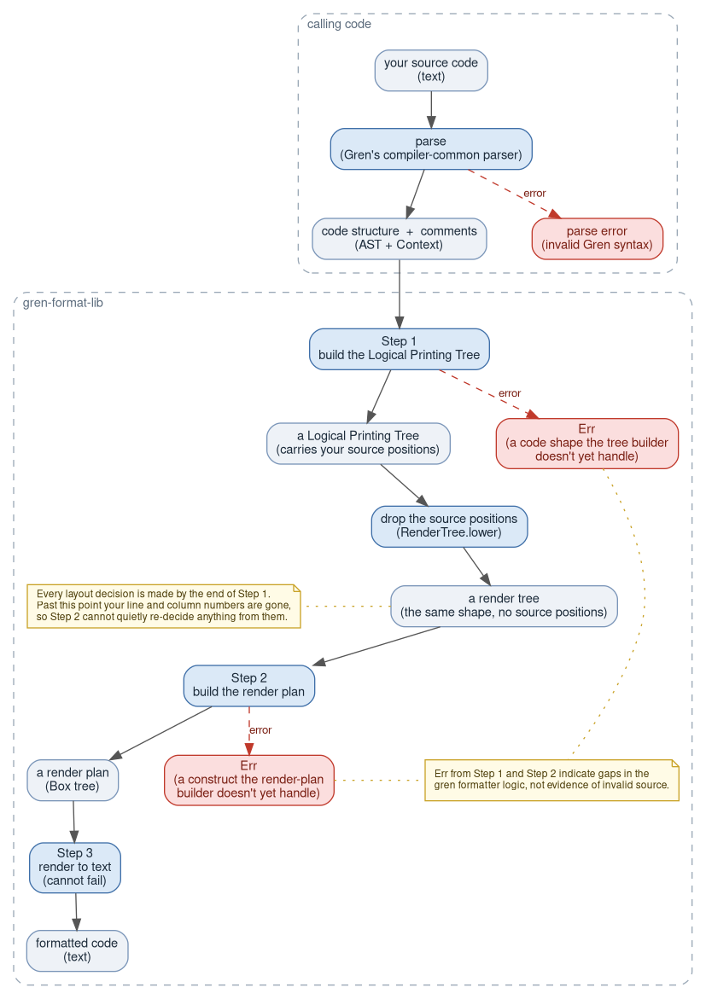

# The Gren Formatter Library

This package is the library behind `gren-format`: given a Gren source file,
it produces a formatted version of the same file — consistent spacing,
consistent indentation, comments and blank lines kept where they belong, and
also honoring the single-line/multi-line formatting the author of the source code chose.

This README covers the essentials — an overview, a worked example, and the
core formatting rules. Four companion documents go deeper:

- **[How the formatter works](docs/howItWorks.md)** — a conceptual,
  step-by-step tour of the pipeline (parse → Logical Printing Tree → render
  plan → text), with a worked example at each step.
- **[Gren Formatter Rules](docs/formatterRules.md)** — the full rule
  reference, with a before/after example for every construct.
- **[Comparison with elm-format](docs/elmFormatComparison.md)** — every place
  `gren format` deliberately diverges from `elm-format`, and why.
- **[Known limitations](docs/knownLimitations.md)** — compiler/parser bugs
  and comment-placement choices the formatter can't do better on today.

---

## Table of contents

- [Overview](#overview)
- [A worked example](#a-worked-example)
- [Gren Formatter Rules](#gren-formatter-rules)
  - [Background](#background)
- [Known limitations](#known-limitations)
- [Comparison with elm-format](#comparison-with-elm-format)

---

## Overview

Turning your source file into its formatted version happens through a pipeline
of steps, each step handing its result to the next. Any step can fail: a parse
error means the source itself is invalid Gren, while a failure in Step 1 or
Step 2 means the formatter hasn't been taught to handle some construct yet —
not that anything is wrong with your code. Either way, nothing is silently
mangled; the failure is reported instead:



**Before this library gets involved**, the compiler-common parser reads your file and
splits it into two pieces:

- the Abstract Syntax Tree (AST) — a description of which function calls which,
  what a `let` contains, what a type looks like, and so on
- a separate list of every comment you wrote, since these
  don't change what the code means, but they do matter for how it looks

This library's job starts from those two pieces and ends with the formatted
text. It never changes what your code means — it only decides how it looks
on the page.

For the full step-by-step tour of that pipeline — what a Logical Printing
Tree is, how a render plan is built from it, and a worked example at each
stage — see **[How the formatter works](docs/howItWorks.md)**.

---

## A worked example

One function, showing several rules at once: a `let` with multiple bindings,
a pipeline, a binary-operator chain that breaks at its loosest operators, an
`if`, a `when`, and a record update. (`order` is a record with `isMember`,
`hasCoupon`, `status`, and `total` fields; `Status` is a custom type that
includes `Cancelled`.)

```gren
summarize : Order -> Array Float -> Order
summarize order prices =
    let
        subtotal =
            prices
                |> Array.keepIf (\price -> price > 0)
                |> Array.foldl (+) 0

        eligible =
            order.isMember && subtotal > 100
                || order.hasCoupon && order.status /= Cancelled

        discount =
            if eligible then
                subtotal * 0.1

            else
                0
    in
    when order.status is
        Cancelled ->
            { order | total = 0 }

        _ ->
            { order
                | total = subtotal - discount
                , hasCoupon = False
            }
```

A few things worth noticing:

- `subtotal` is a pipeline: each `|>` step lands on its own line, indented +4
  from `prices` (see [Pipelines](docs/formatterRules.md#pipelines)).
- `eligible` is a binop chain the author wrote across two rows. `||` is the
  loosest operator here, so it's the only one that breaks; `&&` and `/=` bind
  tighter and stay glued to their operands (see
  [Binary operators](docs/formatterRules.md#binary-operators)).
- `discount`'s `if` branches always drop to their own line, whether or not
  they'd fit inline (see
  [If expressions](docs/formatterRules.md#if-expressions)).
- Both `when` branches return a record update, `{ order | ... }` — the
  `Cancelled` branch's field was written on one line and stays inline, while
  the other branch's two fields were written across rows and stay that way.
  Neither is about length; it's however the author wrote it (see
  [Record updates](docs/formatterRules.md#record-updates)).

Every one of these decisions follows from how the code was written, not from
any line-width target — see [Background](#background) below, and the full
[Gren Formatter Rules](docs/formatterRules.md) for the complete reference.

---

## Gren Formatter Rules

A guide to how `gren format` lays out your code — what it changes, what it
leaves alone, and why. This section covers the core ideas; for a rule
reference with a before/after example for every construct (module
declarations, records, pipelines, comments, and everything else), see
**[docs/formatterRules.md](docs/formatterRules.md)**.

### Background

The Gren formatter has one central idea: **your line breaks are your layout
decisions.** Write something on one line and it stays on one line. Put a line
break between items and the formatter keeps them on separate lines, normalizing
to one item per line.

There is **no page width.** The formatter never wraps a long line. A function
call with five arguments all on one row stays on one line no matter how wide it
is. A type signature written as one long line stays that way. If you want
something to break, put a line break in it.

The four core rules:

1. **One row → one line.** If you wrote a construct on a single row, the
   formatter keeps it on one line. Width is irrelevant.

2. **Multiple rows → one item per line.** If you put a line break between any
   two items of a construct, the formatter keeps every item on its own line.
   There is no "some items here, some there" shape — a line break anywhere
   means every item gets its own line.

3. **The formatter never changes what your code means.** It only moves
   whitespace. It never rewrites an expression, reorders anything, or edits
   text inside a comment or string.

4. **Formatting is stable.** Running the formatter on already-formatted code
   produces the same code back. Format once or ten times — same result. A
   torture test inserts a block comment into every inter-token gap of every
   fixture file, formats twice, and requires byte-identical output; it
   currently finds **zero** non-idempotent gaps across the whole test corpus.

A few things are **always fixed**, regardless of how you wrote them:

- A binding's value always starts on its own line (see
  [Function body](docs/formatterRules.md#function-body)).
- A `when` branch body always starts on its own line.
- An `if` branch body always starts on its own line.
- A blank line always separates `else`/`else if` from the branch above it.
- Two blank lines always precede every top-level declaration.
- One blank line always separates `let` bindings.
- A type alias always puts the aliased type on its own line.
- A custom type always puts the variant list on its own line(s).
- **Indentation is 4 spaces.** Always spaces, never tabs.
- On a `module` line, `exposing` always stays glued to the module name —
  never on its own line — though the exposed list itself can still spread
  across multiple rows below it (see
  [Module declaration](docs/formatterRules.md#module-declaration)).

Everything else follows your layout choices.

---

## Known limitations

`gren-format` has a handful of known gaps: a couple of inherited
compiler/parser bugs (one around field access on a record-update base, one
around aliasing an unparenthesized constructor pattern with `as`), a `when`
pattern shape the Haskell-based compiler can reject even though the formatter
produced it, and several comment-placement choices forced by a token (`=`,
`:`, `|`, `in`, a bracket's closing paren, an effect module's `where` block)
that the parser doesn't record a position for.

Full write-up, with a before/after example for each: **[docs/knownLimitations.md](docs/knownLimitations.md)**.

---

## Comparison with elm-format

Gren is a spiritual descendant of Elm, so `gren format` and `elm-format`
should agree on shared syntax unless there's a deliberate reason not to. Both
formatters share the same "your line breaks are your layout decisions"
philosophy — neither reflows code to fit a page width — so they agree almost
everywhere. Where they don't, it's a deliberate, catalogued choice: 23
divergences, covering things like blank-line placement around comments,
redundant parens (the most common difference on real code), and how a
multi-line operator chain breaks.

The full catalogue, with a real before/after example for every entry, is in
**[docs/elmFormatComparison.md](docs/elmFormatComparison.md)**.
