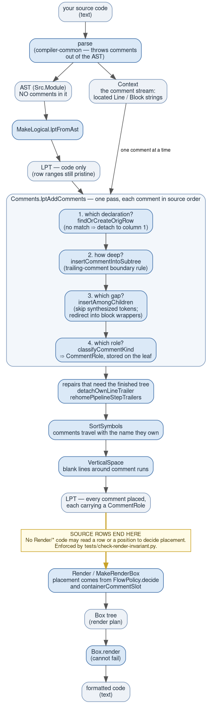
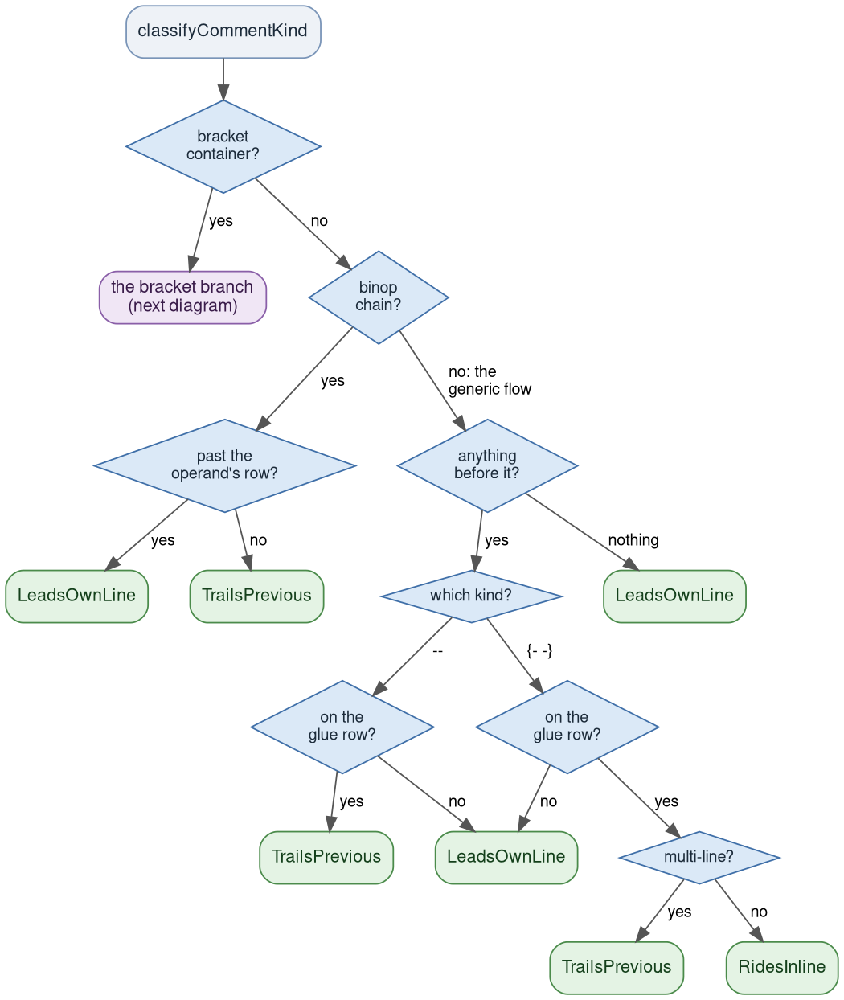
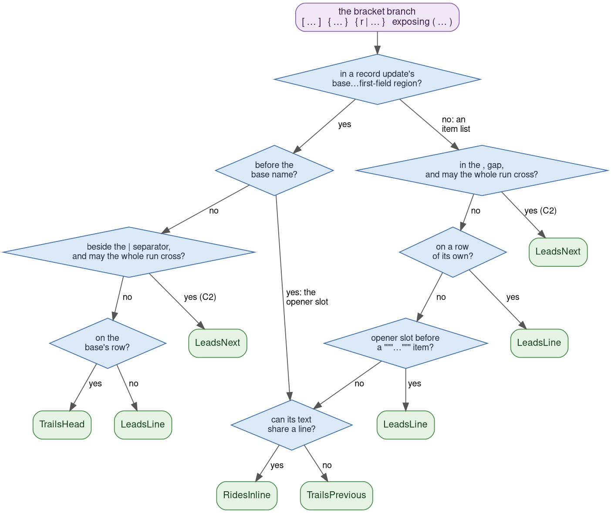

# The comment algorithm

How `gren format` places comments — the *implementation*, for people who work on
the formatter.

This is the companion to [How gren-format places your
comments](commentHandling.md), which is the reader-facing statement of *what*
the formatter does (rules C1–C7, with a before/after for each). This document
answers the next question: **how**, and — more to the point — **why we believe
it handles every case**.

**If you are not extending the formatter, read
[How gren-format handles comments](commentModel.md) instead.** It is the same
story at a tenth of the length: the problem, the one idea, the four questions,
runs, and why they are covered — without the function names, the war stories or
the gate numbers. This document is the full reference underneath it.

It is written for someone who has never touched this codebase. It assumes you
have read [How the formatter works](howItWorks.md) and know what the Logical
Printing Tree (LPT) and the Box tree are. If you are adding a new construct,
read [developer.md](developer.md) as well — it has the checklist; this
document has the model behind it.

---

## Table of contents

- [1. The problem](#1-the-problem)
  - [1.1 What the formatter is actually handed](#11-what-the-formatter-is-actually-handed)
  - [1.2 What "correct" means here](#12-what-correct-means-here)
  - [1.3 Why the fixed point is the hard half](#13-why-the-fixed-point-is-the-hard-half)
- [2. The one idea](#2-the-one-idea)
  - [2.1 `CommentRole`](#21-commentrole)
  - [2.2 The barrier](#22-the-barrier)
- [3. The pipeline](#3-the-pipeline)
- [4. Stage 1 — attachment](#4-stage-1--attachment)
  - [4.1 The fold](#41-the-fold)
  - [4.2 Phase 1 — which declaration?](#42-phase-1--which-declaration)
  - [4.3 Phase 2 — how deep?](#43-phase-2--how-deep)
  - [4.4 Phase 3 — which gap?](#44-phase-3--which-gap)
  - [4.5 Phase 4 — which role?](#45-phase-4--which-role)
  - [4.6 Repairs that need the finished tree](#46-repairs-that-need-the-finished-tree)
  - [4.7 The two passes that run after](#47-the-two-passes-that-run-after)
- [5. Stage 2 — rendering](#5-stage-2--rendering)
  - [5.1 The two decision functions](#51-the-two-decision-functions)
  - [5.2 The three shapes of comment](#52-the-three-shapes-of-comment)
  - [5.3 The glue primitives](#53-the-glue-primitives)
- [6. The three state machines](#6-the-three-state-machines)
  - [6.1 The attachment sweep — over the comment *stream*](#61-the-attachment-sweep--over-the-comment-stream)
  - [6.2 The separator machine — over a flow's *items*](#62-the-separator-machine--over-a-flows-items)
  - [6.3 The run scanner — over a *run*](#63-the-run-scanner--over-a-run)
- [7. Runs: any number, any kinds](#7-runs-any-number-any-kinds)
- [8. Why this covers every run — the argument, not the test suite](#8-why-this-covers-every-run--the-argument-not-the-test-suite)
  - [8.1 Placement is prefix-determined, so *n* is never an input](#81-placement-is-prefix-determined-so-n-is-never-an-input)
  - [8.2 The per-comment answer set is finite, and the classifier is total](#82-the-per-comment-answer-set-is-finite-and-the-classifier-is-total)
  - [8.3 "Any kind" is a three-letter alphabet, not an open axis](#83-any-kind-is-a-three-letter-alphabet-not-an-open-axis)
  - [8.4 Every local rule reads at most one neighbour](#84-every-local-rule-reads-at-most-one-neighbour)
  - [8.5 Where one neighbour is *not* enough](#85-where-one-neighbour-is-not-enough--and-why-that-is-still-bounded)
  - [8.6 The fixed point, restated for runs](#86-the-fixed-point-restated-for-runs)
- [9. A worked example](#9-a-worked-example)
- [10. Coverage: what each gate actually varies](#10-coverage-what-each-gate-actually-varies)
- [11. The functions to be careful about](#11-the-functions-to-be-careful-about)
- [12. Debugging a comment bug](#12-debugging-a-comment-bug)
- [13. Where the rules genuinely run out](#13-where-the-rules-genuinely-run-out)

---

## 1. The problem

### 1.1 What the formatter is actually handed

`gren-format` does not have its own parser. It uses the **production Gren
compiler's** parser (`gren-lang/compiler-common`), and that parser does what
every compiler's parser does: it throws comments away. They are not nodes in
`Src.Module`. There is nowhere in the AST for them to be.

What comes back instead is a second, parallel output — the parse `Context` —
holding a flat, source-ordered list of located comment strings:

```gren
type Comment
    = Line String     -- `-- like this`, text after the `--`
    | Block String    -- `{- like this -}`, text between the delimiters

-- and the context carries: Builder (Located Comment)
-- where `Located` is a start (row, col) and an end (row, col).
```

That is the entire input. For this source (`S.gren`):

```gren
module S exposing (sizes)


sizes =
    [ 1 -- one
    , 2
    ]
```

the formatter receives an AST for `sizes = [1, 2]` and, separately, this —
which you can print for any file with `--pre-context`:

```json
{ "comments": [ { "type": "line", "value": " one",
                  "start": { "row": 5, "col": 9 },
                  "end":   { "row": 5, "col": 15 } } ] }
```

Nothing connects the two. The comment does not know it is inside an array; the
array does not know a comment exists. All the algorithm has to work with is that
`(row, col)` pair and the row ranges of the tree it is placing the comment into.

Re-attaching them is this algorithm.

> **Contrast with elm-format.** elm-format's parser is its own, and it builds
> comments *into* the AST — an expression node physically holds the comments
> written around it. It never has to solve this problem, and much of its comment
> code has no counterpart here. We take the opposite trade: we are always
> parsing exactly what the compiler parses (a formatter that accepts a
> different language than the compiler is a bug factory), and we pay for it with
> the re-attachment pass described below. This trade is discussed at length in
> [developer.md](developer.md#why-the-architecture-is-comment-driven--contrasted-with-elm-format).

### 1.2 What "correct" means here

Three properties, and all three are gated (§10):

1. **Preservation.** Every comment in the input appears exactly once in the
   output, with its text unchanged and its kind unchanged. `gren format` never
   edits comment text. (It does re-*indent* the continuation lines of a
   multi-line `{- … -}`; that is layout, not text.)
2. **Faithful placement.** The comment lands beside the code the author wrote it
   beside — rules **C1–C7** in [commentHandling.md](commentHandling.md).
3. **Idempotency.** `format(format(x)) == format(x)`, byte for byte. Formatting
   is a fixed point.

Property 3 is not a nicety. `gren format` runs in editors on save and in CI. A
file that alternates between two spellings produces phantom diffs for ever, and
"the formatter is unstable" is the fastest way to lose a team's trust in it.

### 1.3 Why the fixed point is the hard half

Here is the whole difficulty in one picture. The formatter decides where a
comment goes **by looking at the row and column the author wrote it on** — that
is the only signal it has. But formatting *moves code onto different rows*. So
the second format asks the same question of different evidence.

Concretely, the recurring failure looks like this:

```
you wrote:                  format¹ produced:        format² produces:

v =                         v =                      v =
    fn a b {- c                 fn a b                    fn a b
   second -}                    {- c                 {- c
                                   second -}            second -}
```

Format¹ read "the comment is on the declaration's last row" and rendered it at
the call's indent. But a multi-line comment cannot sit *on* that row — it brings
its own newlines — so it landed **below** the declaration. Format² now reads a
comment written below a declaration, which is a different question with a
different answer (detach to column 1), and the file has two spellings.

Every comment bug this project has fixed is a variation on that sentence: **a
placement decided from a fact the formatting itself invalidates.** Keep it in
mind; §4 and §5 are largely a catalogue of the places where that can happen and
what each does about it.

(That particular shape is fixed — today's format¹ emits the column-1 form
directly, which is `detachOwnLineTrailer`'s whole job; see §4.6. It is shown
here because it is the *archetype*, and because the general strategy it forced
is the subject of the next section.)

---

## 2. The one idea

### 2.1 `CommentRole`

Every comment's placement is decided **exactly once**, in the Logical stage,
while the source rows are still the author's, and the answer is stored on the
comment leaf as a `CommentRole`. The renderer reads the stored answer. It never
recomputes it.

```gren
type CommentRole
    = TrailsPrevious   -- glue onto the previous sibling's last rendered line
    | LeadsOwnLine     -- own line, at the current flow/body indent
    | LeadsNext        -- belongs to the sibling AFTER an unrecorded separator
    | TrailsHead       -- glue onto the container's head (a record update's base)
    | RidesInline      -- rides mid-line without breaking it (`f {- k -} x`)
    | LeadsInline      -- glued to the FRONT of a declaration (`{- c -} import Qux`)
    | Standalone       -- a detached top-level comment, its own column-1 node
```

The full docstring lives beside the type in
`src/Formatter/Logical/LogicalPrintingTree.gren` and is the normative statement
of what each role means; do not restate it elsewhere, extend it there.

You can see the roles for any file:

```bash
node ../gren-format/app --lpt MyFile.gren     # JSON; each comment leaf has "role"
```

Here is one file exercising all seven. (Every example in this document was
produced by running the formatter; this one's roles are `--lpt`'s own output.)

```gren
module Ex exposing (a, b)

{- c -} import Qux

import Dict {- inline -} as D

a rec =
    { rec -- about the base
        | alpha = 1
    }

b =
    let
        base =
            -- start here
            1
    in
    [ base -- the seed
    , 2, {- two -} 3
    ]

-- detached below b
```

| comment | role |
|---|---|
| `{- c -}` before `import Qux` | `LeadsInline` |
| `{- inline -}` in `import Dict … as D` | `RidesInline` |
| `-- about the base` | `TrailsHead` |
| `-- start here` | `LeadsOwnLine` |
| `-- the seed` | `TrailsPrevious` |
| `{- two -}` | `LeadsNext` |
| `-- detached below b` | `Standalone` |

### 2.2 The barrier

The corollary of "decided once" is a hard architectural rule:

> **No code under `Formatter/Render/` may read a source row or position to make
> a layout or comment-placement decision.**

Placement is the stored `CommentRole`. Verticality is the *rendered box shape*
(`isSingleLine` on a box that has already been built), never "did the author
span rows". The renderer's remaining questions about a comment are about its
**text** — can this text share a line? — which is a property of the string, not
of where it sat.

This is enforced, not merely documented: `tests/check-render-invariant.py` runs
first in `run-tests.sh`, greps `Render/*` for row/position accessors and fails on
any outside a small allowlist of genuinely structural helpers. A new
render-side row read is almost always a regression back toward the oscillation
class above.

Where a renderer *does* need to know something structural about a comment, it
asks a predicate that reads LPT shape and comment text only —
`NodeClassify.commentEndsItsLine`, `commentTextCanRide`,
`subtreeEndsWithMultilineBlockComment`. Each of those docstrings says explicitly
that it reads no rows, because that is the property that lets it live in
`Render/`. Better still is a fact the *rendered box* carries, which no predicate
has to mirror: see `B.endsOpen` in §5.2.

---

## 3. The pipeline



*(Source: `docs/diagrams/comment-pipeline.dot`; regenerate with
`docs/diagrams/generate.sh`, which needs graphviz.)*

In words:

1. `MakeLogical.lptFromAst` builds the LPT from the AST **alone**. At this point
   there are no comments in the tree, and every node's row range is exactly what
   the author wrote.
2. `Comments.lptAddComments` folds over the comment stream in source order,
   placing each one. Four phases per comment (§4.2–§4.5), plus one re-decision
   for the neighbour a new comment has just joined in a gap
   (`repairTornGapRun`, §7's R2).
3. Two repairs run over the finished tree, for placements that only become
   wrong once you can see the whole thing (§4.6).
4. `SortSymbols` reorders exposing lists and import groups — comments have to
   travel with the names that own them (§4.7).
5. `VerticalSpace` inserts blank lines, which is a comment question too: a
   comment run is a unit and the gap belongs to the run, not to its first member
   (§4.7).
6. Everything below the barrier renders from stored roles (§5).

---

## 4. Stage 1 — attachment

All of this is `src/Formatter/Logical/Comments.gren`. It is the single largest
module in the formatter (~3,000 lines), and roughly two thirds of that is
docstrings explaining why a branch exists. Read them; nearly every one names the
shape that broke without it.

### 4.1 The fold

The entry point:

```gren
lptAddComments : Ctx.Context -> LPNode -> LPNode
```

It folds `addOneComment` over the comment stream, threading a `CommentState`:

```gren
type alias CommentState =
    { settled : Builder.Builder LPNode   -- root children no later comment can reach
    , target  : Maybe LPNode             -- the one that might still receive comments
    , rest    : Array LPNode             -- everything after `target`
    }
```

This shape is a performance fix, and it matters on real files: comments arrive
in row order and the root's children are already in sorted, non-overlapping row
order, so once a comment's row passes a child, no *later* comment can reach that
child again. Retiring it into `settled` (an `Array.Builder`, amortized O(1))
makes the whole sweep O(n + m) instead of O(n²) on a file that is mostly
top-level comments.

`addOneComment` has one special case before the generic path:
`tryLeadingGluedAttach`, which recognises a **block comment glued to the front**
of a top-level declaration — `{- c -} import Qux` — and attaches it as a leading
child with role `LeadsInline`. It keys on the comment's **end** row (so a
multi-line comment whose last row carries the keyword is recognised too), where
everything else keys on the start row. Getting this wrong doesn't just misplace
the comment: a comment that fails to travel with its import breaks an import run
in two when the imports sort.

Everything else goes through `addCommentGeneric` → the four phases.

### 4.2 Phase 1 — which declaration?

`findOrCreateOrigRow row stype children`

The root's children are one `OriginalRows` node per top-level declaration, each
carrying a `{ first, last }` source-row range. Scan for the one whose range
covers the comment's row.

**If none does, the comment detaches**: a fresh `OriginalRows` at column 1 is
spliced in at the sorted position, and the comment's role is preset to
`Standalone`.

That is a deliberate, load-bearing choice, not a fallback. A comment written on
its own line below a declaration is **never** attached to that declaration. Why:
column 1 is trivially a fixed point — it cannot drift — whereas any rule that
claims such a comment for the construct above has to place it at some indent,
and then re-derive the same claim from an indent that formatting has moved. An
earlier design did exactly that (a `columnClaim` rule) and it drifted leftward a
few columns per format. elm-format detaches these too.

```gren
-- you write:
b =
    1
    -- detached below b


c =
    2
```

```gren
-- gren-format writes (column 1, and stays there for ever):
b =
    1
-- detached below b


c =
    2
```

### 4.3 Phase 2 — how deep?

`insertCommentIntoSubtree commentNode row col node`

Recursive descent. At each level, pick the deepest child that owns the comment:

```gren
childOwnsComment =
    childHasBody
        && (((subtreeContainsRow child row || elasticTailOwnsComment)
                && not (subtreeStartsAfter child row col)
            )
                || commentAfterBracketOpen
           )
        && not laterSiblingClaims
        && not trailingCommentEscapes
```

Four questions, and each one is a class of bug that was found the hard way:

- **`subtreeContainsRow` / `subtreeStartsAfter`** — plain row containment, plus
  "a child that starts after the comment is never its owner". Row containment
  alone is not enough because sibling subtrees routinely overlap on a row.
- **`laterSiblingClaims`** (`anyLaterSiblingStartsAtOrBefore`) — if a *later*
  sibling's first real token is at or before the comment, this child's apparent
  overlap is a false positive and the comment really sits between the two. The
  canonical shape is two record types straddling a `->` in a signature.
- **`commentAfterBracketOpen`** — a comment written just past a `[`/`{`
  (`[ {- c -} 1, 2 ]`) *looks* like it comes before the container, because a
  bracket has no leaf of its own and the subtree appears to start at the first
  item. The recorded opening position (`lpnBracketStart`) is what says otherwise.
  **Only a bracket and a binary operator carry a recorded position in the Gren
  AST**; everything else the parser discards (see §4.5). So "inside or outside
  this container" is one of the few things we genuinely *know* rather than
  choose.
- **`trailingCommentEscapes`** — the inner half of the trailing-comment boundary
  rule, below.

#### The trailing-comment boundary rule

This is the single most important rule in the descent, and it is the direct
answer to §1.3.

A comment that merely *trails* a node's last token must **not** be sucked inside
that node — it belongs beside the node, at the enclosing level. The rest of this
section is why, since "it would oscillate" is an assertion until you can say what
forces the move.

**When does this even come up?** The guard fires in one specific situation:
the comment's row *is* inside the child's row range, but the comment sits past
the child's last token. Given that ranges are `min..max` rows, that means the
comment was written **on the child's last row, after everything on it** — the
one place where "inside this node" and "after this node" are both readable.

Here is that shape. A parenthesized lambda, with a multi-line comment written on
the body's row:

```gren
-- you write:
b =
    (\q ->
        body q {- c
   second -}
    )
```

```gren
-- gren-format writes (the comment belongs to the PAREN — it renders below the
-- body, at the paren's own column, which is `(`+1):
b =
    (\q ->
        body q
     {- c
        second -}
    )
```

The alternative — the one the guard rules out — is to let the comment descend
into the lambda body it was written on, which would render it a level further in,
at `body`'s column.

#### Why format² cannot simply keep that

The natural objection is: so what? If format¹ puts the comment at the body's
column, why can't format² just leave it there?

Because **format² does not *keep* anything.** It has no memory of format¹ and no
record of what owned the comment. It re-derives every placement from the text in
front of it. So the real question is whether that text still contains the
distinction — and it does not. Once the comment is on a row of its own, the only
surviving trace of "this belonged to the lambda body rather than to the paren"
is the comment's own indentation, and **indentation is not an input to
placement.** That is not incidental; it is a separately gated property of this
formatter (`fuzz-whitespace.py`: `format(perturbed whitespace) ==
format(original)`).

You can watch that directly. Feed the formatter the same comment at three
different columns — the paren's, the lambda body's, and one that means nothing at
all:

```gren
-- A: at the paren's column
b =
    (\q ->
        body q
     {- c
        second -}
    )
```

```gren
-- B: at the body's column — i.e. exactly what "descend into the lambda" emits
b =
    (\q ->
        body q
        {- c
           second -}
    )
```

```gren
-- C: at no meaningful column at all
b =
    (\q ->
        body q
                    {- c
                       second -}
    )
```

All three format to **byte-identical output**, and that output is A. B is exactly
what the descending version would have emitted, and it formats straight back to
the paren's column. This is not a prediction about what format² would do; it is
the shipped formatter, and it takes ten seconds to re-run:

```bash
for f in A B C; do node ../gren-format/app --show $f.gren; done   # three identical outputs
```

Note what the three-way collapse proves, which is more than the one case: the
output column here is a function of the **structure alone**. So it does not
matter what column the descent would have chosen — *any* placement other than
the one the enclosing structure derives is undone by the next format, and
`format(format(x)) ≠ format(x)`. The boundary rule is what makes format¹ commit
up front to the placement format² is going to derive anyway.

The same argument in one sentence: **format² can only keep what it can
re-derive**, and after the comment takes a row of its own there is nothing left
in the file to re-derive "inside the lambda" from.

#### The same rule, without any oscillation

Not every case of this is about idempotency. `RecordUpdate` is on the
never-swallow list for a plainer reason:

```gren
-- you write, and gren-format keeps (the comment is about the record):
v =
    fn a { r | x = 1 } {- note -} b
```

The comment sits past the `}`, on the record's last row — the guard's exact
trigger. Before `RecordUpdate` was on the list, this descended and rendered as:

```gren
v =
    fn a { r | x = 1 {- note -} } b
```

A note about the record, migrated inside the braces, where it now reads as a
note about the field.

And that output is perfectly **stable**. Feed it back to today's formatter and
it comes out unchanged, exit 0 — meaning it parses, preserves the AST, and is
its own fixed point. Every idempotency gate in this repo passes it. It is simply
*wrong*, under rule C1: the author wrote the comment outside the braces and the
formatter moved it in.

So the boundary rule is not only an idempotency device. Half of what it protects
is meaning, and that half is invisible to every gate that compares the formatter
against itself — which is why §10's coverage argument leans on the elm-format
oracle and the generator's oracles, not just on the fuzzers.

Three tests make a comment stay outside:

| test | what it catches |
|---|---|
| `boxKeepsTrailingCommentOutside child` | box kinds that must never swallow a trailing comment |
| `nextSiblingIsBoundary` | the next sibling starts a new flow item — `in`, `else`, the next `let` binding (`IndentedBlock`), the next `when` branch (`WhenBranch`) |
| `containerTailKeepsCommentOutside` | a multi-line comment past the last thing a paren wraps, or past any item of a bracketed container: it belongs to the container, not to that item |

`boxKeepsTrailingCommentOutside` is **the single declared list** of such box
kinds. If you add a construct that needs this rule, add it there rather than
threading a new predicate into the guard:

| box kind | why |
|---|---|
| `AcrossOrVertical` | a function-call / argument flow |
| `IfCondition` | an `if` / `else if` condition |
| `PrefixGlue` | a `\`-glued lambda head or a unary `-` — matters even mid-flow, where the next parameter's flow separator would otherwise shift that parameter by a column |
| `ParenBlock` | a parenthesized expression |
| `AllAcrossOrAllVertical` / `AlwaysVertical` | a bracketed item list: a comment past the closing bracket is a sibling, not an item |
| `RecordUpdate` | `{ base \| f = v }` and the extensible record type — same rule as the bracket lists |

Note what `nextSiblingIsBoundary` is *not*: it is deliberately **not** "any
following sibling". A container followed by a *continuation* — a record type
before its `->` — also has a following sibling, but a comment before that
record's `}` belongs inside it. Widening the test reintroduces
non-idempotency; this was tried.

#### The exception: still inside the brackets

`commentInsideTrailingBracket` overrides all of the above. A comment written
before a container's closing bracket genuinely belongs inside it, and it
descends:

```gren
fn a { r | a = 1 {- c -} } b     -- the comment is on the field: it descends
fn a { r | a = 1 } {- c -} b     -- the comment is on the record: it stays out
```

For this to work, **a container whose closing delimiter the parser discards must
register it** with `lpnBracketNode <closePos>`. This is the number-one thing to
get right when adding a construct. An author-written paren around a *type* went
years without one, and a comment before its `)` escaped the parens and then
landed on the far side of the `->` on reparse — a genuine non-idempotency, fixed
by registering the bracket.

#### Elastic containers

Some closes have no authored position at all because their column is *derived*.
The module header's `exposing ( … )` is the case: its `)` renders below whatever
the list holds. Those register with `lpnElasticBracketNode`, and two things
follow:

- `elasticTailOwnsComment` — an elastic container with nothing after it owns
  every comment that got this far, on any row. Row containment would leave a
  comment written on the row *below* a flat list outside it, where it renders
  glued onto the header; reparsing that puts it back inside. Same shape, both
  spellings, one answer.
- `lpnExtendElasticBracket` — placing a comment inside grows the derived close
  *below* it, and `applyCommentToOrigRow` grows the declaration's own row range
  to match. Without that, the **next** comment of a trailing run reads as past
  the declaration and detaches to column 1 while its neighbour stays put.

An effect module's `where { … }` block has a second derived close, recomputed by
`moduleWhereCloseRow` for the same reason. It is deliberately *not* elastic:
"anything reaching this container is inside it" is true of the exposing list
(nothing follows it) and false here, because `exposing (..)` does.

### 4.4 Phase 3 — which gap?

`insertAmongChildren containerBox commentNode row col children`

The descent has settled on a node; now, between which two of its children does
the comment go? Count how many children end before `(row, col)` — then apply
three adjustments:

**a. Skip synthesized tokens.** Nodes the parser never gave a position
(`SynthesizedText`: a generated `->`, the `in` of a `let`, `else`) are invisible
to ranges, and a comment must never be spliced between a real token and its
synthesized neighbour. The skip walks forward over them.

This skip is what carries a comment trailing the last `let` binding *past* the
position-less `in`, down to the body column:

```gren
-- you write:
f =
    let
        a = 1
        -- after the last binding
    in
    a
```

```gren
-- gren-format writes (the comment lands below `in`, leading the result):
f =
    let
        a =
            1
    in
    -- after the last binding
    a
```

That is a **deliberate divergence** from elm-format, not a gap. `in` has no
position, so "before `in`" and "after `in`" are literally the same input;
scoping the skip to keep the comment with the bindings makes it *oscillate*
(verified: same-row → own-line at the binding indent → reparses as no-longer
same-row → back to the body column). Below `in` is the only stable-and-correct
rule.

**b. The `BodyBlock` guard.** "Position-less" is judged by `lastRealPosition`,
with one exception: a `BodyBlock` is never skipped. A `BodyBlock` wrapping an
*empty* value (`[]`, `{}`) has a real opening position but no last position, so
it looks skippable and a leading comment sails past the value to render
`[] {- note -}`. If that value later gains an inside comment it becomes
non-empty and absorbs the stranded one on reparse.

**c. Redirect into block wrappers.** If the comment lands immediately before a
wrapper that starts its content on a fresh line, push it *inside* as the first
child, so it renders at the body's own column instead of gluing onto the head:

| wrapper | redirected? |
|---|---|
| `IndentedBlock` (a `let` binding's value, a `when` branch's body) | always — **except inside a bracket container** |
| `BodyBlock` **as a declaration's value** (`isDeclValueContainer`) | always |
| `BodyBlock` elsewhere (an array item, a step body, a call argument) | only when the comment cannot ride the row |
| `PipelineStep` | only when the comment cannot ride the row |
| `SoftIndentedBlock` (a lambda body on the `->` row) | only a `--` |

The split in the last three rows is rule **C3** — *a comment never forces a
break*. `seed |> f |> g` stays on one row, so a `{- c -}` written between the
seed and the operator has a flat line to ride and belongs on it. Redirecting it
inside made it the step's first child, where nothing precedes it, so it
classified `LeadsOwnLine` and forced the whole chain vertical — line breaks the
code never needed. The `SoftIndentedBlock` row is the mirror: a `--` *does* end
its line, the body is forced onto the next row regardless, and a reparse reads
that as an `IndentedBlock` — whose arm redirects. So leaving the `--` outside
emits a shape that reparses into the other structure and moves.

Read those arms as one rule: **redirect exactly when the body cannot share the
head's row anyway.**

The bracket exception in the first row is that rule again, and it is worth
reading because the arms state their premise as a fact about the *box* when it is
really a fact about the *container*. "This body always starts a line of its own"
is true of an `IndentedBlock` holding a `let` binding's value and false of the
same box holding a **record field** — `folderInsertRecordField` builds a
lambda-valued field as an `IndentedBlock`, and inside a bracket that box is an
**item**, which renders after the container's `, `. Redirected inside, a comment
written in the `,` gap stacked above `fld =`; the reparse read it as own-line and
moved it in front of the separator, for ever. Every other field shape had always
rendered it `, {- c -} fld =`. The same premise error one constructor over is
what the `BodyBlock` row's `isDeclValueContainer` gate exists for.

### 4.5 Phase 4 — which role?

`classifyCommentKind containerBox commentNode before after row -> CommentRole`

The splice point is known and the neighbours are in hand. This is where the
placement is decided, and the criterion for the decision is stated in the
function's own docstring:

> A `CommentRole` is a reparse fixed point: the row it is decided from equals the
> row it renders on, so a reformat re-derives the same role.

Every branch here should be read against that sentence.

#### The unrecorded-separator problem (rule C2)

Of everything that can separate two pieces of an expression, only **a binary
operator** and **a bracket** survive parsing with a position. All of these are
gone:

```
=    :    |    ,    ->    if / then / else    when / is    let / in
an import's `as` and alias name
```

So `x {- c -} = y` and `x = {- c -} y` arrive as *the same three facts*: where
`x` ends, where the comment is, where `y` starts. The formatter cannot tell them
apart, and it must not look at whitespace width (formatting must not depend on
your spacing). One of the two spellings has to move.

The rule is: **the comment leads what follows the separator** — role
`LeadsNext`. Making that a stored role, rather than a thing each renderer
re-derives, is what stops a comment from flipping sides of an invisible `,`
between formats.

C2 has one documented exception and three documented preferences, all in
[commentHandling.md](commentHandling.md#c2--when-the-parser-doesnt-record-the-punctuation-the-comment-leads-what-follows).
The exception, in code, is `leadsAcrossItemSeparator`: it applies only to a
**single-line `{- -}`**. A `--` ends its row, so it reads as a note about that
row, and at a line-*leading* separator (`,`, a union's `|`, a record update's
`|`) a comment above one strands nothing. `[ apple -- the red one` ⏎ `, banana`
is the idiom real code uses — unanimously, in `core/` and `compiler-common/` —
and is also what elm-format emits.

#### The three branches

`classifyCommentKind` dispatches on the **container**, because the glue rule
differs by container and the differences are real:

```
container is a bracket list / record update   →  the permissive rule
container is a binop chain (Binop / OpAndRhs) →  the operand rule
anything else (the generic flow)              →  the coarse rule
```

- **Bracket branch** (`isBracketContainerBox`) — permissive: a comment on the
  same row as the previous item trails it, whatever kind of item that was; an
  own-row one leads its own line. These comments render through
  `commentBracketListBox`, never through the generic flow, so they get their own
  branch. The record update is a sub-case with its own arm, because its children
  are its *fields* — the base name is not a child at all, so a comment beside it
  needs `TrailsHead`, and the base's recorded position is what separates the
  opener slot (`{ {- c -} rec`) from the ambiguous `|` slot.
- **Binop branch** — a same-row comment trails the operand; a later-row one
  leads its own line at the operator indent. "Later row" is measured from
  `chainedRefRow`, not from the last operand: the last operand's row **grown
  through any comment run written on from it**, because a multi-line `{- … -}`
  closes several rows below its `{-` and what the author wrote after that `-}`
  sits beside it, not on a line of its own.
- **Generic flow** — the coarse rule, split by comment kind:
  `classifyLine` for a `--` and `classifyBlock` for a `{- -}`, each consulting a
  per-box-kind table of "what row does a following comment glue onto":
  `prevLineGlueRow` and `prevBlockGlueRow`.

Here is the whole function as a decision tree, in two halves — the branch
dispatch plus the two simpler branches first, then the bracket branch. Every
leaf is a `CommentRole`.

**Half 1 — the dispatch, the binop branch, and the generic flow:**



The diamonds, in code terms:

| in the diagram | in `Comments.gren` |
|---|---|
| bracket container? | `isBracketContainerBox containerBox` |
| binop chain? | `containerBox` is `Binop _` or `OpAndRhs` |
| past the operand's row? | `row > chainedRefRow` — the last non-comment operand's row, grown through any comment run written on from it |
| anything before it? | `before` is non-empty (`prev`) |
| which kind? | `SingleLineComment` → `classifyLine`, `BlockComment` → `classifyBlock` |
| on the glue row? (`--`) | `row == prevLineGlueRow prev`, or the previous node is elided, or `headerTailGlue` |
| on the glue row? (`{- -}`) | `row == prevBlockGlueRow multiline prev`, or `headerTailGlue` (single-line only) |
| multi-line? | the comment's own text contains a newline |

**Half 2 — the bracket branch:**



| in the diagram | in `Comments.gren` |
|---|---|
| in a record update's base…first-field region? | `isRecordUpdateBox containerBox && Array.all isCommentNode before` |
| before the base name? | `commentPrecedesUpdateBase` — the base's start position is recorded, so this is a fact, not a guess |
| beside the `\|` separator, and may the whole run cross? | `leadsAcrossUpdateSeparator` — a single-line `{- -}` on the base's row or the first field's row, **and** `gapRunCrossesTogether` |
| on the base's row? | `row == updateBaseRow` |
| in the `,` gap, and may the whole run cross? | `leadsAcrossItemSeparator` — a single-line `{- -}` on the previous item's row or the next item's row, **and** `gapRunCrossesTogether`; **never** in an exposing list |
| on a row of its own? | `bracketPrevRow < 0 \|\| row /= bracketPrevRow` (`bracketItemRow` keys a previous comment by its *last* row) |
| opener slot before a `"""…"""` item? | `Array.isEmpty before && nextItemBlocksFrontGlue` — front-gluing there would break the string's equal indentation and stop the output parsing |
| can its text share a line? | `bracketKindRole` — a single-line `{- -}` can; a `--` or a multi-line `{- … -}` cannot |

Two roles never appear as leaves here, because they are decided before this
function runs: **`Standalone`** (`findOrCreateOrigRow`, when no declaration's row
range covers the comment) and **`LeadsInline`** (`tryLeadingGluedAttach`, a block
comment glued in front of a declaration).

*(Sources: `docs/diagrams/comment-classify-flow.dot` and
`comment-classify-bracket.dot`.)*

Four things to read off them:

- **Every path ends in a role.** There is no fallback, no "unknown", and no
  branch that defers to the renderer. That totality is what §2.1's "decided
  exactly once" means in practice, and §8.2's half of the completeness argument.
- **The two C2 diamonds are the only ones that ask about the comment's
  neighbours rather than about the comment.** `gapRunCrossesTogether` is the
  conjunct that makes them all-or-nothing over the run (§7's R2); everything else
  on both diagrams reads this comment's own position, kind and text.
- **Every row test in them is the same question** — *is the comment on the row the
  thing before it ends on?* — and the branches differ only in how that row is
  computed: `bracketItemRow` in a bracket list, `chainedRefRow` in a binop chain,
  `prevLineGlueRow` / `prevBlockGlueRow` in the generic flow. (Rule C2's arms ask
  it of the row *after* the separator as well, which is what makes them stable in
  both authorings.) This is the last time a source row is consulted for this
  comment — everything downstream reads the role.
- **The kind is never the question of *which code owns it*.** That is settled by
  position, in phases 2 and 3, before this function runs. Kind decides only
  whether the comment can share the owning code's line — and where that does move
  a comment (the block-wrapper redirects of §4.4c), it is because "can it share
  the line" is precisely what is at stake there too.

The two glue-row tables the generic flow consults — `prevLineGlueRow` and
`prevBlockGlueRow` — are the heart of the coarse rule, and the difference
between them is the whole point:

```
                                  --  glues?   {- -} glues?
after a bare token                 yes          yes
after a plain call `foo bar`       yes          NO   (stays own-line)
after a single-line bracket        yes          NO
after a multi-line bracket's close yes          yes
after a `"""…"""`                  yes          yes
after a lambda head                NO           NO
```

A `--` runs to end-of-line, so it is *unambiguously* trailing and glues in
strictly more places than a block comment can. This asymmetry matches
elm-format, and it is why `foo bar -- c` is a fixed point while `foo bar` ⏎
`{- c -}` is too.

Both tables key a **previous comment** by its **last** row, not its first, so
that a comment written after a multi-line comment's `-}` trails the run instead
of leading whatever is below.

#### The header's position-less tail

One branch deserves its own note because it looks like a special case and is
not: `headerTailGlue`. An effect module's header renders tokens — the `where
{ … }` block's `}`, the `exposing (..)` after it — that carry **no position at
all**, because their real column depends on the untracked width of the block. A
comment the author wrote on those rows has no recorded token anywhere on its
row, so the ordinary rule reads it as own-line while the format that produced
that row had glued it.

The fix widens the fallback from one row to the header's whole position-less
tail, under three conditions each of which is load-bearing (the container is the
module line; nothing recorded follows except the exposing list; the row is at or
past the last recorded content and inside the declaration). It is scoped to
single-line comments, since only those can ride a header row at all.

The general lesson: **wherever the renderer emits a token the parser did not
record, a comment on that token's row is a placement question rows cannot
answer.** Look for the structural fact instead.

### 4.6 Repairs that need the finished tree

Two passes run at the end of `lptAddComments`, over the whole tree. They exist
because their questions cannot be answered while placing one comment: they are
about what the *rendering* will look like, which you only know once every
comment is in.

**`detachOwnLineTrailer`** — §4.2's rule, asked of the tree instead of the rows.
`findOrCreateOrigRow` refuses a comment written on a row *below* a declaration.
But a comment written on the declaration's **last** row escapes that check — its
row is inside the range — and can still *render* below it, because a multi-line
`{- … -}` with no glue row classifies `LeadsOwnLine` and takes a fresh line.
That is exactly the §1.3 oscillation. So: once everything is placed, lift any
trailing run that renders own-line into the same column-1 `OriginalRows` the
reparse would give it. **Format¹ builds the tree format² would build.**

```gren
-- you write (the comment starts on the declaration's last row):
v =
    fn a b {- c
   second -}
```

```gren
-- gren-format writes (lifted to column 1 — and formatting it again is a no-op):
v =
    fn a b
{- c
   second -}
```

Its scoping is as important as its existence:

- The lift is a **suffix**, not the whole run. `peelOwnLineTrailingRun` splits at
  the earliest member that renders below the declaration and leaves everything in
  front of it where it was written. A run's leader can perfectly well glue onto
  the declaration's last row while a later member cannot, so asking the question
  of the *leader* — which is what this did until 2026-08-06 — keeps a whole run
  glued behind a leader that glues. (`firstRowOfItsOwn` is the scan that finds the
  cut; it is one of the three run state machines in §6.)
- The split has to live in the peel rather than in the caller, because the run is
  collected by descending through each node's last child: a kept prefix could not
  be put back afterwards without re-nesting comments the descent had already
  lifted out.
- **Two** things make a member render below, and they are different questions:
  `runRendersBelowDeclaration` (the member brings its own rows — `LeadsOwnLine`
  *and* a genuinely multi-line `{- … -}`), and **the member in front of it is a
  `--`**, which swallows the rest of its row so everything after it is on a later
  one whatever its own kind says. A `tailComment` field carries "this level's tail
  is a `--`" up to the level above, which is what the first member of an outer run
  has to know.
- Role alone is not "renders own-line" — the render layer keeps a single-line
  block comment inline regardless, which is why `[ 1 ] {- one -} {- two -}` stays
  put. Lifting on the role alone broke nine fixtures.
- A `--` is deliberately excluded from `runRendersBelowDeclaration` even though it
  also ends its row; several fixtures pin an own-line `--` staying at the
  construct's indent, and whether those should detach is a separate question with
  its own fixtures. Note it still *causes* a cut for the member after it — being
  a reason for somebody else to detach and being detachable are not the same
  test.
- The lifted suffix moves together, and only its first member becomes
  `Standalone` — a `-- c` glued behind it keeps `TrailsPrevious`, because that is
  the tree the reparse produces.
- `descendsForTrailingRun` limits how deep the peel looks: only **flow
  wrappers**, ones that render their children and nothing after them. A
  container that renders a closing delimiter does not qualify — the delimiter is
  not a node, so "no node after the last child" does not mean "no token after
  it". `{ rec | fld = x -- c` ⏎ `}` is the shape that trap was found on.

Each scope is a shape that is already a fixed point where the author put it, so
the lift must leave it alone. These three come back byte-identical:

```gren
-- a trailing run that GLUES stays on the closing bracket's row (C1: it belongs
-- to the code it was written next to):
a =
    [ 1
    , 2
    ] {- c
         second -}


-- a single-line {- -} renders inline whatever its role says, so it is not
-- "renders own-line" and is not lifted — nor is a second one chained onto it:
b =
    [ 1 ] {- one -} {- two -}


-- and the peel stops at a container that still has a `}` to render, so this
-- comment is the record update's, not the declaration's:
c rec =
    { rec
        | fld = x -- c
    }
```

(The `--` scope has no example here because it is a scoping *decision* rather
than a shape: a `--` that classifies `LeadsOwnLine` and renders below its
construct is left alone, and the fixtures that pin those live under a wrapped
import and a pipeline's last step.)

**`rehomePipelineStepTrailers`** — a pipeline step's trailing own-line comment
run renders below its step, which puts it *above* the next `|>`; and a comment
on its own row before an operator is, to a reparse, that operator's step's
*leading* comment. There is no other reading available, so format¹ must own it
there too.

This one needs the tree to see, because the repair does **not** change the
output — that is the whole point of it. Write a multi-line comment after a step
whose operand is a single-line paren (a paren gives a block comment no glue row,
so the comment classifies `LeadsOwnLine`):

```gren
-- you write:
v =
    seed
        |> Array.map (\c -> c.kind) {- multi
   line -}
        |> g
```

```gren
-- gren-format writes (the comment drops to the `|>` column, above the next step):
v =
    seed
        |> Array.map (\c -> c.kind)
        {- multi
           line -}
        |> g
```

Now ask the tree who owns it. This is `--lpt`'s JSON with everything but the box
types and the comment's own fields stripped out:

```
Pipeline
  UnbreakableText 'seed'
  PipelineStep
    UnbreakableText '|>'
    UnbreakableText 'Array.map'
    ParenBlock
      …the lambda…
  PipelineStep
    BlockComment ' multi\n   line '  role=LeadsOwnLine     ← here
    UnbreakableText '|>'
    UnbreakableText 'g'
```

The comment is the **first child of the second step**, ahead of that step's own
`|>` — not a trailing child of the first step, which is where the author wrote
it. That move is `rehomePipelineStepTrailers`, and step 2 is the owner a reparse
of the output derives: in those bytes the comment is on its own row before
`|> g`, and a comment on its own row before an operator is that operator's step's
leading comment. There is no other reading available.

The boundary is one operand kind away. Give the step a plain call instead of a
paren and the same comment finds a glue row, classifies `TrailsPrevious`, and
stays exactly where it was written:

```gren
v =
    seed
        |> Array.map fn {- multi
                           line -}
        |> g
```

```
Pipeline
  UnbreakableText 'seed'
  PipelineStep
    UnbreakableText '|>'
    UnbreakableText 'Array.map'
    UnbreakableText 'fn'
    BlockComment ' multi\n   line '  role=TrailsPrevious   ← stays in step 1
  PipelineStep
    UnbreakableText '|>'
    UnbreakableText 'g'
```

This one is worth studying because a renderer-only fix was tried first and was
not enough. Making both owners produce the same **bytes** for the run left
`glueLeading` reading a different run in each format — it asks
`commentTextCanRide` of the whole leading run, all-or-nothing, and with the run
split across two steps format¹ saw only the ridable `{- c -}` while the reparse
saw both. Same comment, same role, same rendering rule, different answer, for
ever. **Making two owners render alike is not the same as making the owner not
matter**; the owner also decides what else the comment is grouped with.

### 4.7 The two passes that run after

**`SortSymbols`** reorders exposing lists and import groups. A comment must
travel with the name that owns it, or `(a {- c -}, b)` and `(b, a {- c -})` land
on different bytes — and the same module written in two author orders must
format identically (this is checked by an oracle; §10). `takeSameRowTrailing`
chains a whole trailing run onto its name; `unfoldLastTrailing` handles the
closing-`)` pinning; `hoistBracketLeadingComments` handles a comment written
before the first item.

Note that an exposing list is the **one** bracket list whose items get
reordered, and it therefore models comment ownership the *opposite* way round
from C2 — a comment after a name is that name's. `leadsAcrossItemSeparator`
excludes it explicitly.

**`VerticalSpace`** inserts blank lines, and its comment-relevant part is
`computeDetachedBelow`: whether a node has a gap under it. The subtlety is that
**detachment is a property of the comment *run*, not of a node**, and has to
propagate up through an adjacent following comment.

```gren
-- you write:
{-| doc -} -- c

foo =
    1
```

```gren
-- gren-format writes:
{-| doc -}
-- c


foo =
    1
```

The two comments are one run, detached from `foo`, so the run gets the two blank
lines below it. Now look at what each pass sees. The `-- c` is written on the doc
comment's row, so on the **first** pass it is a *child* of that node and the
node's own rows cover both — that node can see the gap. Reparsed, the `-- c` is
its own column-1 node directly below, so the doc comment's next sibling is
adjacent and the gap belongs to somebody else. Asking per node gives two blanks
and then one; asking the *run* answers the same either way.

---

## 5. Stage 2 — rendering

Below the barrier the job is narrow: a comment's *placement* is already decided,
so the renderer only materializes it, plus answers the questions that are about
the comment's text.

### 5.1 The two decision functions

Everything goes through one of two functions in
`Formatter/Render/FlowPolicy.gren`:

- **`decide`** — how an item joins a *flow* (a call's arguments, a binop chain, a
  signature). Its input is `ItemFacts`, and that type is deliberately the
  **complete legal input set**: anything richer is "not extra precision, it is a
  divergence generator". For a comment the facts are its kind and its
  `CommentRole` — no rows. `decide` returns a `Placement` (`GlueSpace`,
  `OwnLine`, `SoftSep`, `BlockJoin`, …) and the next separator state.
- **`containerCommentSlot`** — where a comment sits among the children of a
  *vertical container* (a union body's variants, a record update's fields, a
  `when`'s branches, a bracket list's items). Four answers, in priority order:
  `LeadsOpener`, `LeadsFollowing` (rule C2), `GluesPrevious`, `StandsAlone`.

`containerCommentSlot` was extracted in August 2026 from four hand-written
if-chains that agreed only by inspection — one of them said so in a code comment
("mirrors `commentBracketListBox`'s `pending`"), an invariant asserted in prose
and enforced by nothing. The four containers still *materialize* the answer
differently (a `when` stacks its lead run and separates branches with blank
lines; a bracket list glues the run onto the item's front behind a `, ` prefix;
a union body has no prefix at all) — but they no longer classify differently.
**If you find yourself writing a fifth comment-slot if-chain, call this instead.**

The renderer's own state is one field:

```gren
type alias FlowState =
    { separator : NextSeparator }
```

`NextSeparator` has six values and is the machine §6.2 describes in full. The old
two-row state machine that re-derived *placement* at render time
(`prevRowBlock` / `prevRowLine` / `prevElided`) is gone; what is left carries only
"what has the row in front of me got on it", which is not a placement and cannot
be re-derived from rows.

`decide` is **total** — it returns a `Decision`, not a `Result` — so there is no
arm that can fail and no unhandled combination of item and state. The one item
kind it cannot receive (`WhenBranchItem`, whose nodes route through a dedicated
renderer) still carries a real policy rather than an error, so a routing change
cannot turn into a crash.

### 5.2 The three shapes of comment

Almost every remaining render-side question reduces to one table:

| | can code follow it on the same line? |
|---|---|
| `-- like this` | **no** — runs to end of line |
| `{- like this -}` on one row | **yes** |
| `{- like this` ⏎ `and this -}` | **no** — brings its own newlines |

The predicates that ask it, all in `Render/NodeClassify.gren`:

- `commentEndsItsLine` — the table itself. Shared by every "does this comment
  force a break" question so they cannot drift.
- `commentTextCanRide` — the same question about the comment's own text. **Not
  the same as `commentRidesInline`**, which asks the stored *role*. Every
  `RidesInline` comment is a single-line block comment; not every single-line
  block comment is `RidesInline` (the second comment of an opener run is
  `LeadsNext`). Three stale docstrings conflated the two and that conflation is
  the likely origin of two sibling arms in `commentBracketListBox` using
  different predicates for the same question.
- `commentBreaksFlowRow` — whether a comment among these siblings pushes a
  *later* sibling onto a new row. This one exists to keep a row-derived
  `forceVertical` honest: `insertCall`/`insertBinops` set that flag from AST
  rows, and the AST has no comments in it, so a construct written on one row is
  flagged `forceVertical = False` even when a comment inside it *will* break.
  Format¹ renders flat, the break happens anyway, and format² sees the later
  sibling on a later row and renders broken. Folding this predicate into the
  same decision makes format¹ commit to the shape format² will agree with.
  Note the **grain**: this is a question about a *gap*, so `audit-predicates.py`
  asks it of a whole comment run and not of one member. Asked per member it
  reported 8,527 lies that were not lies — in a run there is always another
  reason for the break, so a `--` over-claims (delete it and the other member
  still breaks the row) and a single-line `{- -}` that merely *occupies* a row
  under-claims. A claim whose direction is a pure function of the run's
  composition is a grain mismatch, not a layout bug.
- `literalCommentsRideFlatLine` — may a bracketed literal stay on one line?
And one fact that is **not** a predicate at all, because the rendered box
carries it: `B.endsOpen` — would gluing onto this box's last line land *inside*
a `--` and be silently swallowed? A `--` renders as a `Line.LineComment` leaf,
which survives every combinator that builds a line (all of them only prepend to
the left or stack above), so the box answers for itself. This used to be
`NodeClassify.subtreeEndsWithLineComment`, a walk down the LPT's right spine
that had to enumerate which container constructors emit a closing delimiter
after their last child — a mirror of the renderer, of the kind §5.2 exists to
warn about. A box needs no such list: `[ x -- c` / `]` ends in `]`.

It is what stops the formatter from emitting source that does not parse:

```gren
-- you write, and gren-format keeps (it may NOT collapse to one line —
-- the `]` would land inside the `--`):
c =
    [ lower + margin -- inclusive
    ]
```

The check lives in `ElmStructure.groupBox` / `extensionGroup`, which lay out the
flat form only if every child is `B.asJoinable` — and it is *every* child, not
just the last: a `--` in a middle item swallows the following `, ` just as
surely. Note the asymmetry that scopes it. A `--` may perfectly well END a
joined row (`people |> Array.sort -- note` is flat and correct), so the strict
test belongs only where something follows, which on a flat group is every child
and on a `joinInline` is not.

### 5.3 The glue primitives

Two mirrored helpers in `Render/BoxOps.gren`, and their asymmetry is deliberate:

- `glueCommentSuffix` — a trailing comment onto a box's last line. Uses
  `B.addSuffixBox`, which **pads the comment's continuation lines** by the glued
  line's rendered width, so a multi-line comment's body hangs under its own
  `{-`.
- `glueLeadingCommentPrefix` — a leading comment onto a box's front: the code's
  first line continues the comment's last line, the comment's earlier lines sit
  above, and the code's continuation lines stay **untouched at their own
  column**. The declaration's own layout must not shift.

One trap worth knowing about, because it cost a real bug: `Box.prefix` used to
measure the prefix with `lineLength 0`, i.e. *as if it began at column 0*. A
`Tab` in the Box IR advances to the next multiple of 4 **from where it stands**,
so a prefix containing tabs measures differently at column 6 than at column 0,
and the padded continuation lines drifted. The fix (`Box.blankLike`) pads with a
**blanked copy of the prefix line** rather than a count of spaces: every element
keeps its offset, so every `Tab` snaps identically at any starting column.
Freezing the tabs instead was tried and reverted — it fixes the width *and*
changes the emitted line.

---

## 6. The three state machines

Nothing in this algorithm iterates over "a run" as a whole object with a length.
Every part of it is a small machine that takes one thing at a time and carries a
bounded amount of state forward. That is not a stylistic note — it is the reason
§8's completeness argument works, so the three machines are worth naming
individually. Each one has a state set you can write out on one line.

### 6.1 The attachment sweep — over the comment *stream*

`lptAddComments` folds `addOneComment` over the whole file's comments, in source
order, carrying:

```gren
type alias CommentState =
    { settled : Builder.Builder LPNode   -- root children no later comment can reach
    , target  : Maybe LPNode             -- the one that might still receive comments
    , rest    : Array LPNode             -- everything after `target`
    }
```

The machine is a **monotone cursor**: comments arrive in row order and the root's
children are already in sorted, non-overlapping row order, so once a comment's
row passes a child, no *later* comment can reach that child again and it retires
into `settled`.

The performance argument for it is the obvious one — an `Array.Builder` push is
amortized O(1), so the whole sweep is O(n + m) rather than O(n²) on a file that
is mostly top-level comments. The *structural* consequence matters more, and §8
leans on it directly:

> When comment *k* is placed, comments *k+1 … n* are not in the tree yet.

So a comment's role is a function of the code and of the comments **written
before it**, and never of how many follow. A run of five is the same function
applied five times.

The price is that a decision genuinely needing a later member cannot be taken
in the fold at all, and the algorithm pays it in exactly two ways, both of them
named:

- **Re-decide on arrival.** `repairTornGapRun` re-asks any still-`LeadsNext`
  sibling the moment a comment lands next to it, by calling
  `classifyCommentKind` again over the children array that now holds the whole
  run. Only a role that is not yet final is re-asked, and re-running the
  classifier on an unchanged neighbourhood returns what it returned before, so
  this is idempotent by construction.
- **Repair the finished tree.** `detachOwnLineTrailer` and
  `rehomePipelineStepTrailers` (§4.6) run once, at the end, over everything.

Anything else that needs the whole run is a quantifier rather than a decision,
and there are three of those (§8.5).

### 6.2 The separator machine — over a flow's *items*

This is the one that materializes a run. `FlowPolicy.decide` is a transition
function: it takes the current `NextSeparator`, one item's `ItemFacts`, and
returns the item's `Placement` plus the next state. Six states:

| state | what it means about the row in front of the next item |
|---|---|
| `FirstItem` | nothing precedes |
| `FlowSep` | ordinary live content — the next item may share the row |
| `HardNl` | a block ended, or a comment glued onto an already-broken line |
| `AlreadyTerminated` | a `--` (or a single-line comment standing alone) ended the line |
| `TerminatedByBlockComment` | a multi-line `{- … -}` ended the line, and its `-}` row is glueable |
| `TerminatedByOwnLineComment` | the row holds **nothing but comments** |

What each item kind leaves behind:

| item | leaves |
|---|---|
| a plain token | `FlowSep` |
| `--` | `AlreadyTerminated` |
| multi-line `{- … -}` | `TerminatedByBlockComment` |
| single-line `{- -}` riding a live row | `FlowSep` |
| single-line `{- -}` that glued onto a hard-broken line | `HardNl` |
| single-line `{- -}` that opened a row of its own | `TerminatedByOwnLineComment` |
| single-line `{- -}` standing alone after a terminated line | `AlreadyTerminated` |
| `IndentedBlock`, `PipelineStep` | `HardNl` |
| `BodyBlock`, `SoftIndentedBlock` | `FlowSep` |

And what each state does to what comes next — the two columns being genuinely
different questions, which is the whole reason the state set is this size:

| state | next **token** | next **comment** |
|---|---|---|
| `FirstItem` | `AsFirst` | `AsFirst` |
| `FlowSep` | `SoftSep` | glues (`GlueSpace`) or takes its own row, by role |
| `HardNl` | `OwnLine` | glues or takes its own row, by role |
| `AlreadyTerminated` | `GlueNoSep` | glues if its role says the author wrote it there |
| `TerminatedByBlockComment` | `GlueNoSep` | glues onto the `-}` row, by role |
| `TerminatedByOwnLineComment` | `OwnLine` | glues or takes its own row, by role |

Three of these six distinctions were each bought with a bug, and they are the
reason this cannot be collapsed into "did something break the line":

- `AlreadyTerminated` vs `TerminatedByBlockComment` — a comment written after a
  `--` on the same row is *inside its text* and never becomes a node at all, so
  nothing may ever glue back onto a `--`'s line. A multi-line `{- … -}` has a
  closing row that a same-row trailing comment legitimately shares.
- `TerminatedByOwnLineComment` vs both — a row holding only comments must not
  space-join the next **token** onto it. Answering `FlowSep` there shifted a
  broken call's function name right while its arguments kept their column, and a
  call's arguments must be indented past the function token, so
  `\item ->` ⏎ `{- c -} fn` ⏎ `arg` **reparsed as** `(\item -> fn) arg`. That is
  an AST change, invisible to every idempotency check; `--show`'s AST comparison
  is what caught it.
- `HardNl` vs `FlowSep` after a comment that *glued* — a glued comment did not
  terminate its line, so `FlowSep` would space-join the next token onto it. For a
  `let` binding that is not merely wrong but unparseable: a binding must start at
  the block's column.

The `next comment` column is where rule **C7** lives at render time. Until
2026-08-08 `AlreadyTerminated` answered `GlueNoSep` unconditionally, which split
every authored one-row run into one row per member, and
`TerminatedByOwnLineComment` let a following comment merge *up*, which joined a
run the author had split. Both are now role-aware, which is to say: **gren never
moves a comment between rows.**

### 6.3 The run scanner — over a *run*

`firstRowOfItsOwn` is the smallest of the three and the easiest to read as a
machine. It walks a trailing comment run left to right looking for the first
member that renders below the declaration, carrying `{ index, prev, found }`:

```
state: still-on-the-declaration's-row  ──┐
                                         │  member brings its own rows
                                         │  OR the member before it is a `--`
                                         ▼
       cut found (everything from here down detaches)
```

Two states, and the transition reads exactly **one** neighbour: the member in
front of the one being examined. `endsItsRow` is that read, and it is true of a
`--` and of nothing else.

Note what is *not* here: no length, no lookahead, no "if the run has more than
two members". That is the shape every rule in this algorithm has, and §8 is the
argument that it is enough.

---

## 7. Runs: any number, any kinds

The question this document is really here to answer: what happens with *n*
comments of mixed kinds in one place? §8 argues *why* the answer is "the same
thing that happens with one"; this section is the five rules that make it so.

**R1 — The reference row grows through the run.** Whenever a placement asks
"what row does the thing before me end on", the answer counts any comment run
written on from that row. A multi-line `{- … -}` closes several rows below its
`{-`, and what the author wrote after that `-}` sits beside it:

```gren
-- you write, and gren-format keeps (both comments stay with `Mango`;
-- the block comment's continuation row is re-indented under its own `{-`):
fruit =
    [ Apple
    , Mango {- mango's
               comment -} -- and mango's trailing line comment
    , Pear
    ]
```

All three of these implement it, and they must agree: `prevLineGlueRow` /
`prevBlockGlueRow` (generic flow, key on the previous comment's *last* row),
`bracketItemRow` (bracket branch), `chainedRefRow` (binop branch). The binop one
was the last to learn it, and until it did, the second comment of a chain
dropped to its own row below the chain — where the reparse re-homed it to column
1.

R1 is also what keeps the *fixed-point* criterion true inside a run.
`classifyCommentKind`'s rule is "the row it is decided from equals the row it
renders on". For the first member that is the code's row; for the second it is
the first member's **last rendered** row, which is what R1 computes and what the
reparse will see. Drop R1 and the criterion still holds per comment and fails per
run.

**R2 — One gap is one attachment: the run crosses together or not at all.** Rule
C2 sends a comment past an unrecorded `,` / `|` to the item *after* it, and that
test (`leadsAcrossItemSeparator`) applies only to a single-line `{- -}` — a `--`
and a multi-line `{- … -}` both stay with the item above. Asked per member, a
mixed run in one gap therefore **tears in half**. So the question is asked of the
whole run, by `gapRunCrossesTogether`: it crosses only if every member would.

The two shapes below differ in nothing but the run's composition, and that is the
whole of what decides where both members land:

```gren
-- both members can cross, so the run crosses:
v =
    [ 1
    , {- a -} {- b -} 2
    ]


-- one member cannot, so neither does:
w =
    [ 1 {- a -} -- b
    , 2
    ]
```

Asked per member, the second one came out as `[ 1 -- b` ⏎ `, {- a -} 2` — the run
torn, and the author's **order reversed**. `repairTornGapRun` is the other half:
because comments attach one at a time (§6.1), a member can only see the ones
written *earlier*, so the earlier decision has to be re-taken once the run is
complete. It re-takes it by calling `classifyCommentKind` again over the children
array now holding the whole run, rather than naming a replacement role — the
fallback is `RidesInline` or `TrailsPrevious` depending on a branch above, and a
second copy of that choice is exactly the kind of mirror this repo has paid for.

**R3 — Once a run breaks, it stays broken.** If any comment in a leading run
cannot share a line, then *every* comment of the run stands on its own row, and
so does the body:

```gren
-- you write, and gren-format keeps:
c =
    [ {- 1 a
         1 b -}
      {- x -}
      1
    ]
```

Not this:

```gren
    [ {- 1 a
         1 b -} {- x -}
      1
```

Letting later members jump onto the item's line is not a fixed point: on reparse
`{- x -}` sits on the item's row rather than the run's, so format³ drops it back.
`glueLeadingCommentRun` implements this (its `firstBreak` index), and
`assembleBrokenWithComments` and `renderWhenBranchesBox` apply the same
all-or-nothing rule. elm-format agrees here.

**R4 — A run keeps the rows you gave it.** This is rule
[C7](commentHandling.md#c7--a-comment-keeps-the-rows-you-gave-it), and it is the
run's own layout as opposed to the code's: members written on one row stay on one
row, members written apart stay apart. It is enforced in the two arms of §6.2's
`next comment` column — `commentPlacement`'s `AlreadyTerminated` arm (which
otherwise splits an authored one-row run) and the inline arm's
`TerminatedByOwnLineComment` handling (which otherwise joins a split one). Both
were unconditional until 2026-08-08, each in the direction that *lost* the
author's rows, and each matched elm-format, which re-decides a run's rows from
the context around it. Keeping them is a deliberate divergence
([#30](elmFormatComparison.md#divergence-30)).

R4 is what makes the answer to "what about a run?" independent of where the run
sits. A rule that decided rows per context would need a case for every context a
run can appear in; this one has none.

**R5 — A run moves as a unit.** `detachOwnLineTrailer`, `SortSymbols`'
`takeSameRowTrailing`, and `VerticalSpace`'s `computeDetachedBelow` all treat
the run as the thing that has an owner, a sort position, and a blank line —
never its first member alone. (With one refinement that is not an exception to
it: `detachOwnLineTrailer` moves a run's **suffix**, chosen by §6.3's scanner —
the members in front of the cut are a run in their own right and they move as a
unit too. See §4.6.)

The remaining per-comment question — can *this* text ride? — is answered per
member by `commentTextCanRide`, which is why `[ 1 {- a -} {- b -} ]` stays on one
line while adding a `--` anywhere in that run opens it up.

Here are all five at once. Six comments, three kinds, one gap:

```gren
-- you write, and gren-format writes:
v =
    fn a {- 1 -} {- 2
                    over two rows -} {- 3 -} {- 4
                                                again -} {- 5 -} -- 6
```

Every member keeps the author's single logical row (R4); each multi-line member's
continuation is re-indented under its own `{-`; member 3 glues after member 2's
`-}` two rows down rather than leading anything, because the reference row grew
through the run (R1); and the whole thing is a fixed point — `--show` exits 0.
Nothing in producing it consulted the number six.

---

## 8. Why this covers every run — the argument, not the test suite

§10 is the coverage evidence: what each gate varies and what it found. This
section is the part that does not depend on any of it — the reason to expect
*n* comments in one gap to work given that one comment works, argued from the
shape of the code rather than from a green suite. The claim:

> For any *n* ≥ 0 comments of any kinds in one place, the algorithm assigns
> exactly one placement to each; and a run of *n* reaches no decision that a run
> of two does not.

The second half is the interesting one, and note what it is **not**. It is not
"the output is always right" — where two spellings arrive at the formatter as the
same input, one of them has to move (§4.5), and §13 lists the three places the
information genuinely is not there. It is not "always a fixed point" either:
there are known non-idempotent inputs, all of them a parser bug upstream of here
(§10). What it *is* is the statement that **length and mix are not a source of
new cases** — so the correctness of a run reduces to the correctness of one
comment and of its boundary with one neighbour, which is a finite thing to check.

It rests on four properties of the code, plus one honest boundary.

### 8.1 Placement is prefix-determined, so *n* is never an input

The attachment sweep (§6.1) folds over comments in source order, and when comment
*k* is placed, comments *k+1 … n* are not in the tree. Therefore

```
role(k) = f(code, comments 1 … k−1)
```

and `f` is the same function for every *k*. There is no branch anywhere in
`Comments.gren` that asks how many comments a gap holds, because at the moment
the question is asked the answer is not knowable. *n* enters the algorithm in
exactly one way: as the number of times `f` is applied.

This is why "does it handle a run of 40?" is not really a question about runs. It
is the same question as "does it handle the 40th comment in a file", and the fold
does not distinguish those two cases in the first place.

### 8.2 The per-comment answer set is finite, and the classifier is total

`classifyCommentKind` returns a `CommentRole` — not a `Maybe`, not a `Result`.
Both decision diagrams in §4.5 have the property to check here: **every path ends
in a role.** There is no fallback arm, no "unknown", and no branch that defers the
question to the renderer.

So after *n* comments the tree carries *n* independent annotations drawn from a
**7-element set**. That is what rules out the failure mode people expect from a
comment placer — a combinatorial case analysis over configurations, with the
uncovered corner. There are no configurations; there are *n* leaves.

The renderer inherits this: `FlowPolicy.decide` is total too, returning a
`Decision` rather than a `Result`, so no combination of state and item can fail
to produce a placement.

### 8.3 "Any kind" is a three-letter alphabet, not an open axis

Gren has two comment syntaxes, but every layout question about a comment's kind
goes through one function, `commentEndsItsLine`, which reads the comment's own
*text* and distinguishes three shapes:

| | can code follow it on the same line? |
|---|---|
| `-- like this` | no |
| `{- like this -}` on one row | yes |
| `{- like this` ⏎ `and this -}` | no |

Everything else about a comment — how long it is, what it says, how it is
indented — is not read by any decision. So "any variety of comments" is not an
unbounded space to cover. It is three letters, and the classifier's kind-sensitive
branches are a case analysis over those three.

(`commentTextCanRide` asks the same question of the same text; the pair exists so
that no site re-derives the table. Confusing either with `commentRidesInline` —
which asks the stored *role* — is a real and recurring mistake, and §5.2 says so
at length.)

### 8.4 Every local rule reads at most one neighbour

This is the load-bearing one. Here is every place a run's members interact —
every *local* one; §8.5 is the three that are deliberately not local:

| rule | what it reads |
|---|---|
| R1 reference rows (`prevLineGlueRow` / `prevBlockGlueRow` / `bracketItemRow` / `chainedRefRow`) | the **previous** member's last row |
| the render fold (§6.2) | a 6-value state summarising the row in front |
| the peel scanner (§6.3) | the **previous** member's kind (`endsItsRow`) |
| `commentTextCanRide` | the member's own text |

Not one of them looks two members back, or two forward.

#### What that implies about runs

Think of a run as a chain of **boundaries** — each member and the one thing
before it:

```
code │ A │ B │ C │ code
     ↑   ↑   ↑   ↑
     each rule above is a function of ONE of these
```

If every rule reads a single boundary, then a run's layout is decided entirely by
*which boundaries it contains*, and neither its length nor a member's position in
it is an input at all. Since §8.3's alphabet has three letters, there are exactly
**nine possible comment→comment boundaries**, and a run of any size is built out
of those nine.

So a bigger run can only reach something new in one of two ways: by containing a
boundary that a smaller one could not, or by putting a member at **two**
boundaries at once. The first stops being possible once all nine have appeared;
the second is only observable if some rule reads both sides, which by the table
above none does.

#### The prediction, and what the sweeps found

That is a falsifiable claim about what a test varying run size will turn up. Read
"**finds bugs**" as "this probe reaches something no earlier probe did" and
"**finds nothing new**" as "everything it reports was already known":

| probe | what it newly reaches | predicted | measured |
|---|---|---|---|
| one comment | nothing — every neighbour is *code* | (the baseline) | the state of every gate here until 2026-08-06 |
| `--run 2` | the first comment→comment boundary ever tested | **finds bugs** | **20 findings** in 19,081 gaps; one real family, fixed the same day |
| `--run 3` | nothing — `block│block` was already there at n=2 | **nothing new** | 17 findings in 57,885 gaps, **all 17 a known upstream parser bug** |
| `--mix-pairs` | the other eight boundaries — a *different* kind on each side | **finds bugs** | **1,752 findings** in 115,770 gaps, **1,718 formatter-side**, in three bugs — one of them R2 above |
| `--mix-triples` | nothing — every ordered pair already appeared | **nothing new** | 154 findings in 475,824 gaps, **all 154 known upstream** |

Two axes, swept independently, each finding real bugs at exactly the size where a
new boundary first becomes expressible and nothing beyond it. The two
"nothing new" rows are the load-bearing ones: if any rule *had* been reading
both sides of a member,
`--mix-triples` was 475,824 chances to catch it, and it caught nothing
formatter-side.

That is the argument being **confirmed** rather than merely untested — it said in
advance which sweeps would pay for themselves and which would not, and it was
right both times. It is still corroboration and not proof: these sweeps vary runs
over the positions the corpus happens to contain, so a rule that reads two
neighbours *in a shape nothing here writes* would go unseen (§10's first caveat).

### 8.5 Where one neighbour is *not* enough — and why that is still bounded

Three rules genuinely cannot be decided from a neighbour, because they are about
the run as a whole. Each is stated as a **quantifier over the run**, not as a case
analysis over its length:

| rule | the quantifier | §7 |
|---|---|---|
| may the run cross an unrecorded separator? | ∀ members: could this one cross? (`gapRunCrossesTogether`) | R2 |
| may the run ride a flat line? | ∀ members: can this one ride? (`glueLeadingCommentRun`'s `firstBreak`, `literalCommentsRideFlatLine`) | R3 |
| who owns the run — for detaching, sorting, blank lines? | the run is the unit (`detachOwnLineTrailer`, `takeSameRowTrailing`, `computeDetachedBelow`) | R5 |

A `∀` over a set is still length-independent: `Array.any` does not care how many
elements it folds over. The two boolean ones are also **monotone** — adding a
member can only ever turn the answer off, never on — so they can only make a
comment stay where it was written, never move one that was not already moving.
That is what makes them safe to add to a rule that was previously per-member: a
gap holding one comment, and a homogeneous run that already moved together, are
unaffected by construction. So §8.1–8.4's conclusion survives these three intact.

What does *not* survive is any comfort about there being only three. **Every one
of them was written per-member first, and every one was found as a bug** — the
torn gap reversing the author's order, the run half-riding and never settling,
the blank line above a floating run alternating between one and two. The
per-member version is the natural thing to write, it is correct for a run of one,
and a corpus of hand-written fixtures will not contain the mixed run that breaks
it.

So the honest form of the completeness claim is:

> Given that no rule reads more than one neighbour except the three that quantify
> over the whole run, length and composition add nothing past two members.

The premise is a property that has to be **maintained**, not one anything
enforces. That is precisely what the run axes of §10 are for: they do not prove
the argument, they test its premise. A fourth all-or-nothing rule discovered
tomorrow would not break the reasoning — it would be added to the table above,
and the reasoning would carry on unchanged.

### 8.6 The fixed point, restated for runs

Nothing above would matter if the *n* placements were individually stable and
collectively not. They are not collectively anything: the roles are independent
leaf annotations (§8.2), and each is chosen under `classifyCommentKind`'s stated
criterion —

> a `CommentRole` is a reparse fixed point: the row it is decided from equals the
> row it renders on

— with R1 supplying the row for members after the first. A reparse of the output
runs the same fold over the same comments in the same order against code whose
rows the first format already committed to, so it re-derives the same *n* roles.

So idempotency for a run is not a separate property needing a separate argument:
it is *n* instances of the per-comment one, and the only thing joining them is
R1's reference row.

Which is also the practical advice. When a run misbehaves, the three things that
have actually been wrong are, in order of how often: a **stale reference row**
(R1 not grown through the run — the binop chain, the bracket item), one of
§8.5's three **quantifiers written per-member** (the torn gap, the half-riding
run, the blank line), and a **missing state** in §6.2's machine (a row holding
only comments, which had no state of its own until a run could produce one).
Check those three before designing a rule.

Where a role could not be made to satisfy that criterion in place, the fix is
never a cleverer rule — it is to make **format¹ build the tree format² would
build** (`detachOwnLineTrailer`, `rehomePipelineStepTrailers`, §4.6). Those are
repairs precisely because they need the finished tree, which §6.1 says the fold
cannot have.

---

## 9. A worked example

Input:

```gren
module Ex1 exposing (total)

import Dict {- c -} as D


{-| Adds things up. -}
total : Int -> Int
total n =
    let
        base = -- start here
            n + 1
    in
    [ base -- the seed
    , 2, {- two -} 3
    ] |> List.sum
```

Output:

```gren
module Ex1 exposing (total)

import Dict {- c -} as D


{-| Adds things up. -}
total : Int -> Int
total n =
    let
        base =
            -- start here
            n + 1
    in
    [ base -- the seed
    , 2
    , {- two -} 3
    ]
        |> List.sum
```

What happened to each comment:

| comment | phase 1 | phase 2 | phase 3 | role | rendered as |
|---|---|---|---|---|---|
| `{- c -}` | the `import` declaration | into the import's flow | after the module name; the `as` and alias are position-less, so C2's *earlier*-side preference for `as` keeps it here | `RidesInline` | rides the row |
| `{-\| … -}` | its own top-level slot | — | — | *(doc comments need no role — they are top-level only and unambiguous)* | own line |
| `-- start here` | `total`'s declaration | into the `let` binding | lands before the binding's `IndentedBlock` value → **redirected inside** (§4.4c) | `LeadsOwnLine` | own line at the value's column |
| `-- the seed` | `total`'s declaration | into the array | after `base`, on `base`'s row | `TrailsPrevious` | glued to `base`'s line — and, being a `--`, it forces the array open (§5.2) |
| `{- two -}` | `total`'s declaration | into the array | in the unrecorded `,` gap | `LeadsNext` (rule C2) | glued to the front of `3`, behind the `, ` prefix |

Two things to notice in the output. First, the `--` opened the array up — that
is C3 working as specified: the comment did not *choose* a break, it *is* a
break, and once a bracketed container is multi-line it gets one item per line
like always. Second, `{- two -}` moved from after the `,` to before `3`… which is
the same place. It was already leading `3`; C2 just fixed which side of the
invisible comma it is recorded on, so the next format agrees.

Verify any of this yourself:

```bash
node ../gren-format/app --lpt Ex1.gren   # roles
node ../gren-format/app --show Ex1.gren  # parse → format → reparse → AST-compare
                                         # → format again → idempotency-compare
```

---

## 10. Coverage: what each gate actually varies

§8 is the argument. This is the evidence, gate by gate. The important column is
the last one — what each gate **cannot** see — because that is what the next gate
exists for.

| gate | what it varies | what it proves | blind to |
|---|---|---|---|
| **Fixture suite** (`run-tests.sh`, 368 `.formatted.gren` across 12 suites) | hand-written cases | exact bytes, AST equivalence, idempotency, per fixture | anything nobody thought to write |
| **`fuzz-idempotency.py`** | inserts a comment into **every** inter-token gap of every fixture (and, in a second pass, past every declaration's end), formats twice | the fixed point, and — via a marker count — that the comment survives exactly once | only says *whether* something moved |
| ⤷ `--run N` | the same, with a **run of N** in each gap | the rules whose neighbour is another comment (§8.4) | a run whose members are all one kind has one neighbour shape |
| ⤷ `--mix-pairs` / `--mix-triples` | run **composition** — every ordered pair, then all 24 non-uniform triples | the boundaries between *different* kinds | — (triples found nothing pairs had not; §8.4) |
| **`check-decision-stability.py`** | the same gaps and the same run axes, but diffs the *decisions* | **which** decision was unstable, as named branches with no positions in them | a decision nobody traced |
| **`fuzz-whitespace.py`** | inter-token whitespace | `format(perturbed) == format(original)` — placement must not depend on your spacing | comments |
| **`matrix-syntax.py --comments`** (68,922 cells) | 41 expression × 25 contexts + 11 type × 15 contexts, × 3 comment kinds × 2 positions, each diffed against **elm-format** | placement *divergence* — a stable, idempotent, AST-preserving wrong answer | shapes outside its vocabulary; it reports zero for those exactly as it does for agreement |
| ⤷ `--comment-runs` (113,796 cells) | the same cells with a **two-member run**, all nine compositions | that a run is idempotent, AST-preserving and preserved *in order*, over generated syntax | elm-format parity (deliberately not baselined — see below) |
| **`gen-random.py`** | random-but-legal modules, structure **and** comments | comment **multiset** preservation (drop / duplication / kind change), **author-order invariance**, and predicate/renderer agreement | shapes outside its grammar |
| **`audit-predicates.py`** | the corpus | that a "does this break?" predicate agrees with the renderer | under-approximation (deliberate) |
| **`check-render-invariant.py`** | — | the barrier of §2.2 | nothing structural |
| **`fuzzrun.py`** | drives `gen-random.py` over days, across hosts, with a persistent seed cursor per profile | depth — the conjunctions of features nobody would write | the same as `gen-random.py` |

Three of those deserve emphasis, because they cover holes that look covered:

- **A dropped comment passes almost everything.** Deleting a comment is
  AST-equivalent, and the output is its own fixed point, so `--show` passes and
  every stability check passes. Only `fuzz-idempotency.py`'s marker count and
  `gen-random.py`'s multiset oracle can see it. This class is not hypothetical —
  it has been caught twice, both times a renderer reading a node's children
  positionally (`Array.popLast`, "the head is `[name, =, lambdaHead]`") in a
  formatter where **a comment is a child**.
- **A wrongly-*attached* comment passes even those.** The multiset oracle
  discards positions on purpose, and a wrong-but-stable attachment is a fine
  fixed point. The only gate that sees it is `gen-random.py`'s **sort-order
  oracle**: emit the same module twice with its import runs and exposing lists in
  reversed author order, with each comment still on the same owner, and require
  byte-identical output. That is something only a generator can do.
- **A run reassembled *backwards* is a perfectly good fixed point.** Tear a run
  across a separator with the mover written first (§7's R2) and the output is
  stable, AST-equivalent and comment-preserving — the multiset oracle discards
  order along with position. The gates that see it are the marker oracles, which
  for a run require `¤1 … ¤n` to appear **in source order**. Note the residual
  hole, stated rather than papered over: torn with the mover written *second*, the
  output comes out in source order and nothing in this repo can see it at all.
  That case is pinned by a fixture and was found by enumerating the grid, not by a
  gate.

**Current state (2026-08-09):**

- Fixture suite: **378 tests, all passing** — 368 fixture cases across 12 suites,
  plus 10 unit tests.
- `check-decision-stability.py`: **PASS**, 0 unstable decisions over the corpus.
- `fuzz-idempotency.py`: 17 findings at n=1, and **all 17 are a known upstream
  parser bug**
  ([compiler-common#35](https://github.com/gren-lang/compiler-common/issues/35)
  — a binary `-` whose right operand starts at the operator's own column parses
  as a negation). They are reported with that label, counted, and **not
  subtracted**: the gate stays red on purpose until the parser fix ships,
  because hiding a finding is how a gate starts lying about its coverage. The
  **formatter-side residual is zero.**
- The run axes agree with it and add nothing formatter-side: `--run 2` reads the
  same 17-all-known; `--run 3` 17-all-known over 57,885 gaps; `--mix-pairs` 43,
  all 43 known; `--mix-triples` 154 over 475,824 gaps, all 154 known (136 #35, 16
  [#25](https://github.com/gren-lang/compiler-common/issues/25), 2
  [#14](https://github.com/gren-lang/compiler-common/issues/14)).
  `check-decision-stability.py` reports **the same counts with the same issue
  split** in the `--run 2` and `--mix-pairs` modes — two gates arriving at one
  number over 100k+ probes, which is what "imports the other's probe definitions
  by path rather than copying them" is supposed to buy.
- `matrix-syntax.py --comments`: 68,456 cells formatted, **0 failing, 0
  UNREVIEWED** — every divergence from elm-format names a catalogue entry. 20,038
  are byte-identical to elm-format; 73 have **no Elm twin at all** (Elm requires a
  declaration to start in column 1 and Gren does not, so `elm-format` rejects the
  *program*, not the translation — [#31](elmFormatComparison.md#divergence-31)),
  and those are skipped from the comparison, counted, and printed with a shape
  breakdown on every run.
- `matrix-syntax.py --comments --comment-runs`: 113,796 cells over all nine
  two-member compositions, run against oracles 1–3 only.

That parity zero is the line to quote to a sceptic: every place `gren format` and
`elm-format` put a comment differently is a *decision on record with a reason*,
not an unexamined difference. It took several `--interview` sittings to get there
from 16,141, and the last 3,407 were read down in one — **finding two formatter
bugs on the way**, which is the argument for reading debt rather than widening a
classifier until the counter reaches zero.

**And note what a green gate is worth.** This axis ran green for months over two
of the three comment kinds; adding the third found 70 non-idempotencies the same
afternoon. A gate that runs green over the wrong axis reads exactly like a gate
that runs green. Check what a gate *varies* before trusting what it reports.

The honest caveats, stated so nobody has to discover them:

- **The run axes are exhaustive in length and composition, not in position.**
  Both stopped finding anything new at three members (§8.4), over the corpus and
  over the matrix's generated cells. Neither says anything about a run in a
  syntactic position that neither the corpus nor the matrix vocabulary contains —
  and one such shape (a two-field record whose second field holds a lambda with a
  multi-line body) produced a real bug on 2026-08-09 that the comment axis reads
  as zero, because it never reaches it. A baseline that does not cover a shape
  reports zero for it exactly as it reports zero for a shape that agrees.
- **The comment-run axis has no elm-format baseline, on purpose.** Sampled, it
  would book ~47,000 UNREVIEWED cells, and a 98k-entry asset half of which reads
  `UNREVIEWED` reads to a human as reviewed. Runs also *deliberately* diverge
  (rule C7 / [#30](elmFormatComparison.md#divergence-30)), so a baseline would be
  detecting drift from a target this axis does not have. Oracles 1–3 still run on
  every cell. Re-sample when a comment-layout rule changes; do not book it.
- `matrix-syntax.py` does not cover an `import`'s own syntax or the module
  header against elm-format; the corpus fuzzers reach them, no oracle does.
- Multi-line string literals are excluded from the matrix by construction
  (`"""x"""` does not parse on one line, so it cannot be a one-line atom).

---

## 11. The functions to be careful about

If you are changing comment behaviour, these are the places where a small change
has a large blast radius. The right-hand column is what breaks when it is wrong
— all of them observed, none hypothetical.

### Attachment — `Formatter/Logical/Comments.gren`

| function | decides | failure mode |
|---|---|---|
| `findOrCreateOrigRow` | which top-level declaration; **detach to column 1** when none | a claimed trailing comment drifts left a few columns per format |
| `insertCommentIntoSubtree` | how deep to descend | the whole trailing-comment oscillation class |
| `boxKeepsTrailingCommentOutside` | the declared list of never-swallow boxes | a comment sucked into the construct it merely trails |
| `commentInsideTrailingBracket` / `commentInsideEmptyBracket` | the "still inside the brackets" exception | a comment escapes a container, then lands on the far side of a synthesized token |
| `insertAmongChildren` | the splice index, the synthesized-token skip, the wrapper redirects | a comment between a token and its generated `->`; a comment that forces a break C3 forbids |
| `classifyCommentKind` | the `CommentRole` | everything downstream; a role that is not a reparse fixed point oscillates for ever |
| `prevLineGlueRow` / `prevBlockGlueRow` | per-box-kind glue rows | a comment alternating between glued and own-line |
| `flowEndsAtBracketClose` | does this flow end in a closing bracket, i.e. is there a glue row at all | a comment gluing onto a row the output does not have (a lambda whose *pattern* ends in a `]`) |
| `headerTailGlue` | the effect header's position-less tail | a comment on a row with no recorded token on it; scoped away from comments, whose own positions already answer |
| `chainedRefRow` / `bracketItemRow` | run chaining (§7 R1) | the second comment of a run dropping below the construct |
| `gapRunCrossesTogether` + `repairTornGapRun` | whether a whole run crosses an unrecorded separator (§7 R2) | a mixed run torn in half, sometimes with the author's order reversed |
| `detachOwnLineTrailer` + `peelOwnLineTrailingRun` + `firstRowOfItsOwn` + `descendsForTrailingRun` + `hostsOwnLineTrailer` | lifting the *suffix* of a run that renders below its declaration | §1.3's oscillation, exactly; and, if asked of the leader instead of per member, a run kept glued behind a leader that glues |
| `rehomePipelineStepTrailers` | which step owns a trailing run | two owners that render alike but group differently |
| `applyCommentToOrigRow` / `lpnExtendElasticBracket` / `moduleWhereCloseRow` | growing derived closes as comments land | the *next* comment of a run escapes the declaration |
| `tryLeadingGluedAttach` | `LeadsInline` | a comment that fails to travel with its import, splitting an import run |

### Ownership — `SortSymbols.gren`, `VerticalSpace.gren`

| function | decides | failure mode |
|---|---|---|
| `takeSameRowTrailing` / `takeSameRowTrailingIdx` | which name a run belongs to through a sort | two author orders, two outputs |
| `unfoldLastTrailing` | the closing-`)` pinning | a comment attached to a list instead of to its last name |
| `hoistBracketLeadingComments` + `hoistedTailRole` | a comment before the first item, and the role it gets in its **new** slot | it sorts to the wrong place, hoists when it should not, or keeps the old slot's role — which is a role the reparse does not assign |
| `computeGroupStarts` / `computeDetachedBelow` | blank lines around runs | one blank vs two, alternating |

### Rendering — `Render/*`

| function | decides | failure mode |
|---|---|---|
| `FlowPolicy.decide` | how any item joins a flow | any layout policy living outside it is a divergence generator |
| `FlowPolicy.NextSeparator` | what the row in front of the next item has on it (§6.2) | collapsing two of the six states: a token space-joined onto a comments-only row (an **AST change**), or an authored one-row run split one-per-row |
| `FlowPolicy.containerCommentSlot` | the comment slot in a vertical container | four containers classifying differently by accident |
| `NodeClassify.commentEndsItsLine` / `commentTextCanRide` | the shape table (§5.2) | using the role where the shape was meant, or vice versa |
| `NodeClassify.commentBreaksFlowRow` | a comment-aware `forceVertical` | flat-then-broken oscillation |
| `Box.endsOpen` / `asJoinable` | is gluing here safe? | **output that does not parse** — a `]` swallowed by a `--` |
| `NodeClassify.subtreeEndsWithMultilineBlockComment` | is the box align-carrying? | a comment's continuation row off by a few columns |
| `CommentBox.commentForcesBracketOpen` | may a literal stay flat? | as above, or a needless break |
| `CommentBox.glueLeadingCommentRun` / `glueLeadBoxes` | run cohesion (§7 R3) | a run that half-rides and never settles |
| `MakeRenderBox.commentBracketListBox` | the comment-bearing bracket layout | the biggest single materializer; most bracket comment bugs land here |
| `CommentBox.multiLineBlockCommentBox` | continuation-line reindent | comment bodies that walk right on every format |
| `CommentBox.span*` / `peelTrailingCommentNodes` | which comments a renderer peels off | peeling a comment that was supposed to glue, and vice versa |
| `FlowAssembly.softGlueAlignment` | first-line-only vs align-carrying glue | continuation rows short by the glued prefix's width |
| `Box.prefix` / `Box.blankLike` | padding width under `Tab`s | drift proportional to the enclosing column |

### Two classes of bug that keep recurring

> **1. A comment is a child.**

Any code that reads a node's children **positionally** — `Array.popLast`,
"element 0 is the name", "the head is exactly `[name, =, lambdaHead]`" — is
wrong the moment the author writes a comment in that node. This has produced a
dropped comment (twice), a misplaced lambda head, and a stranded operand
comment. Known instances, all now split at the last **non-comment** node or
looking through the wrapper: `renderGluedLambdaField`,
`renderPipelineStepChildrenWith`, `spanOperandLeadingComments`,
`makeMultilineLambdaArgBox`, `makeParenBlockBoxWithParts`.

When you review such a site, do not stop at "this one is fine" — trace **why**
it is fine. A whole-repo audit of these found one live instance and one that was
**correct by accident**, and the accidental one is the more dangerous of the two.

> **2. A premise about the box is really a premise about the container.**

The redirect arms of §4.4c each rest on a sentence like *"this body always starts
a line of its own"*, written while looking at one place the box appears. The same
`LPBox` constructor is reused elsewhere — an `IndentedBlock` is a `let` binding's
value **and** a record field holding a lambda; a `BodyBlock` is a declaration's
value **and** an array item — and inside a bracket the box is an *item*, which
renders after the container's `, `. The premise is false there, and the comment
that acts on it stacks above a separator the reparse then moves it in front of.

Both known instances are now gated on the container (`isBracketContainerBox`,
`isDeclValueContainer`) rather than on the box. When you write such a premise,
write down *which container you were looking at* — that is the fact that goes
stale, and the code comment that records it is what lets the next reader spot it.
The general form is the one §1.3 states: **a placement decided from a fact the
formatting itself invalidates** — here the fact is not a row but a context.

---

## 12. Debugging a comment bug

The recipe, in the order that wastes the least time:

```bash
# 0. Rebuild — every tool below shells out to the built app.
cd gren-format && ./build.sh

# 1. Is it a placement bug or a stability bug?
node gren-format/app --show MyFile.gren > /dev/null && echo "stable + AST-preserving"
node gren-format/app --show-first MyFile.gren    # format¹, when --show refuses

# 2. Where did the comment end up in the tree, and with what role?
node gren-format/app --lpt MyFile.gren

# 3. If it moves between formats: which DECISION moved?
node gren-format/app --decisions MyFile.gren

# 4. Reproduce a gate's finding (`<fixture>[<kind>]@<gap>`) exactly:
cd gren-format-lib/tests
./repro.py TrickyComments.formatted.gren multi 100   # both passes + diff
./repro.py <fixture> <kind> <gap> --input            # the spliced source
./repro.py <fixture> <kind> <gap> --lpt1             # the tree pass 1 rendered from
./repro.py <fixture> <kind> <gap> --lpt2             # …and pass 2

# A run finding's kind is spelled `blockx2` (a run of two) or `block+line`
# (a mixed run); `repro.py` takes those directly, so a label pasted off any
# gate's findings list works unchanged.
./repro.py <fixture> block+line <gap>
```

Four hard-won habits:

- **Ask what the comment-free twin does.** That is rule C4 made operational: if
  the output differs from the same code with the comment deleted in anything but
  where the lines fall, that is the bug. It is also the only way to find a bug
  whose other half is *stable* — a wrong-but-idempotent placement is invisible to
  every fuzzer here, and one was found only by asking what the sibling operand
  kinds do.
- **When the instrument names nothing, read the bytes.** A recent 14-probe family
  was "unexplained" by the decision trace because the comment changed *owner*
  between passes while keeping the same role string — and there is a traced
  decision for a role but none for ownership. Fourteen diffs that move the same
  construct by the same four columns are a family whatever the trace says.
- **Renderer first, then attachment.** Where both halves need changing, land the
  renderer fix alone (usually a no-op on the corpus, hence separately verifiable)
  and only then move the attachment. The reverse order ships a comment-loss bug
  behind a green suite.
- **Check the fixtures before designing a rule.** When a shape is unstable in one
  container, look for the container that already agrees. More than once the
  fixture that pins the *opposite* shape already had the answer in its
  description.
- **For a run finding, reproduce the run — do not guess a smaller shape.** The
  discriminating input is often larger than it looks: one effect-header finding
  needed a comment already glued on the `exposing` row, a multi-line one, a
  single-line one *and* a trailing multi-line after it, and two smaller
  authorings that looked like the bug discriminated on neither binary. `repro.py`
  reconstructs exactly what the gate spliced; start there. The same caution
  applies in reverse to `gen-random.py`: **re-check the unminimized `input.gren`
  after fixing the minimized one** — one seed has carried two independent bugs,
  and shrinking kept only the first.

---

## 13. Where the rules genuinely run out

Three places cannot be decided well, because the information is not there. All
three are documented with worked examples in
**[Known limitations](knownLimitations.md)**:

- **A comment after the last `let` binding** goes below the `in`. `in` has no
  recorded position, so before-`in` and after-`in` are the same input, and below
  is the only stable choice (§4.4a).
- **A `--` inside an effect module's `where { … }` block** can escape the block:
  the parser hands back byte-identical AST *and* Context for both layouts.
  Proven undecidable for `{- -}` too; the elastic-close workaround was measured
  and disproven. Do not retry it.
- **A comment after the last name of a flat, one-line `exposing ( … )` list** is
  read as the list's rather than the name's, because the closing `)` has no
  recorded position to measure against. Write the list across several lines and
  the two are tellable apart again.

Plus one that is not ours: `compiler-common#35`, §10.

Where `gren format` and `elm-format` place a comment differently on purpose —
and there are several such places, each with a reason on record — the list is
**[Comparison with elm-format](elmFormatComparison.md)**.

---

## See also

- [How gren-format places your comments](commentHandling.md) — rules C1–C7, the
  normative statement of *behaviour*
- [How the formatter works](howItWorks.md) — the pipeline, conceptually
- [developer.md](developer.md) — adding a construct; the position rules
- [Testing gates](testing.md) and [Comment-run testing](commentRunTesting.md)
- `CommentRole`'s docstring in `Formatter.Logical.LogicalPrintingTree` — the
  normative statement of each role
