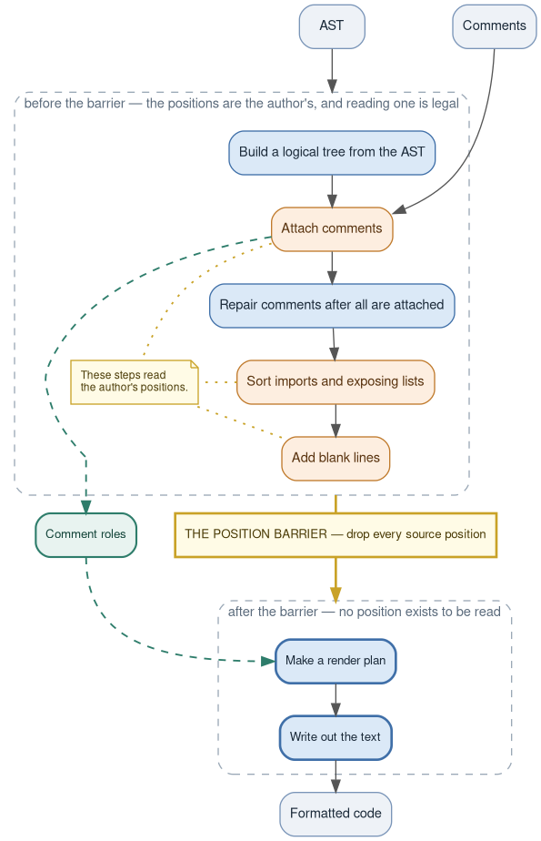

# Challenges when writing gren-format

*A short tour of the problems we ran into building a code formatter for Gren,
and what we did about each one. For the long version of the comment story, see
[Putting the comments back](puttingCommentsBack.md).*

**TL;DR.** We built the formatter on top of the compiler's own v2 parser, which
produces a syntax tree with no comments in it, and some punctuation tokens elided. Many
difficulties arise from that: putting comments back where they belong, doing it
in a way that gives the same answer on the second run, and testing a tool whose
only spec is "it looks right". The one idea we would carry to the next project:
decide anything position-dependent once, record the decision as a value, and
make it a compile error for later stages to look at the source positions again.

## Table of contents

- [1. We borrowed the compiler's parser, and it keeps almost nothing](#1-we-borrowed-the-compilers-parser-and-it-keeps-almost-nothing)
- [2. No page width: your line breaks are the layout](#2-no-page-width-your-line-breaks-are-the-layout)
- [3. Putting the comments back](#3-putting-the-comments-back)
- [4. Idempotency](#4-idempotency)
- [5. Matching elm-format without copying it](#5-matching-elm-format-without-copying-it)
- [6. Testing a thing with no spec](#6-testing-a-thing-with-no-spec)
- [7. Bugs that aren't ours](#7-bugs-that-arent-ours)
- [8. How fourteen other formatters cope](#8-how-fourteen-other-formatters-cope)
- [9. Odds and ends](#9-odds-and-ends)
- [10. Three takeaways](#10-three-takeaways)

---

## 1. We borrowed the compiler's parser, and it keeps almost nothing

`gren-format` has no parser of its own. It calls the Gren compiler's v2 parser,
the same code that compiles the program. The reason is simple: Gren is a
language that is still changing, and a formatter with its own parser will
eventually disagree with the compiler about what is valid. Ours can't. It
accepts exactly what the compiler accepts, always.

The price is what a compiler's parser throws away, because a compiler doesn't
need it. Two things are gone by the time we see the tree.

**Comments.** Ordinary `--` and `{- -}` comments are not in the syntax tree at
all. They arrive separately, as a flat list, each one tagged with nothing but a
start and end `(row, column)`. (Doc comments, `{-| -}`, are the exception; the
compiler keeps those for documentation, and they arrive on the declaration
they belong to.)

**Punctuation.** `=`, `:`, `,`, `|`, `->`, `then`, `in` and friends have no
node and no position. Only operators and brackets survive. That matters more
than it sounds: these two lines

```gren
x {- c -} = y
x = {- c -} y
```

reach the formatter as the same three facts: where `x` ends, where the comment
is, where `y` starts. The formatter doesn't know where the `=` is at all.
We can't tell them apart, and we refuse to guess by looking at
whitespace widths (formatting must not depend on your spacing). The only way
to ensure idempotent formatting is to choose one side of the `=` to place
such a comment. We picked a rule, "the comment lands after the separator", and
recorded it as one of the roles in section 3.

Had the compiler kept comments, we'd have taken them gladly. It didn't, so
sections 3 and 4 are the result.

---

## 2. No page width: your line breaks are the layout

Many formatters have a column limit and a decision: try to fit the code in 80
columns, break the least bad thing when it doesn't. `gren-format` has neither.
The whole layout policy is this:

- If you wrote a construct on one line, it stays on one line, however wide.
- If you put a line break anywhere inside a container (an array, a record, a
  call's arguments, a pipeline), every item gets its own line.

```gren
-- you write:                     -- gren-format writes:
f =                               f =
    combine a b                       combine a
        c                                 b
                                          c
```

That's easy to explain to a user and easy to predict, which is the point. It
was also the source of a whole class of bugs, because the author's row numbers
are sitting right there on every node and every layout rule is tempted to peek.
"Did the author break this call across rows?" is a legitimate question. "Is the
thing before me on the same row?" asked deep inside the renderer, after we've
already moved things, is not, and it took us a long time to see the difference.
Section 3 is about making that second kind of question impossible.

---

## 3. Putting the comments back

Here's the formatter's fundamental problem: **comment placement is decided from source
positions, and formatting is the thing that invalidates source positions.**

Take this Gren source code:

```gren
module S exposing (sizes)


sizes =
    [ 1 -- one
    , 2
    ]
```

The formatter receives two things. The first is the syntax tree, which is the
tree for `sizes = [1, 2]` with a source range on every node (`@row:col-row:col`)
and no comment anywhere in it:

```
module  name='S'  @1:8-1:9, effects='none'
    ├── exports
    │   └── [0]: lower  name='sizes'  @1:20-1:25
    └── values
        └── [0]  @4:1-7:6
            └── value  name='sizes'  @4:1-4:6
                └── body: array  @5:5-7:6
                    └── items
                        ├── [0]: number  @5:7-5:8
                        │   └── value: int  value=1
                        └── [1]: number  @6:7-6:8
                            └── value: int  value=2
```

The second is the parse context, a flat list of the comments, each with
nothing but a start and end position:

```json
{ "comments": [ { "type": "line", "value": " one",
                  "start": { "row": 5, "col": 9 },
                  "end":   { "row": 5, "col": 15 } } ] }
```

The array spans rows 5 to 7; the comment is on row 5, column 9. The comment
doesn't know it's inside the array; the array doesn't know the comment exists.
The only thing connecting them is a `(row, column)` pair across two data
structures, and we work out that the comment trails the `1` by comparing
numbers: its row is the first item's row, and its column is past the item's
end. Then we lay the file out again, the numbers change, and if anything
downstream compares them a second time it can get a different answer.

For most of the project's life, that is exactly what happened. Comment
placement was re-derived at each point of use, in at least eight places in the
rendering code, each one doing its own row arithmetic. We replaced that with
two moves.

**Decide once, as a role.** Every comment's placement is now decided exactly once,
early, while every position in the tree is still the author's, and the answer
is stored on the comment as one of seven values:

```gren
type CommentRole
    = TrailsPrevious   -- glue onto the previous sibling's last line
    | LeadsLine        -- own line, at the current indent
    | LeadsNext        -- belongs to the thing after an unrecorded separator
    | TrailsHead       -- glue onto the container's head (a record update's base)
    | RidesInline      -- sits mid-line without breaking it  (f {- k -} x)
    | LeadsInline      -- glued to the front of a declaration ({- c -} import Qux)
    | Standalone       -- a detached top-level comment on its own
```

A role is a direction, not a coordinate. "Glue onto the previous sibling's last
line" is something a renderer can do wherever that line ends up. Every
comment gets a role; there is no "unknown role".

We call this a **position barrier**. It is a barrier in our formatter's
pipeline. Before the barrier, code can read the source positions. After
the barrier, those source positions are gone, completely inaccessible.



**Make the barrier a type.** The renderer does not receive the tree with the
positions on it. It receives a copy, `RenderNode`, built by a function called
`lower` that strips every position field and every `Located` payload off. A
handful of questions genuinely need the author's rows ("did the author break
this signature at an arrow?"), so `lower` answers those once, as four booleans,
and passes the answers along. The evidence stays behind.

So a row read in the renderer is now a compile error. Before that we used
a script that grepped the render modules for a list of accessor names. It
worked fine but would break any time someone later spelled an accessor
differently, and it went quietly stale when the list of names did.
"Don't read positions here" as a comment in a file
is advice. "It doesn't compile" is a property of the system.

The position barrier doesn't prove anything is stable. What it does is
shrink the surface area of the question. With nothing downstream reading
positions, two runs can disagree only if the role classifier answers
differently the second time, and that's one function, small enough to
argue about in full. Section 4 is that argument.

---

## 4. Idempotency

There are three distinct requirements when formatting these re-attached
comments:

1. Every comment survives.
2. Every comment ends up beside the code it was written beside.
3. Formatting an already-formatted file changes nothing. (idempotency)

You can have 1 and 2 and still fail 3, and we did, often. Here's an example
from an old bug of ours:

```
you wrote:            first format:         second format:

v =                   v =                   v =
    foo bar -- c          foo bar               foo bar
                          -- c              -- c
```

The first run read the comment's row, saw it on the body's last row, and
decided "trails the body". But the code that turns "trails" into output
couldn't find a line to glue onto for a two-token body, so it dropped the
comment onto its own line. The second run read *that* file. Now the comment is
on the row after the declaration, and a comment there is detached, so it goes
to column 1. Same rules, same comment, different row, different answer. The
file settles after two runs instead of one.

The rule we ended up writing the classifier to is: **a role must re-derive to
itself.** If a comment's role was decided from row N, the comment has to render
on row N, so that the second run asks the same question of the same row. When
the output fails to honour that, the fix goes to the output, not the rule.

That handles the case where the *comment* moves. The nastier case is when the
**code** moves. The Gren formatter rewrites the source in a few small ways: it sorts
`exposing` lists and runs of `import`s, and it can add or drop a `port` keyword.
Sorting imports moves the `import` a comment was anchored to. When we got that
bookkeeping wrong, the comment stayed put while its anchor sailed away, and the
second run classified it differently.

Here's one of the bugs we hit. The comment is written *inside* an `import`,
which is a place the tree has no room for a comment, so the formatter has to
promote it to a line of its own. The goal was to sort the Alpha, Mu, and Zeta
`import` statements.

```
you wrote:            first format:         second format:

import Zeta           import Zeta           {- k -}
import {- k -} Mu     {- k -}               import Alpha
import Alpha          import Alpha          import Mu
                      import Mu             import Zeta
```

The first (buggy) run promotes the comment onto its own line and then sorts, but its
bookkeeping leaves the comment's row looking like the end of the import run, so
only `Mu` and `Alpha` are sorted and `Zeta` stays put. The second run reads
*that* file, where the comment genuinely is on a line of its own above `import
Alpha`. A comment does not end an import run, so now all three sort together,
and the comment travels with the import it leads. Two runs, two files, and a
comment that now sits beside an import it was never written next to.

That's the non-idempotent version, and an idempotency check catches it. But the
same mistake can happen differently: sometimes the misplaced comment also made the
blank-line pass emit a blank line, and on the next parse that blank line was a
real boundary between import groups:

```
the same input, first format — and every format after it:

import Zeta

{- k -}
import Alpha
import Mu
```

A blank line is the one thing that splits a run of imports, so on the next parse
`import Zeta` is alone in its run and there is nothing left to sort. The output
was now a fixed point. It had just silently declined to sort `Zeta` below the
other two. No idempotency check can see that, because nothing changes. We
finally caught it with a test that generates the same random module with its
imports in the other order and demands byte-identical output: write those three
imports as `Alpha`, `Mu`, `Zeta` to begin with and the formatter has nothing to
move, so it prints them in that order — a different file from the same module.

Worth saying out loud: any formatter that rewrites tokens at all, sorting,
removing redundant syntax, normalizing a keyword, has this problem, and its
idempotency test gate does not cover the case of an idempotent but wrong
format.

---

## 5. Matching elm-format without copying it

Gren is a fork of Elm, and elm-format is a mature, well-liked formatter. Where
the two languages agree we wanted the two formatters to mostly agree, so that an Elm
programmer feels at home. We could not simply reuse it: elm-format has its own
parser, which is the thing we decided not to have. The elm formatter is written
in Haskell, and the Gren formatter is written in, well, Gren itself.

What we did take is its output model. Our `Box` module is a port of
elm-format's `Box.hs`, including the detail that decided most of the
indentation questions for us: its indent is a **tab stop** (advance to the
next multiple of 4), not "add four". That's why a parenthesized `when` sits at
`(`+2 after a `+ `, `(`+5 after a `|> `, and `(`+4 when `(` starts its line.
None of those offsets is chosen; they fall out of "body at the next tab stop
after the keyword" plus wherever the `(` happened to land. We tried hard-coding
one of them early on, confirmed it in one shape, and were wrong in the next.

Where we deliberately differ, every divergence is written down in the
[comparison catalogue](elmFormatComparison.md), and every entry has a fixture
in `tests/testfiles/Divergence/` that a script keeps 1:1 with the document. The
test suite is testing the documentation.

Elm-format is used as a comparison, not something we try to match completely.
Our generated-syntax matrix
diffs every cell against elm-format and gates against a *reviewed* baseline
rather than assuming elm-format is right. Yes, the `gren-format` author
reviewed differences and recorded "gren is right" or "elm is right" for each one.
Or, "neither is right", making us fix the formatter again.

That work turned up one place where elm-format's own output is not
idempotent: run it twice on a certain
pipeline shape and you get two different files. We reported it as
[elm-format#842](https://github.com/avh4/elm-format/issues/842). Either side of
a differential comparison can be the wrong side.

---

## 6. Testing a thing with no spec

A formatter has no specification beyond "the output should look right", so
the test problem is really "what properties can we check by machine, and what
is left over for a human?"

**The fixture suite** checks three things per file: the output matches the
expected file, the output re-parses to a semantically equal tree, and
formatting the output again changes nothing (down to the position of every
comment and blank line). About 400 fixture pairs, hand-written apart from the
divergence ones.

**The comment fuzzer** takes each fixture and inserts a comment into *every*
inter-token gap, one at a time, and checks the result formats to a fixed point.
Then it does it with runs of two, then runs of two different kinds. That
sounds like it should explode, so it's worth saying why it doesn't.

There are only three kinds of comment as far as layout is concerned: `--`,
a one-row `{- -}`, and a multi-line `{- -}` spanning rows. The only question any rule ever
asks about a comment's kind is "can code follow this on the same line?", and
the answer is one newline check on the text. And every local rule in the
placer reads at most one neighbour: the previous member's last row, the
previous member's kind, its own text. Nothing looks two back, or forward. So a
run of comments is a chain of boundaries, and there are exactly nine possible
comment-to-comment boundaries (three kinds squared). If two comments sit next
to each other, there are only nine combinations of comment types to worry
about. Runs of three comments in a row (or N comments in a row) can also cover only
those nine combinations. Once we fixed bugs related to 2 comments in a row,
we ran runs of three across half a million gaps as a prediction,
and found no new bugs.

**The bugs no property test can see.** We replayed 61 of our own old bug fixes
against the full set of gates we have today: build the formatter from the
commit just before the fix, run every current gate on the triggering input, see
what fires. 37 were caught again and 3 would not reproduce. **21 were invisible
to our test gates**, and 16 of those 21 were layout bugs: output that parsed,
meant the same thing, kept every comment, was idempotent, yet was wrong. There
is nothing left for a property to check. The position barrier from section 3
doesn't help either; it controls *where* a decision is made, not whether it's
right. For that class the only defense is an expected answer, meaning the test
fixtures and the elm-format comparison.

**A green gate on the wrong axis.** For months every fuzzer swept the
`.formatted.gren` half of the corpus, because those are known-good fixed
points. But a formatted file has nothing left to sort, so the import-sorting
bug in section 4 was unreachable from it. The first sweep of the `.dirty.gren`
half found 24 findings in 66,252 probe sites, 22 of them that one bug. Before
you trust a green gate, check what it varies, not whether it passed.

---

## 7. Bugs that aren't ours

Sometimes the parser that feeds the formatter has bugs of its own. The one we
hit most often: given

```gren
10 -
    3
```

the parser hands us this tree:

```
call  @1:1-2:6
    ├── fn: number  @1:1-1:3
    │   └── value: int  value=10
    └── args
        └── [0]: negate  @1:4-2:6
            └── expr: number  @2:5-2:6
                └── value: int  value=3
```

There is no subtraction node in it anywhere: this is a *function call*, `10
(-3)`, the number ten applied to the argument negative three. The parser
decides "no space after the `-`, so this is a unary minus" by comparing
columns, and here the `3` happens to start in the column right after the `-`,
one row down. The production Gren compiler (the Haskell one) reads this as
subtraction, and so does elm-format; we use the newer v2 parser, written in
Gren, and it gets this wrong.

The formatter renders the tree it is given, so it never sees a subtraction
here. With nothing else on the line it writes `10 -3`, which the v2 parser and
the production compiler both read as that same call, so every check passes and
a subtraction the real compiler accepted has quietly become a call it rejects.
Nothing on our side can see that. What we *can* see is the case where the
author put a comment after the operator:

```gren
10 - -- c
    3
```

Now the tree says: call `10` with a negated `3`, and the comment sits between
the `-` and the `3`. A negation is glued to its operand, so the faithful
rendering of that tree lands the comment right after the minus sign:

```gren
10
    --- c
     3
```

The `-` has been swallowed into the `--`, and the expression means something
else. A space would not help: negation must be glued to its operand (`- 3` is a
subtraction), and a `--` runs to end of line — so that tree has no legal way
to be written. The formatter's own AST check notices that the output no longer re-parses to
the same tree, and it **refuses to write the file**. That's the decision,
not an oversight: a wrong file is worse than an unformatted one.

The fuzzers hit this bug nineteen times. Rather than subtracting those from
the count, the gates label them on sight (`[known: compiler-common#35]`) and
register each one by name in a baseline file. An unregistered finding fails
the gate, and so does a registered one that *stops* reproducing, so a real
regression can't hide among the known ones and a fix can't leave a stale
exemption behind. Before this the fuzzer just ran permanently red, and eight
findings of a real bug sat among the upstream ones for weeks.

---

## 8. How fourteen other formatters cope

While designing the comment handling we read the source of fourteen other
production formatters. The variable that matters turned out to be not the
layout algorithm but **what the parser hands the formatter**:

| what arrives | who |
|---|---|
| comments are ordinary tree nodes | [topiary](https://github.com/tweag/topiary) |
| named comment slots on AST nodes, no positions at all | [elm-format](https://github.com/avh4/elm-format) |
| comments as *trivia* hanging off tokens | [dart_style](https://github.com/dart-lang/dart_style), [google-java-format](https://github.com/google/google-java-format), [swift-format](https://github.com/swiftlang/swift-format), [CSharpier](https://github.com/belav/csharpier), [biome](https://github.com/biomejs/biome), [Black](https://github.com/psf/black) |
| a comment-free AST plus a list of located comments | **gren-format**, [ormolu](https://github.com/tweag/ormolu), [ocamlformat](https://github.com/ocaml-ppx/ocamlformat), [gofmt](https://github.com/golang/go/tree/master/src/go/printer), [prettier](https://github.com/prettier/prettier) |
| nothing; comments re-read from the raw source between nodes | [rustfmt](https://github.com/rust-lang/rustfmt), [zig fmt](https://github.com/ziglang/zig/blob/master/lib/std/zig/Ast/Render.zig) |

The first three rows never have to work out where a comment goes; the front
end already attached it. The last two have to reconstruct attachment from
positions, which is our situation, and it's where the survey's stubborn
instability bugs live. Crossing that with "does the tool have a position
barrier" gives a table where `gren-format` is the lone exemplar of its
category.

| | has a position barrier | no position barrier |
|---|---|---|
| attachment delivered by the front end | all eight | — |
| attachment must be reconstructed | **gren-format** | [prettier](https://github.com/prettier/prettier), [ocamlformat](https://github.com/ocaml-ppx/ocamlformat), [ormolu](https://github.com/tweag/ormolu), [gofmt](https://github.com/golang/go/tree/master/src/go/printer), [rustfmt](https://github.com/rust-lang/rustfmt), [zig](https://github.com/ziglang/zig/blob/master/lib/std/zig/Ast/Render.zig) |

Four stories from the right-hand column and its neighbours:

- **ocamlformat** decides attachment once, but its printer still reads source
  rows. Its shipped answer is to format the file repeatedly, "until formatting
  stabilizes", up to a user-settable `--max-iters` of 10, then print `BUG:
  formatting did not stabilize`. This is `lib/Translation_unit.ml`, abridged:

  ```ocaml
  (* iterate until formatting stabilizes *)
  let rec print_check ~i ~conf ~prev_source ext_t std_t =
    …
    if String.equal prev_source fmted then Ok (strlocs, fmted)
    else
      …
      (* Too many iteration ? *)
      if i >= conf.opr_opts.max_iters.v then
        Error (Unstable {iteration= i; prev= prev_source; next= fmted; input_name})
      else (* All good, continue *)
        print_check ~i:(i + 1) ~conf ~prev_source:fmted ext_t_new std_t_new
  ```

- **gofmt** reformats every `.go` file in the Go tree and checks for
  idempotency. That gate found a comment-placement bug in 2018. The bug is
  architectural, so what shipped is an exemption inside the gate for that
  filename. This is the tail of `cmd/gofmt/long_test.go`, as it stands today:

  ```go
  // the first and 2nd result should be identical
  if !bytes.Equal(b1.Bytes(), b2.Bytes()) {
      // A known instance of gofmt not being idempotent
      // (see Issue #24472)
      if strings.HasSuffix(filename, "issue22662.go") {
          t.Log("known gofmt idempotency bug (Issue #24472)")
          return
      }
      t.Errorf("gofmt %s not idempotent", filename)
  }
  ```

  [golang/go#24472](https://github.com/golang/go/issues/24472) is still open.

- **swift-format** had a rule that inserted blank lines between members by
  reading the *input's* line numbers before the printer ran. Two comment-bug
  patches later, the maintainers named the problem ("single-line-ness must be
  based on the source after pretty printing") and deleted the rule, 149 lines
  of code and 365 of tests, in January 2020. Two days later they deleted the
  accessor it had called, whose last line is the whole bug
  (`SyntaxProtocol+Convenience.swift`):

  ```swift
  let startLocation = sourceLocationConverter.location(for: startPosition)
  let endLocation = sourceLocationConverter.location(
    for: lastToken.endPositionBeforeTrailingTrivia)

  return startLocation.line == endLocation.line
  ```

  Neither has come back. They discovered the principle, but the only way they
  could honour it was to delete the feature; because our barrier is a type, we
  get to keep the equivalent rule.

- **rustfmt** is in exactly our position, reusing the compiler's parser and
  recovering comments from source spans. Its comment label carries about 450
  issues, 89 of them about a comment being lost or eaten, arriving at roughly
  forty a year for eleven years, in a tool that has a 400-file idempotency
  gate. The gate is not the missing piece. What ships instead is a runtime
  net — `recover_comment_removed`, in `src/comment.rs`, which compares the
  comments in a rewrite against the ones in the span it replaced and throws
  the rewrite away if any went missing:

  ```rust
  let snippet = context.snippet(span);
  if snippet != new && changed_comment_content(snippet, &new) {
      // We missed some comments. Warn and keep the original text.
      …
      snippet.to_owned()
  } else {
      new
  }
  ```

And the counterweight: having a barrier doesn't make a tool immune. Black and
topiary both have one, both ship idempotency fixes anyway, and both run an
idempotency check at runtime by default. What the barrier buys is keeping the
bugs small enough to find.

---

## 9. Odds and ends

- **Every performance bug had one of two shapes.** Rescanning settled work
  (re-walking all previous declarations once per new one, `O(n²)`), or
  rendering the same subtree twice (exponential in nesting depth). The fixes
  were equally uniform: accumulate with a builder, and render each subtree
  once, up front.
- **The formatter rewrites three things** that aren't layout: the order of an
  `exposing` list, the order of a run of imports, and the `port` keyword on a
  module header (plus whole imports, on request, under
  `--remove-unused-imports`). A blank line is the only thing that splits an
  import run; a comment travels with the import it leads. Redundant parentheses
  in an expression or a type are never stripped — a pattern's parens are not in
  the tree at all, so those are re-synthesized where the meaning needs them.
  Every one of those was a decision, and each is written down in
  [settled decisions](settledDecisions.md) so it doesn't get relitigated.
- **CRLF got normalized in some modes and not others**, because one file-reading
  path didn't go through the function whose docstring said "every read funnels
  through here". The fix was to make that true and to add a fuzzer that
  exercises the modes that actually write files, since every other gate runs
  `--show` on one file.
- **Never rebuild the binary while a fuzzer is running.** This silly mistake
  bit us a few times. The tests shell out to the formatter,
  and a rebuild at the same time produces a burst of findings that look
  exactly like a regression. Oops!

---

## 10. Three takeaways

1. **Reusing the compiler's parser is worth it**, and it means you will
   reconstruct comment placement from positions. Budget for that.
2. **Decide position-dependent things once, store the decision as a value, and
   delete the positions before the next stage sees them.** Enforce it with a
   type, not a review. It doesn't remove the obligation; it moves it to one
   function you can reason about.
3. **Idempotency is a property you engineer in, separately**, and it has a
   blind spot: a wrong fixed point. If your formatter rewrites any tokens, you
   need a test that varies the input's order too.
