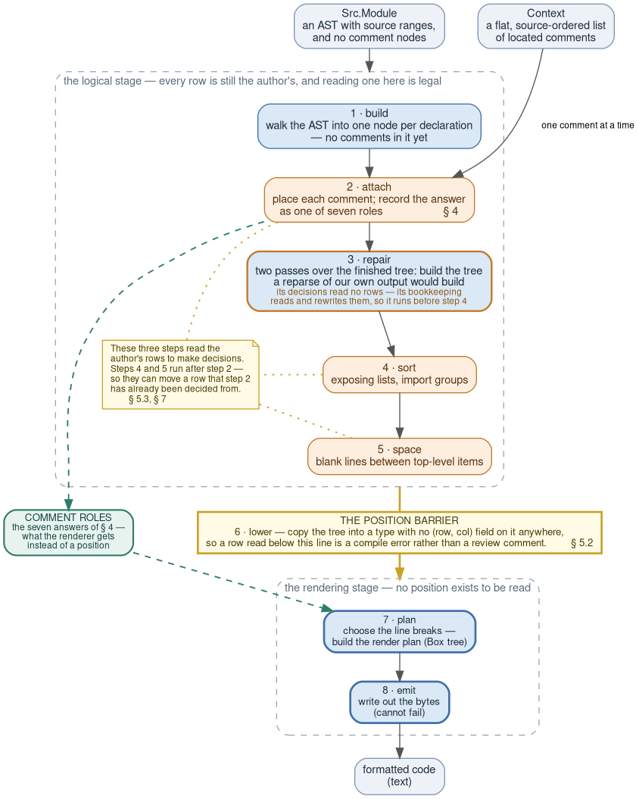

# Putting the comments back

*How `gren-format` places comments when the parser it uses throws them away:
what the problem is, what we built, what it does not cover, and a survey
of other formatters.*

## Table of contents

- [1. Background](#1-background)
- [2. Five kinds of front end, and no parser of our own](#2-five-kinds-of-front-end-and-no-parser-of-our-own)
- [3. The problem, concretely](#3-the-problem-concretely)
- [4. Decide once — the role, not the position](#4-decide-once--the-role-not-the-position)
- [5. The position barrier, and how to make it a type](#5-the-position-barrier-and-how-to-make-it-a-type)
- [6. Why forty comments in a row is not forty cases](#6-why-forty-comments-in-a-row-is-not-forty-cases)
- [7. The anchor — what that argument does not cover](#7-the-anchor--what-that-argument-does-not-cover)
- [8. What the gates cannot see](#8-what-the-gates-cannot-see)
- [9. What fourteen other formatters do](#9-what-fourteen-other-formatters-do)
- [10. Summary](#10-summary)

---

## 1. Background

`gren-format` reuses the Gren compiler's upcoming parser, and that parser discards
comments. The formatter is handed a comment-free syntax tree plus a list of
comments carrying nothing but **source positions** — a `(row, column)` pair at
each end and nothing more — and has to figure out where each one belongs.
*Position* means that whole pair throughout: the column carries real weight,
since a comment at column 1 attaches differently from one indented under the
line above. The difficulty is:

> **Placement is decided from source positions, and formatting invalidates the
> positions the placement was decided from.**

It's easy to get that wrong and produce non-idempotent output: formatting an
already-formatted file changes it again.

Our answer is the **position barrier** — a line drawn across the pipeline that
source positions do not cross. Above it, in the logical stage, code reads the
author's positions freely; that is where every comment's placement is decided,
once, and recorded as one of seven roles. Below it, in the stage that chooses line
breaks and writes bytes, positions are not merely off-limits, they are *absent*:
the renderer consumes a different data structure with every position field dropped, so
the formatter author simply cannot access the row and column of anything.

**So a role, not a position, is what crosses the barrier** — and that is the
implication worth stating early, because it decides the shape of everything
below the line. A `(row, column)` pair describes the file the *author* wrote; the
renderer is writing a different one, so the pair is stale the moment layout
begins. A **`CommentRole`** is instead the placement expressed *relative to the
comment's neighbours* — which one it belongs to and how it attaches to it, as in
`TrailsPrevious`, *glue onto the previous sibling's last rendered line*. That
stays true however the line moves, because it never named a position in the
first place. The seven roles, and what each one directs the renderer to do, are §4.

The barrier does not buy idempotency. It buys **localization**: with nothing
below the line reading a source position, two runs can disagree only if one
function — the classifier that assigns those roles — answers differently on the
second pass. The risk that was spread across every layout rule before we
implemented the position barrier now sits in one place.

Even with the position barrier, we still ran into other problems that had to be
fixed:

- **§5.3** — the comment classifier is not the only code above the barrier
  that reads the author's positions, so care must still be taken to trust the
  source position during the logical stage.
- **§7** — formatting rewrites code as well as laying it out. Sorting an import
  list moves the code a comment was attached to, so a placement that was right
  when it was decided is wrong by the time the file is read back.
- **§8** — some bugs break no property at all: the output is complete, stable
  and comment-preserving, and merely wrong. No property gate can see them.

---

## 2. Five kinds of front end, and no parser of our own

Formatters are usually told apart by their layout algorithm — whether they fit
lines to a page width, how they choose where to break. For comments, none of
that is the variable that matters. The variable that matters is **what the front
end hands the formatter**, because that is what decides whether the formatter
has to work out where a comment goes at all. We read the sources of fourteen
production formatters besides our own (§9); they sort into five rungs, in
decreasing order of how much work the parser has already done.

| rung | what arrives | who |
|---|---|---|
| **A0** | comments are ordinary nodes of a concrete syntax tree; the formatter needs no comment concept at all | [topiary](https://github.com/tweag/topiary) (over [tree-sitter](https://github.com/tree-sitter/tree-sitter)) |
| **A1** | named, typed comment slots on AST nodes — and no source positions anywhere | [elm-format](https://github.com/avh4/elm-format) |
| **A2** | *trivia* hanging off tokens | [dart_style](https://github.com/dart-lang/dart_style), [google-java-format](https://github.com/google/google-java-format), [swift-format](https://github.com/swiftlang/swift-format), [CSharpier](https://github.com/belav/csharpier), [biome](https://github.com/biomejs/biome), [Black](https://github.com/psf/black) |
| **A3** | a **comment-free AST**, beside a flat source-ordered list of located comments | **gren-format**, [ormolu](https://github.com/tweag/ormolu), [ocamlformat](https://github.com/ocaml-ppx/ocamlformat), [gofmt](https://github.com/golang/go/tree/master/src/go/printer), [prettier](https://github.com/prettier/prettier) |
| **A4** | nothing; comments are recovered by re-reading the raw source between two nodes' byte offsets | [rustfmt](https://github.com/rust-lang/rustfmt), [zig fmt](https://github.com/ziglang/zig/blob/master/lib/std/zig/Ast/Render.zig) |

**Trivia** is what compiler front
ends call the bytes between two tokens that the grammar does not care about:
whitespace, newlines and comments. A trivia-carrying front end does not discard
them; it hangs them off the token they sit beside, split into *leading* trivia
(before the token) and *trailing* trivia (after it). In `foo(1);  // why`, that
comment is trailing trivia of the `;` — a field of a token in the tree from the
moment the lexer finishes, so no later stage has to work out where it belongs.

On **A0–A2** the comment is already attached to something before the formatter
starts: the front end answered "which code is this comment beside?" while it was
still looking at the input, and the answer travels with the tree. Placement is
then a question about a tree the comment is already in, and the problem this
document is about does not arise — though it is worth noting that four of those
eight tools have shipped idempotency fixes anyway (§9.5), so just knowing
where comments should attach is not enough to guarantee idempotency. The test
problems of §8 apply to all the rungs of formatter front-ends.

On **A3 and A4** the comments are not attached to the parse tree, so it
has to be reconstructed — from source positions, which are the one piece of
evidence formatting destroys. Every instability story in §9 lives on those two
rungs.

A3 is not an exotic place to be: it is simply **what a production compiler's
parser hands a formatter**, and five of the fifteen tools surveyed are there.

**`gren-format` is on A3, deliberately.** It has no parser of its own: it calls
the Gren compiler's in-development parser — the same front end that compiles the code being
formatted. That buys one guarantee, and it is the reason for everything that
follows: **the formatter can never drift from the language.** It accepts exactly
what the compiler accepts, this release and every future one. A formatter with
its own grammar is a bug waiting to happen, and a language that is still moving will
outrun a second grammar.

The price is exact and unavoidable: a compiler's parser discards comments,
because a compiler does not need them. We use it anyway, because Gren's front
end is still moving and a formatter that can never disagree with it is worth more
to us than easy comment placement. Had the compiler already carried trivia we
would have taken that instead.

---

## 3. The problem, concretely

### 3.1 What the formatter is actually handed

Two things. The first is `Src.Module`: an ordinary AST with source ranges on its
nodes and **no comment nodes anywhere** — there is nowhere in the type for a
comment to be. The second is the parse `Context`, which carries a flat,
source-ordered list of located comments:

```gren
type Comment
    = Line String     -- `-- like this`, the text after the `--`
    | Block String    -- `{- like this -}`, the text between the delimiters

-- the context carries: Builder (Located Comment)
-- where `Located` is a start (row, col) and an end (row, col).
```

For this module:

```gren
module S exposing (sizes)


sizes =
    [ 1 -- one
    , 2
    ]
```

the formatter receives an AST for `sizes = [1, 2]` and, separately:

```json
{ "comments": [ { "type": "line", "value": " one",
                  "start": { "row": 5, "col": 9 },
                  "end":   { "row": 5, "col": 15 } } ] }
```

The comment does not know it is inside an array. The array does not know a
comment exists. The only thing connecting them is a `(row, column)` pair.

### 3.2 Reattachment vs Formatting

That is a reattachment problem, and reattachment interacts badly with the one
thing a formatter does:

> **Placement is decided from source positions, and formatting invalidates the
> very positions the placement was decided from.**

Here is the whole difficulty in one picture. The author wrote a multi-line block
comment trailing a call:

```
you wrote:                  format¹ produced:        format² produces:

v =                         v =                      v =
    fn a b {- c                 fn a b                    fn a b
   second -}                    {- c                 {- c
                                   second -}            second -}
```

Format¹ read "the comment is on the declaration's last row" and rendered it at
the call's indent. But a multi-line `{- … -}` cannot sit *on* that row — it
brings its own newlines — so it landed *below* the declaration. Format² is now
reading a comment written below a declaration, which is a different question
with a different answer (detach to column 1). The file now has two spellings and
alternates between them for ever.

**Every comment bug this project has fixed is a variation on this.**
Oscillation is the single largest bug class in the project's history that any
property gate can see (§8.2).

### 3.3 Three properties, gated separately

1. **Preservation.** Every input comment appears exactly once in the output, text
   and kind unchanged. (Continuation rows of a multi-line block comment are
   re-indented; that is layout, not text.)
2. **Faithful placement.** The comment lands beside the code the author wrote it
   beside. Specified as [C1–C7](commentHandling.md#the-seven-rules-at-a-glance):
   the first two decide *which code a comment attaches to*, the last five decide
   *how it is laid out*. Attachment is settled first, then layout works
   with whatever it is given.
3. **Idempotency.** `format(format(x)) = format(x)`, byte for byte.

Properties 1 and 2 come nearly free from a trivia-preserving front end. Property
3 is where the architectures separate. With trivia, a comment's slot in the tree
is stable across formatting because it was never derived from layout in the first
place. Here it is derived from layout, and layout is the output:

```
run¹   placement¹ = place(code, positions)            -- the author's positions
       output¹    = layout(code, placement¹)

run²   placement² = place(code, positionsOf(output¹)) -- no longer the author's
       output²    = layout(code, placement²)
```

Idempotency is `output² = output¹`, and it follows as soon as
`placement² = placement¹` — that is, as soon as `place` gives the same answer
asked about the formatter's own positions as it gave about the author's. Nothing
above makes those two agree by construction. Something has to, and here it is one
rule on the classifier — **a role must re-derive to itself** (§4): every comment
is placed so that the position its placement was decided from is the position it
renders at. Run 2 then asks the same question of the same position and gets the
same answer.

Note what is held fixed: `code` is the same in both runs. §7 is what happens when
it is not.

It is worth separating 1 from 2 explicitly, because keeping the comment does not
give attachment. Black keeps every comment — they ride in a leaf's whitespace
prefix — and still says so in the docstring of the function that has to place
them:

> "The sad consequence for us though is that comments don't 'belong' anywhere.
> … We simply don't know what the correct parent should be."

### 3.4  Author-driven vs Page-Width Reformatting

`gren-format` imposes **no page-width limit**.  The formatting
changes depending on whether the author introduced newlines
or not, or for some constructs, the multi-line format has to be chosen.
But there is no search for the best or prettiest arrangement, or re-fitting
due to page width.

Could this be the reason for the reattachment vs formatting problem
in §3.2?  Do formatters that already recompute the layout from scratch
(because of fitting into page boundaries) avoid the non-idempotency
problem?  The survey in §9 says "no"; prettier *is* that type
of formatter and has the non-idempotency problem anyway, for nine
years. Meanwhile gofmt has no page-width fitter at all and is not stable
either. The variable is whether *placement of constructs* reads source
positions, not whether *layout* is author-driven.

What author-driven layout really does is make the author's positions *more
tempting to read*. They are right there, and they are usually correct. That is
precisely why the ban in §5 has to be mechanical rather than advisory.

### 3.5 The pipeline with the position barrier

Here is `gren-format`'s algorithm, with the position barrier dividing the
pipeline.



**Step 2** is where every placement decision is made, and §4 is the argument for
making all of them there, once, rather than at each point of use. **Step 6** is
the barrier, and §5 describes it.

**Steps 4 and 5 are shaded with step 2** because they are the same kind of step:
all three read the author's positions. The difference is that they run *after*
the placement decision and still on the legal side of the line, so nothing stops
them moving a position step 2 was already decided from. So care must be taken!
Both of this document's hard-won sections are about that — §5.3,
where the barrier turns out not to cover them, and §7,
where sorting moves the code a comment was attached to.

**Step 3 keeps the blue fill but takes an orange border**, because it is half of
each. Its decisions are made from a comment's role and its own text, never from
a position — but the bookkeeping that records them reads and rewrites the row
ranges the later steps go on to read. That is what fixes its place in the order: step 4
renumbers rows when it moves an import, and step 3 writes a range derived from
the numbering step 4 has not yet changed. Running the two the other way round
leaves one node holding a row from each numbering.

---

## 4. Decide once — the role, not the position

Every comment's placement is decided **exactly once**, in the logical stage,
while every position in the tree is still the author's. For most of this project's
life it was decided the other way — re-derived at each point of use, in at least
eight separate places, at render time. The answer is now stored on the comment
leaf as a `CommentRole`:

```gren
type CommentRole
    = TrailsPrevious   -- glue onto the previous sibling's last rendered line
    | LeadsLine        -- own line, at the current flow/body indent
    | LeadsNext        -- belongs to the sibling AFTER an unrecorded separator
    | TrailsHead       -- glue onto the container's head (a record update's base)
    | RidesInline      -- rides mid-line without breaking it (`f {- k -} x`)
    | LeadsInline      -- glued to the FRONT of a declaration (`{- c -} import Qux`)
    | Standalone       -- a detached top-level comment, its own column-1 node
```

**The role is what the renderer gets in place of a position.** A `(row, column)`
pair says where the comment *was*, in a file that is about to be laid out again;
the role says how it *fits* — which neighbour it belongs to, and how it attaches
to that neighbour. Every decision that used to compare the comment's position
against another node's reads one of these seven values instead.

The renderer reads the stored answer. It never recomputes it.

One module exercising all seven — the role column is the formatter's own `--lpt`
output for this file, not a hand annotation:

```gren
module Ex exposing (a, b)

{- c -} import Qux

import Dict {- inline -} as D

a rec =
    { rec -- about the base
        | alpha = 1
    }

b =
    let
        base =
            -- start here
            1
    in
    [ base -- the seed
    , 2, {- two -} 3
    ]

-- detached below b
```

| comment | role |
|---|---|
| `{- c -}` before `import Qux` | `LeadsInline` |
| `{- inline -}` in `import Dict … as D` | `RidesInline` |
| `-- about the base` | `TrailsHead` |
| `-- start here` | `LeadsLine` |
| `-- the seed` | `TrailsPrevious` |
| `{- two -}` | `LeadsNext` |
| `-- detached below b` | `Standalone` |

**Four questions, asked once.** Each comment is placed by answering, in order:
**which declaration** owns it; **how deep** inside that declaration's subtree it
belongs; **which gap** between siblings it falls in; and **which role** it takes
at that gap. All four are answered while the positions are still authorial, and
none is revisited. The full decision procedure is
[commentAlgorithm.md §4](commentAlgorithm.md#4-stage-1--attachment).

**Every role has to survive being re-derived from the formatter's own output.**
That is the rule the classifier is written to satisfy:

> **A role must re-derive to itself**: the position a comment's placement is
> decided from is the position that comment renders at.

If the classifier says "this comment trails the item before it" because the
author wrote it on that item's last row, then the comment must come out on that
item's last row. The second run asks the same question of the same row, gets the
same answer, and nothing moves.

**When a role cannot satisfy that, the rule is not the thing to change.** §3.2's
oscillating example is the case in point: the comment is decided from the row the
author wrote it on, and cannot render there. The rule is already right about
where the author put it; the trouble is that the output puts it somewhere else.
What fixes it is **making format¹ build the tree format² would build** — the
comment is going to end up below the declaration, so the first pass puts it there
itself, at column 1, which is precisely what a reparse would produce. Two passes
do that over the *finished* tree, because a comment's neighbours are not known
until the last one is in
([commentAlgorithm.md §4.6](commentAlgorithm.md#46-repairs-that-need-the-finished-tree)).

**Every comment gets a role; there is no "don't know".** `classifyCommentKind`
returns a `CommentRole` — not a `Maybe`, not a `Result`, no `Unknown`
constructor, no branch that leaves the question for the renderer to settle later.

That totality is what makes §6's argument possible. Because the answer is always
exactly one of seven values, a file with *n* comments carries *n* independent
labels — not a combined state depending on how those comments sit relative to one
another. The alternative is what people expect a comment placer to look like
inside: a case analysis over *configurations*, a space that grows with the number
of comments in one place and always has a corner nobody enumerated. There is no
such space here.

Deciding once is, incidentally, *not* the unusual part: ten of the fifteen tools
surveyed in §9 do it, into role sets of two to nine members. What differs is
what the classifier is allowed to read, and what the stages downstream may do
with its answer.

---

## 5. The position barrier, and how to make it a type

### 5.1 The rule

> **No code in the rendering stage may read a source row or position to make a
> layout or comment-placement decision.**

What that means in practice is a split between two lists of questions. **Above
the barrier**, in the logical stage, where every position in the tree is still
the author's:

| question | what it reads |
|---|---|
| which declaration owns this comment, how deep in its subtree, in which gap between siblings, and with which role (§4) | the comment's `(row, col)` against each node's cached range |
| did the author write this construct across rows? — the `forceVertical` flag on a call, an `if` condition, a record literal | the node's own first and last row |
| did the author write this node on the same row as the item before it? | both nodes' rows |
| did the author break this signature at a `->`, or spread this union's variants over several lines? | the children's rows |
| does this node cover any source row at all, or was it synthesized? | whether the node has a range |
| how many blank lines go between two top-level items, and where one import group ends and the next begins | the last row of one subtree against the first row of the next |

**Below the barrier**, in the rendering stage, where no position exists to read:

| question | what it reads |
|---|---|
| where does this comment go? | the `CommentRole` stored on the comment leaf — §1's role-for-a-position substitution, from below the line |
| is this construct vertical? | `isSingleLine`, applied to a `Box` that has already been built |
| can code follow this comment on the same line? | the comment's own **text** — the three kinds of §6.2 |
| any of the author-intent questions above | the boolean `lower` computed at the barrier — the answer, never the evidence behind it |
| is there a line here to glue onto? | what the renderer has emitted so far (§5.3) |

The second list is the whole of what the renderer is allowed to ask, and nothing
on it is a source position — including *where does this comment go?*, which
sounds like one. That question is §4's substitution seen from this side:
`TrailsPrevious` says *glue onto the previous sibling's last rendered line*,
`TrailsHead` says *onto the container's head*, `LeadsNext` says *the sibling
after an unrecorded separator* — directions a renderer can follow without
coordinates.

The author-intent entry is what makes this affordable rather than merely strict:
the questions that genuinely do need the author's rows still get answered — the
renderer is handed the answer instead of the evidence, and cannot re-derive it
later against different rows.

### 5.2 Making it a type error

This is enforced by the type checker, not by documentation and not by a linter.

The rendering stage does not consume the logical printing tree at all. It
consumes `RenderNode`, a **mirror of the node type with the seven cached position
fields removed**, reachable only through a `lower` function that drops them.
`RenderShape` strips the `Located` payloads off eight shape constructors too, so
there is no position anywhere in the renderer's view of the tree.

A render-side row read is therefore not a lint failure. It is a type error, and
there is no allowlist to grow.

Five render-side decisions genuinely needed the author's rows — the fourth entry
in §5.1's second table. `lower` computes them once, at the barrier, as four
booleans: `rnSharesRowWithPrevItem`, `rnHasSourceContent`, `rnVariantsSpanRows`
and `rnTypeSegmentsBroken`. `RenderShape` is total over the logical shape type,
so adding a new shape does not compile until the lowering maps it.

**The previous version of this barrier was a script**, and deleting it is the
part worth reporting. It ran first in the test suite and grepped the rendering
stage for an enumeration of position-accessor names. It worked, and it was a
barrier only until someone wrote the accessor a different way — or until the
enumeration of another module's vocabulary went stale, silently, which it did.
A grep over an enumeration is a reviewed convention wearing a script's clothes.

"Be careful not to read positions here" is a comment in a file nobody reads at
2am. "It does not compile" is a property of the system.

The cost is a second tree, and it is measured rather than asserted:
[renderTreeMemory.md](renderTreeMemory.md), which also explains why peak RSS is
the wrong instrument for measuring it.

### 5.3 What the barrier does not cover

Two gaps, both of which have produced real bugs here. Neither was a reason not to
build the barrier; both were reasons to stop believing we had finished.

**On the renderer's own side of the line: a role is not a row.** Turning a role
into output still requires a fact no role can carry — *is there a line here to
glue onto?* A `TrailsPrevious` comment glues onto the previous item's last line,
but whether that sibling ended on a line this comment may join is a fact about
what the renderer has just emitted. Legitimately below the barrier, answered from
render state rather than positions, and perfectly possible to get wrong.

**On the other side of the line: a position that this pipeline is itself going
to move.** Above the barrier, reading source positions is legal and necessary —
but they stop being the author's part-way through the logical stage. Steps 4 and 5 of
§3.5 can each move a position step 2 was decided from. A decision keyed to such a
position is stale for exactly the reason a render-side read is stale, and the
barrier does not touch it, because every step involved sits above the line.

This is the one that catches people, and it caught swift-format in the same place
(§9.6). Our criterion in §4 is stated *for roles*, and that scoping was itself
the defect: steps 4 and 5 are position-keyed decisions that produce no role, so
neither was ever held to the sentence, and both were later found violating it.
The vertical-space pass decided whether a comment was free-floating from the gap
*below* it — and then closed that very gap itself, when it pulled a definition up
under its signature. First format saw a gap and emitted two blank lines; second
saw none and emitted one. Read correctly, the sentence was never about roles:

> **Every** position-keyed decision in the logical stage must be decided from a
> position that this pipeline does not itself move.

### 5.4 What the barrier is actually for

It does not *prove* idempotency. It **localizes the obligation**.

With no positional read downstream, the only thing that can differ between run 1
and run 2 is the classifier's answer. So "is formatting idempotent?" stops
being a question about the whole pipeline and becomes a question about a single
function — one that always returns an answer, and always one of seven. That is
what makes the coverage argument in §6 possible at all. Without it, the
obligation is spread over every layout rule that reads a position: 19 of prettier's
73 print modules, 14 source reads in ocamlformat's printer. There is no
corresponding argument to be made about those, and §9 shows what gets shipped
instead.

Localizing is not discharging, and §9.5 is the counterweight: most of the tools
that hold the barrier have shipped idempotency fixes anyway. What is left after
the barrier is small enough to argue about. Something still has to argue.

---

## 6. Why forty comments in a row is not forty cases

The question every reader of a comment placer asks is "what happens if I write
forty comments in a row?". This section argues that it is the wrong shape of
question.

The claim:

> For any *n* ≥ 0 comments of any kinds in one place, the algorithm assigns
> exactly one placement to each; and a run of *n* reaches no decision that a run
> of two does not.

It rests on three properties of the implementation, plus one boundary it does
not cover (§7). The full version, with the code sites for each, is
[commentAlgorithm.md §8](commentAlgorithm.md#8-why-this-covers-every-run--the-argument-not-the-test-suite).

### 6.1 Placement is prefix-determined, so *n* is never an input

The attachment fold walks comments in source order, and when comment *k* is
placed, comments *k+1 … n* **are not in the tree**. So

```
role(k) = f(code, comments 1 … k−1)
```

and `f` is the same function for every *k*. No branch anywhere in the attachment
module asks how many comments a gap holds, because at the moment the question is
asked the answer is not knowable. *n* enters the algorithm in exactly one way: as
the number of times `f` is applied.

That is why "does it handle a run of 40?" is not a question about runs. It is the
same question as "does it handle the 40th comment in the file", and the fold does
not distinguish the two. With the classifier's totality (§4) alongside it, the
tree after *n* comments carries the same *kind* of state it carried after one.

### 6.2 The formatter tracks three kinds of comment

The language has two comment syntaxes, but every layout question about a
comment's kind routes through **one** predicate, which reads the comment's own
*text* and distinguishes three shapes:

| | can code follow it on the same line? |
|---|---|
| `-- like this` | no |
| `{- like this -}` on one row | **yes** |
| `{- like this` ⏎ `and this -}` | no |

Nothing else about a comment — its length, its content, its original indentation
— is read by any decision. "Any variety of comments" is not an unbounded axis:
it is three kinds.

The design decision underneath that is the one we would defend hardest here:
**every kind-sensitive question routes through a single predicate**, so the
number of kinds is a fact we can state rather than an emergent property of
scattered `case` arms. Ours is three because that predicate says so.

### 6.3 Every local rule reads at most one neighbor

This is the most important of the three properties. Every place a run's members
interact locally:

| rule | what it reads |
|---|---|
| the reference row (four sites) | the **previous** member's last row |
| the render fold | a 6-value state summarizing the row in front |
| the peel scanner | the **previous** member's kind |
| "can this text ride?" | the member's **own** text |

Not one looks two members back, or forward. So a run of comments is a chain of
**boundaries** — the junctions between one thing and the next — and every rule in
the table is a function of exactly one boundary. A run of three comments, A, B
and C, written between two pieces of code has four of them:

```
   code │ comment A │ comment B │ comment C │ code
        ↑           ↑           ↑           ↑
     code→A        A→B         B→C       C→code
```

Three of those four are comment→comment boundaries, and with three kinds of
comment there are exactly **nine** of those possible. A run of any size is built
from the same nine.

A longer run can therefore reach something new in only two ways: by containing a
boundary a shorter one could not — impossible once all nine have appeared — or by
putting a member at **two** boundaries at once, which is observable only if some
rule reads both sides. By the table above, none does.

### 6.4 Where one neighbor is not enough

Three rules genuinely cannot be decided from one neighbor, because they are
about the run as a whole. Each is stated as a **quantifier over the run**, never
as a case analysis over its length:

| rule | the quantifier |
|---|---|
| may the run cross an unrecorded separator? | ∀ members: could this one cross? |
| may the run ride a flat line? | ∀ members: can this one ride? |
| who owns the run — detaching, sorting, blank lines? | the run is the unit |

A `∀` over a set is still length-independent: folding a predicate over an array
does not care how many elements it has. Both boolean ones are additionally
**monotone** — adding a member can only turn the answer *off*, never on — so they
can only make a comment stay where it was written, never move one that was not
already moving.

**Every one of those three was written per-member first, and every one was found
as a bug**: a mixed run torn in half and reassembled in the author's *reverse*
order, a run that half-rode a flat line and never settled, a blank line above a
floating run that alternated between one and two. The per-member version is the
natural thing to write, it is correct for a run of one, and a corpus of
hand-written fixtures will not contain the mixed run that breaks it. §9 shows
two other projects learning the same thing independently.

### 6.5 What it looks like

Six comments, three kinds, one gap:

```gren
v =
    fn a {- 1 -} {- 2
                    over two rows -} {- 3 -} {- 4
                                                again -} {- 5 -} -- 6
```

Every member keeps the author's single logical row; each multi-line member's
continuation is re-indented under its own `{-`; member 3 glues after member 2's
`-}` two rows down, because the reference row grew through the run; and the whole
thing is a fixed point. Nothing in producing it consulted the number six.

**One caveat, stated plainly.** The premise — that no rule reads more than one
neighbour, except the three that quantify over the whole run — is a property that
must be **maintained**, not one that anything enforces. A fourth all-or-nothing
rule discovered tomorrow gets added to §6.4's table, and the reasoning carries on
unchanged. So the run sweeps do not prove the argument; they test its premise,
and they were run as a prediction: probes that insert a run of *two* comments, or
of two *different* kinds, into every inter-token gap found real bugs — 20 and
1,752 findings — while runs of three and mixed triples, which §6.3 says reach no
new boundary, found nothing formatter-side in 533,709 gaps.

---

## 7. The anchor — what that argument does not cover

This is the section whose lesson we learned last and most expensively. The
implementation-facing version, naming the passes involved, is
[commentAlgorithm.md §8.7](commentAlgorithm.md#87-the-anchor--the-obligation-this-argument-does-not-discharge).

### 7.1 Code is an input too

Everything in §6 quantifies over *the run*, holding the tree fixed. Look again at

```
role(k) = f(code, comments 1 … k−1)
```

§6 shows that `f` is length-independent in its **second** argument. But `code` is
an argument too, so the obligation is really two, and §6 discharges only one:

> **(i)** given the same `code`, `f` returns the same roles when re-asked over the
> output's positions; and
> **(ii)** the second run *is given the same* `code`.

(ii) holds exactly insofar as formatting does not rewrite concrete syntax — and
ours does, in three ways that delete, insert or reorder a token: it **sorts**
exposing lists and import groups, it strips redundant parentheses from patterns,
and it adds or drops the `port` keyword on a module header.

> **Any formatter that rewrites tokens at all — sorts imports, removes redundant
> syntax, normalizes a keyword — carries obligation (ii), and an idempotency gate
> does not discharge it.**

### 7.2 What actually moves

A comment's **anchor** is the code its placement was decided against. Obligation
(ii) fails when the formatter moves that code out from under the decision. Ours
did, for a comment written *inside* an import statement:

```gren
import {- k0
    tango -} Qux0 exposing (..)
import Bar3
```

That comment's range **overlaps** the import's, and there is nowhere inside an
import node for it to live, so attachment promotes it to a **sibling** and the
first pass prints it on a row of its own — after which sorting moves the import
out from under it. Read the output back with fresh eyes, which is what the second
run does, and the comment is no longer inside anything: it is now a **leading**
comment of the import below it. That is a different attachment, and since leading
comments count as part of an import unit, the group boundary the sorter keys on
moves too. Nothing re-read a position at render time; the classifier answered a
different question because the code had changed shape. Underneath was an
invariant nobody had written down — **siblings are disjoint and in source order** —
and promotion is exactly what breaks it.

**And no gate here could have seen it.** Every comment-gap sweep ran against the
corpus of **already-formatted** fixtures, and the rewrite that moves an anchor
cannot happen on a fixed point. Promotion is sharper still: it happens only to a
comment written inside a statement, and the formatter's own output never contains
one. The input class was not merely absent from that corpus, it was *excluded
from it* by construction. Running the same instrument over the 391 *unformatted*
halves of the same fixture pairs — 66,252 probe sites — produced **24 findings**
on the first sweep, 22 of them this class. That axis is now a standing default
(`--corpus both`, in
[testing.md](testing.md#idempotency-fuzzer-fuzz-idempotencypy)).

### 7.3 The part that no idempotency gate can see

We first read this as a format¹-vs-format² disagreement and fixed it that way. It
is not only that. When the same misreading also makes the **vertical-space** pass
emit a blank line, that phantom blank becomes a **real run boundary on the next
parse** — and the wrong grouping is now *self-consistent*. Formatting is a fixed
point that has silently declined to sort two adjacent imports.

No idempotency gate can see that, and ours did not. The shape survived two fixes
and was finally caught by the **author-order invariance** oracle: emit the same
module with its import run in the other order and require byte-identical output.
That is the one gate in the portfolio that does not ask about repetition at all.
So, exactly:

> §6 establishes that run length and composition are not inputs to placement. It
> does **not** establish that placement re-derives to itself, because it assumes an
> anchor the formatter is free to move.

Obligation (ii) **cannot be discharged by idempotency testing at all**, since the
class has members that are fixed points. Covering it needs an oracle that varies
the input's **authoring** rather than repeating the formatter: *emit the same
program spelled two legal ways and require the same bytes.* We have exactly one,
we built it late, and building a second is the open work. Two other projects ship
this shape today, one deliberately (§9.5, §9.6).

---

## 8. What the gates cannot see

A portfolio of property gates has *shaped* holes, and they can be enumerated in
advance. What each gate varies is in [testing.md](testing.md); two results are
worth carrying out of it.

### 8.1 Three holes that look covered

- **A dropped comment passes almost everything.** Deleting a comment is
  AST-equivalent and the output is its own fixed point, so the end-to-end check
  passes and so does every stability check; only a marker count and a multiset
  oracle can see it. Caught twice here, both times a renderer indexing a node's
  children positionally — in a formatter where **a comment is a child**. Not ours
  alone: rustfmt carries 89 issue titles reporting a lost comment, 29 open, and
  swift-format loses one today in a rule whose comment guard covers one slot of
  three (§9.6).
- **A wrongly *attached* comment passes even those.** A multiset oracle discards
  positions on purpose, so a wrong-but-stable attachment is a perfectly good
  fixed point; only §7.3's author-order oracle sees it, and only a generator can
  run that.
- **A run reassembled backwards is a perfectly good fixed point.** Tear a run
  across a separator with the mover written *first* and the output is stable,
  AST-equivalent and comment-preserving; only the *ordered* marker oracles see
  it. Torn with the mover written *second*, nothing in the portfolio can see it
  at all — that case is pinned by a fixture, found by enumerating the grid rather
  than by a gate. [prettier #10108](https://github.com/prettier/prettier/issues/10108),
  "Comments in array: idempotence violation *and change of order*", is the same
  shape reported externally.

One methodological finding generalizes well past formatters:

> **A gate green over the wrong axis is indistinguishable from a correct
> implementation.**

Our comment axis ran green for months over two of the three comment kinds. Adding
the third found 70 non-idempotencies the same afternoon. Check what a gate
*varies* before trusting what it reports.

### 8.2 The class no property gate sees at all

Replayed against the project's own history: 135 fix commits, each checked out at
its parent, built there, and run against the one input that triggered the bug. An
oracle **witnesses** a bug when it fires at the parent and is clean at the fix —
so a commit is only usable as an experiment if the tree builds at both, and **61
of the 135 did**. 37 of those were witnessed by some oracle. **21 were invisible
to the entire portfolio**: the output changed, and was *wrong but stable* —
AST-equivalent, its own fixed point, every comment preserved, the end-to-end
check exiting 0 at the parent. Each commit's class was assigned by hand from what
was wrong, never from which oracle fired — which would have made the table below
a tautology.

| class | witnessed | invisible | not reproduced |
|---|---:|---:|---:|
| oscillation · crash · wrong-attachment · performance | 33 | 0 | 2 |
| **layout** | **0** | **16** | 1 |
| mixed · dropped-content · blank-lines · literal-corruption | 4 | 5 | 0 |

The separation is almost perfect. The property portfolio caught **every** crash,
oscillation, wrong-attachment and performance bug it was given — and **none of
the seventeen layout bugs**, the single largest class in the corpus.

> A property oracle asks "did the output violate an invariant?" A layout bug
> violates none. The output is complete, stable, AST-equivalent and
> comment-preserving, and merely **wrong**. Only an expected answer, or a second
> implementation to compare against, can say so.

That is why one gate takes its inputs from real published packages — the only
inputs in the portfolio that nobody here chose. Every other gate is synthetic,
built from a vocabulary this project authored, and a sweep of ten such packages
found nine bugs, each a *feature conjunction* no single-axis gate could
generate.

---

## 9. What fourteen other formatters do

We read the sources of fourteen production formatters; **all counts and
repository states below are as of 2026-08-23**, the date of the pull. Beyond §2's
input rung, three axes separate them: *when* placement is decided; whether layout
is width-aware or author-driven; and — the axis that is almost never named — the
**position barrier**, which §5 builds.

The barrier is not implied by deciding once: a tool can decide attachment exactly
once and still let every layout rule re-derive verticality from the author's
rows. It is also a stronger bar than "the fitter is positionless", since several
tools reach their fitter through a tree walk that is itself full of layout
choices, and it is that walk the barrier has to cover.

| formatter | comments arrive as | placement decided | layout | position barrier? |
|---|---|---|---|---|
| topiary | A0 CST nodes | *never asked* — author-row facts resolved to atoms once | author-driven | yes |
| elm-format | A1 named slots | at parse time | author-driven | yes (no positions exist) |
| dart_style | A2 token trivia | once, front end → 4 roles | **80-col cost solver** | yes (positionless `Piece` IR) |
| swift-format | A2 token trivia | at token-stream build, *lexically* → 4×2 | 100-col Oppen | yes (printer reads only output rows) |
| google-java-format | A2 token trivia | at lex time, *lexically* | 100-col greedy `Doc` | **partial** — `Doc` sees none, op-builder reads 2 |
| CSharpier | A2 [Roslyn](https://github.com/dotnet/roslyn) trivia | while walking trivia → 2×2 | 100-col `Doc` | yes |
| biome | A2 [rowan](https://github.com/rust-analyzer/rowan) trivia | once, pre-pass → 3×3 | 80-col `Doc` | yes |
| Black | A2 prefix *strings* | once, `list_comments` → 2 roles | 88-col | yes (comments become typed leaves) |
| **gren-format** | **A3 located list** | once, logical stage → 7 roles | author-driven | **yes, type-enforced** |
| prettier | A3 located list | once, `attach.js` → 3×3 | 80-col `Doc` | **no** — 19/73 printers read the source |
| ocamlformat | A3 located list | once, `Cmts.init` → 3 roles | 80-col `Format` boxes | **no** — 14 `Source.*` reads in the printer |
| ormolu | A3 located list | **at print time**, span compares | author-driven | no |
| gofmt | A3 located list | **at print time**, row/col compares | author-driven | no |
| rustfmt | A4 missing spans | **at print time**, byte spans | 100-col | no |
| zig fmt | A4 raw source scan | **at print time**, byte offsets | author-driven | no |

Or, by grouping by whether comments are delivered attached to the parse tree,
we have two groups:

| | **has position barrier** | **no position barrier** |
|---|---|---|
| **A0–A2** — attachment delivered by the front end | all eight (google-java-format: partial) | — |
| **A3–A4** — attachment must be reconstructed | **gren-format, alone** | prettier, ocamlformat, ormolu, gofmt, rustfmt, zig |

**Every tool that must reconstruct attachment lacks the barrier, except ours** —
and those six are where the survey's *architectural* instabilities live, the ones
answered with an exemption or an iteration loop rather than a fix (§9.3, §9.4,
§9.8). §9.5 is the counterweight: having the barrier does not make a tool immune,
it keeps its bugs local.

The top row invites an inference that does not hold — that a front end which
delivers attached comments delivers the barrier along with it. Attachment is a
fact about the input; the barrier is a prohibition on a stage, and most of
§5.1's questions are not about comments at all. A trivia CST still carries a
position on every token. So seven of those eight built the barrier themselves,
each in an IR that drops positions; only elm-format is handed it, and only
because rung A1 has no positions to hand.

The position barrier is neither an idea of ours (swift-format wrote it down in 2020)
nor a rarity (eight of fifteen have it). Only the fact that `gren-format` has
it while also reattaching comments to the parse tree, is novel.

### 9.1 Deciding once is the norm, not the contribution

Ten of the fifteen classify each comment exactly once, before printing, into a
small finite role set: Black's two, ocamlformat's three, dart_style's four,
elm-format's five slots, ours seven, swift-format's four kinds crossed with a
boolean, prettier's and biome's 3×3. So §6.1's premise is not an assumption
anyone needs to defend; it is what production formatters already do. What differs
is **what the classifier may read** and **what happens downstream**. Two of the
tools that decide once still oscillate — prettier and ocamlformat — and they are
exactly the two whose *layout* stage reads positions.

### 9.2 biome and CSharpier are the controlled experiment

This is the strongest external evidence available for anything in this document,
and it was produced by people with no stake in it.

**biome** is prettier's algorithm, prettier's 3×3 role model and prettier's
80-column `Doc` fitter, rebuilt over a trivia-carrying rowan CST. **CSharpier** is
the same for C# over Roslyn trivia. In both, the positional reads simply
*vanish*: biome counts `piece.is_newline()` over trivia pieces where prettier
reads `options.originalText` and node offsets to answer the identical question,
and the barrier appears without anyone setting out to design one. Holding
algorithm, role model and fitter fixed and varying only the substrate isolates
the variable:

> prettier's instability is not caused by its algorithm, its role model, or its
> fitter. It is caused by its substrate forcing positional reconstruction.

That also states exactly what a formatter like ours is for: we are in prettier's
substrate position and cannot leave it, because reusing the compiler's parser is
the whole point — so the barrier has to be *built*.

### 9.3 ocamlformat ships an iteration instead of an argument

ocamlformat decides once, and its printer still reads `Source.begins_line` and
`Source.empty_line_between`. So `Translation_unit.ml` does not format the file;
it formats it repeatedly, under a comment reading `(* iterate until formatting
stabilizes *)`, bounded by a user-facing `--max-iters`, default **10**, after
which it emits `BUG: formatting did not stabilize after %i iterations`.

That is the most direct external evidence that §3.2's instability class is real,
general, and unsolved: a mature, widely used formatter's shipped answer is *run it
up to ten times and report a bug if it still moves.*

### 9.4 gofmt has the strongest corpus gate in the survey, and an exemption inside it

gofmt's printer has no fitter at all; layout is maximally author-driven. But
`writeCommentPrefix` decides same-line-vs-own-line from `pos.Line == p.last.Line`,
blank lines from `pos.Line - p.last.Line`, and — for a comment before a `case`
label — *which block the comment belongs to* from `pos.Column == next.Column`, all
inside the emission loop. A maintainer's diagnosis on the resulting issue states
§3.2 in one sentence:

> "When the next token is on the same line as the comment, this appends a space
> character instead of `\t`. **However, the next token is not necessarily on the
> same line after formatting.**"

`cmd/gofmt/long_test.go` re-formats **every `.go` file under `GOROOT`** and
asserts idempotency. It works — it caught the bug on a file in Go's own tree.
But the bug is architectural, not local, and what has shipped since 2018 is an
exemption *inside the gate*: a `strings.HasSuffix(filename, "issue22662.go")`
branch that logs "known gofmt idempotency bug" and returns.
[golang/go#24472](https://github.com/golang/go/issues/24472) is open, labeled
`NeedsInvestigation`, seven and a half years old, and the exempted file still
fails when replayed on go1.25.1 — as does
[golang/go#73958](https://github.com/golang/go/issues/73958) (2025), whose second
pass *invents* a bare `//` line. Separately, `go/printer`'s own fixture suite
opts out per file, because idempotency "is very difficult to achieve in general".

This is the sharpest form of the thesis available anywhere in the survey: **the
corpus gate is not the missing piece.** gofmt has a bigger one than we do. What
it does not have is an architecture in which the answer cannot go stale — so the
gate finds the instance, the instance resists fixing, and the file gets an
exemption.

### 9.5 The barrier is necessary and demonstrably not sufficient

Mining the full histories of the five barrier-holding tools we cloned turns up
idempotency fixes in four of them, two within six weeks of the survey date:

| tool | idempotency fixes | comment-related | latest | idempotency gate |
|---|---|---|---|---|
| topiary | 8 (OCaml ×6, Nickel ×2) | 0 | 2026-07-20 | runtime, default on |
| Black | 9 | 3 | 2026-07-21 | runtime, default on |
| biome | 4 (all embedded-language) | 1 | 2026-04-10 | none |
| CSharpier | 2, user-reported | 0 | 2024 | none |
| swift-format | 1 — *a feature removal* | 1 (the removal itself) | 2020-01-30 | fixtures |

Topiary's two 2026 fixes are §3.2 verbatim — "the type ascription **collapsed
onto one line, which flipped the body's indentation between runs**" — and they
show where the obligation went: topiary's engine cannot have the bug, so it lives
in the per-language query files instead, for four years. Black's is better
documented: omitting optional parentheses "**re-parents the comment onto a
different leaf after the next parse**", which changes the split on a second pass
— in a tool that runs `assert_stable` on every format. That is §7's shape
exactly: the classifier answered differently because its *anchor* moved, not
because anything re-read a position. Biome's
four are all at *composition boundaries*, where one barriered formatter's output
becomes another's input.

Read that table together with §5.4: four tools have the barrier and no coverage
argument, all four still ship the bug, and three compensate with a runtime check.

**And elm-format, from the other direction.** It sits on rung A1 — named comment
slots, no source positions anywhere for a layout rule to misread — and ships
§3.2's mechanism anyway: for a pipeline whose last step forces a multi-line
block, it produces two different outputs for semantically identical code,
differing only in how the author happened to break the source lines. We found it
because every generated cell is diffed against elm-format, gated against a
**reviewed baseline** rather than treated as an oracle. We reported it as
[elm-format#842](https://github.com/avh4/elm-format/issues/842), where the
discussion established what the divergence had not shown: running elm-format
again on the first output yields the second, so the first output is **not a fixed
point**. Either side of a differential comparison can be the wrong one, and once
it was.

### 9.6 swift-format is the control condition

This is the survey's most useful external datapoint, because each stage of it is
a stage of this document's argument.

**The rule.** `BlankLineBetweenMembers` (2019-07-10) put at least one blank line
between the members of a type. It is a phase-1 rule — it rewrites the syntax tree
before the Oppen printer runs — and it decided whether to insert that blank line
by comparing the start and end **line numbers of the input**. That is §3.2's
mechanism exactly, in a tool that otherwise holds the barrier cleanly, and the
one place it was broken is where we broke it too (§5.3): not in the printer, but
in a pass that runs before it and reasons about what the printer will do. It was
patched twice in 2019, eight days apart, both times as a *comment* bug rather
than as non-idempotency. **Then the class is named, and the rule is deleted** —
2020-01-30 removes 149 lines of rule and 365 of tests:

> "The rule is unfortunately **based on the trivia before the pretty printing
> pass, which means it decides single-line-ness based on the input which may be
> incorrect. The single-line-ness must be based on the source *after* pretty
> printing**, so it cannot be accomplished in a phase 1 rule."

That is §5.1's sentence, reached independently, six years earlier. Two days later
"Delete some dead code" removes the `isSingleLine` accessor too — a stronger
decision, because it makes the question *unaskable* rather than merely unasked,
which is §5.2's remedy arrived at by review instead of by a type. The
break-based reimplementation the commit proposed still does not exist; the
feature was traded for the invariant and the trade was never revisited. **The
principle held, though**: of swift-format's 44 rules, exactly three mention
`sourceLocationConverter` today, all three to build a diagnostic's location. Six
years, no regression, no allowlist, no exemption file.

So swift-format is not a counterexample; it is the *control condition*. The
principle is discoverable without the architecture (they found it), finding it
does not by itself yield the feature (they lost it), and holding it by review is
expensive. What enforcement buys is affordability: `Formatter.RenderTree` deletes
the *field* rather than the *feature*, so our analogue of that rule — the
vertical-space pass — can exist, because the fact it needs is computed once at
the barrier and does not go stale. swift-format had to choose between the rule
and the invariant; the point of the barrier being a type is not having to
choose.

**§7's anchor, in someone else's tracker.** We ran swift-format 6.3.3 on the
three rules that rewrite tokens. `OrderedImports` reconstructs attachment from
row adjacency and then sorts the row out from under it: a file header above the
first import is carried into the middle of the block when that import sorts down,
and the output is **a fixed point** — §7.3's category exactly. **This one is not
a defect, and that is the better result.** It was reported as swift-format #772
(2024-07-18) and closed as working-as-intended: attaching a leading comment is
*required*, because a comment about the import below it is indistinguishable from
a licence header, so "just requiring a blank line is the cleanest way forward." A
second project reached the anchor, recognised that the missing input is *what the
comment is about*, and resolved it by making the author encode the answer in
whitespace — the same move we make, since a blank line is the only run boundary
our import handling has either. That is stronger evidence for §7 than a bug would
have been.

`NoCasesWithOnlyFallthrough` **deletes a comment**. Merging a case whose only
statement is `fallthrough` into the case below leaves three slots a comment can
occupy: above the absorbed case (the merge is suppressed), above the surviving
case (kept, but re-anchored, so it now reads as a note about the case above), and
trailing the absorbed case on the same line (**gone**). The rule *is* guarded
against comments, but the guard covers only that first slot — and both of its
guards open with `.drop(while: { !$0.isNewline })`, which discards exactly the
same-line fragment the lost comment lives in. That is §4's failure mode in a
single rule: attachment decided per-slot at each point of use rather than once
for every comment, so a slot nobody enumerated has no answer, and "no answer"
renders as nothing. We
filed [swift-format #1274](https://github.com/swiftlang/swift-format/issues/1274)
(2026-08-25), open as of writing.

### 9.7 Runs, independently corroborated

Four of the surveyed tools model runs of comments explicitly and three have
shipped run bugs. dart_style's `CommentSequence` is documented as *n* comments
and *n+1* newline counts — §6.3's boundary counting, arrived at independently.
ocamlformat groups adjacent comments and decides the group as a unit. gofmt
passes `prev *ast.Comment`, "the previous comment in a group" — **exactly one
neighbor**, which is §6.3's rule. Black's `list_comments` is §6.3 in its most
reduced possible form: only the *first* line of a prefix can be a trailing
comment, every later one is standalone.

And the bugs. Ormolu's 0.1.0.0 changelog fixes **five** comment-idempotence bugs
in a single release, two of them run bugs in the project's own words: comments
"picked up as 'continuation' of a series of comments"
([#449](https://github.com/tweag/ormolu/issues/449)) and "different indentation
levels in a comment series"
([#512](https://github.com/tweag/ormolu/issues/512)). rustfmt
[#7019](https://github.com/rust-lang/rustfmt/issues/7019), "Non-idempotency in
consecutive block comment", was filed 2026-08-10 — in a formatter with a
400-file idempotency gate. That is §6.4's sentence — *a corpus of hand-written
fixtures will not contain the mixed run that breaks it* — coming true twice,
independently, in other projects.

### 9.8 The two trackers, read against each other

*rustfmt is in the identical position to ours.* It reuses the production Rust
compiler's parser, whose AST carries no ordinary comments, and recovers them from
**"missing" source snippets** — the raw text between the last emitted byte
position and the next node's span. Its `A-comments` label carried **447 issues,
147 open**; **89 titles report a comment being removed, deleted, eaten or lost**,
29 still open, the oldest from 2019. Twelve titles report non-idempotency, and
three report a comment migrating between owners across an import reordering
([#5485](https://github.com/rust-lang/rustfmt/issues/5485),
[#6241](https://github.com/rust-lang/rustfmt/issues/6241),
[#3127](https://github.com/rust-lang/rustfmt/issues/3127)) — §7's class, the one
§8.1 says only an author-order oracle can see. Two things keep this from being a
cheap comparison. The **arrival rate** rather than the backlog is the signal:
roughly forty comment issues a year for eleven consecutive years, no downward
trend, in a mature and near-universally deployed formatter. And **rustfmt is not
missing an idempotency gate** — it re-formats every file in `tests/target` and
asserts no change, with a floor of 400 files, exactly the gate our fixture suite
provides. What it does not have is a probe that inserts a comment into every
inter-token gap, or one that varies runs by length and composition.

*prettier shows that keeping the comment is not sufficient.* prettier never
discards a comment, but it must still **attach** each one, and it does so from
source positions, deciding `ownLine` / `endOfLine` / `remaining` from the
author's line structure — structurally §4's role assignment, decided once, before
printing. It oscillates anyway, because prettier reflows: the line structure of
the output is not the line structure the classifier read. Its `area:idempotency`
label carried **109 issues, 54 open**, and **47 carried both `area:comments` and
`area:idempotency`**; the oldest open comment-instability issues date from **April
2017**. By contrast only 16 prettier titles named comment *loss*.

The contrast is sharper than either tracker alone:

> A **discarding** parser puts *preservation* at risk — rustfmt loses comments in
> volume, for years. **Keeping** the comment does not buy idempotency,
> because attachment is still decided from positions that printing invalidates —
> prettier loses almost nothing and oscillates constantly.

The instability class is therefore caused by **positional attachment**, not by
comment discarding. Discarding merely *forces* positional attachment.

### 9.9 The exempt-rather-than-fix reflex is general

Beside gofmt's filename exemption: Black keeps an expected-*failure* fixture set
"with the unstable formattings" and ships `--unstable` as a release channel;
swift-format deletes the rule; ocamlformat iterates ten times; topiary reserves
an exit code. Five projects, five ways of declining a fix, each an implicit
judgment that the class is architectural rather than local.

Runtime idempotency checking is itself a recognized pattern — four of the fourteen
ship one. ormolu offers `--check-idempotence`; ocamlformat iterates; topiary
checks by default; Black checks by default in `--safe` mode, alongside an AST
equivalence check, and its source names the failure mode precisely:

> "We shouldn't call `format_str()` here, because that formats the string twice
> and may hide a bug where we **bounce back and forth between two versions**."

Three of those four tools *have* the barrier and check anyway.

---

## 10. Summary

The problem is one sentence — placement is decided from source positions, and
formatting invalidates them. Our answer is three moves: **decide once**, while
the positions are still the author's, into one of seven roles (§4); **enforce it
with a type**, by handing the render stage a tree with no positions on it at all
(§5); and then keep looking, because the barrier localizes the obligation without
discharging it — §5.3's position-keyed passes above the line, §7's anchor moving
under a decision that was right when it was made, and §8's bug classes no
property gate can see.

**Decide once, behind an enforced barrier** generalizes to any pass whose *own
output destroys the evidence its input decisions were made from*. Two components
do the work and they are separable: the decision must be recorded as a value
rather than recomputed on demand, and the ban on re-deriving it must be
mechanically checked rather than documented. The second is what turns "we were
careful" into "the mistake is unrepresentable".

Two limits, both visible in §9. **A barrier protects one pass, not a pipeline of
them** — where one formatter's output becomes another's input, the outer pass
decides from positions the inner pass just wrote, and the premise that made deciding
once safe is gone. All four of biome's shipped idempotency fixes are at such a
seam. **And a barrier relocates the obligation rather than removing it**:
topiary's engine cannot have the bug, so it lives in the per-language query files
instead, for four years and counting. Where the obligation lands is the whole
question. Ours lands on one function that always returns one of seven answers —
small enough that §6 can be an argument about all of it.
